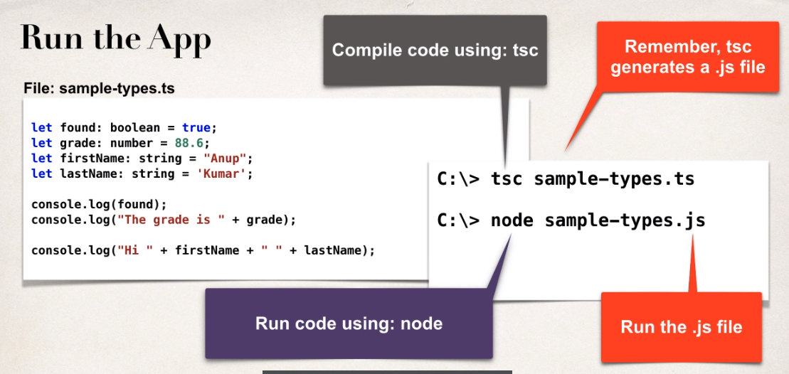
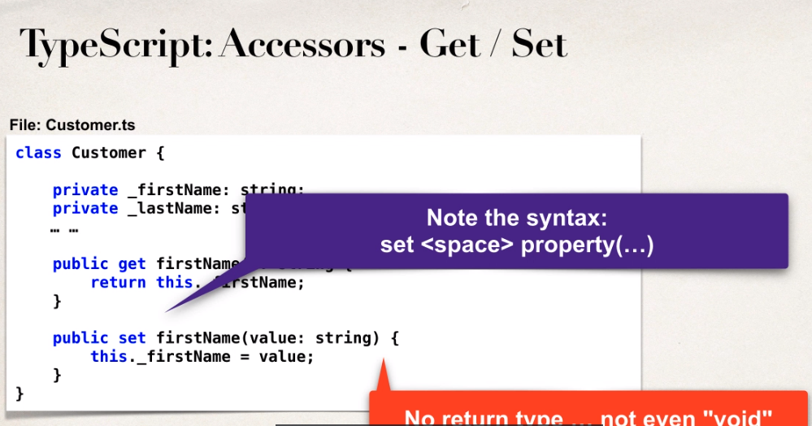
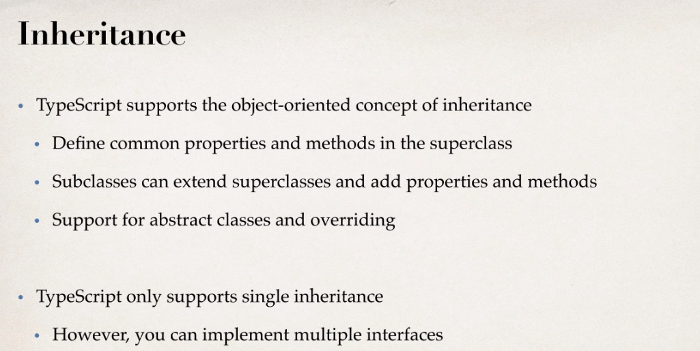
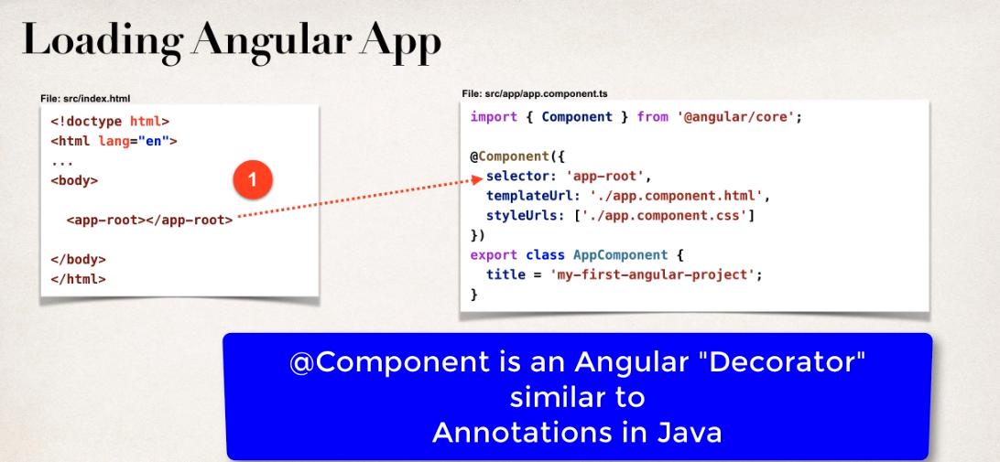
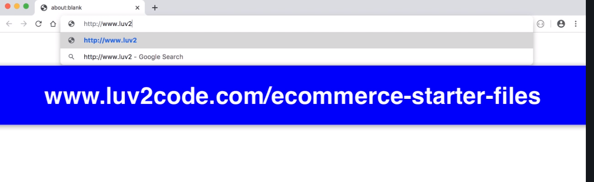
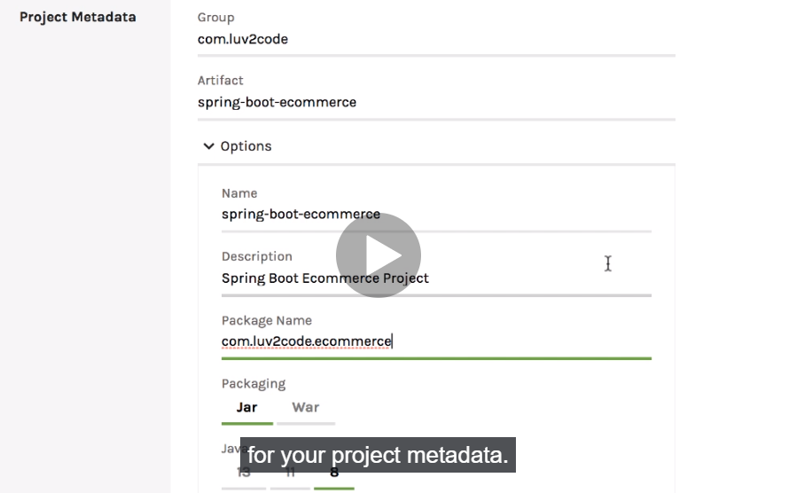
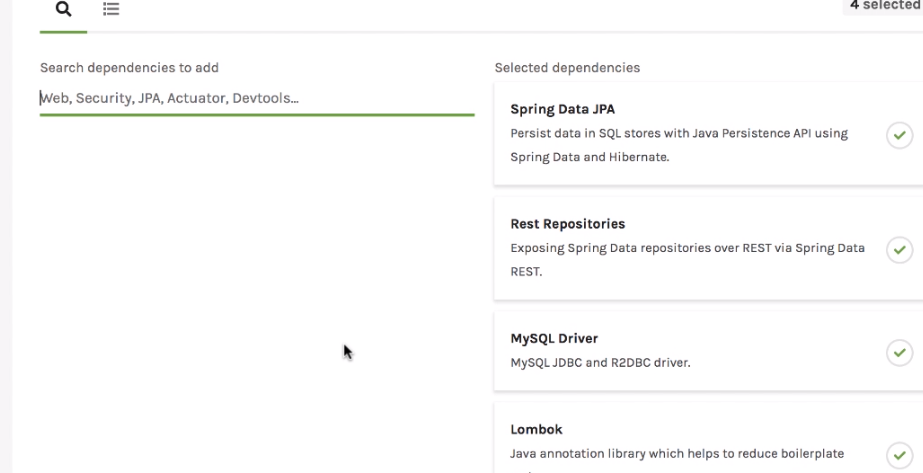
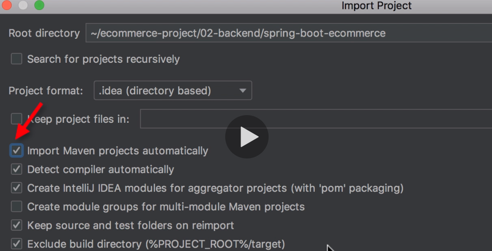

[TOC]

---

- [1. Introduction](#1-introduction)
  - [1. Introduction](#1-introduction-1)
  - [2. How To Take This Course and How To Get Help.html](#2-how-to-take-this-course-and-how-to-get-helphtml)
  - [3. Download the Source Code and PDF Files.html](#3-download-the-source-code-and-pdf-fileshtml)
- [2. Angular Overview](#2-angular-overview)
  - [1. Angular Overview](#1-angular-overview)
- [3. Set Up Development Tools](#3-set-up-development-tools)
  - [1. Set Up Development Tools](#1-set-up-development-tools)
- [4. TypeScript Crash Course - Fundamentals](#4-typescript-crash-course---fundamentals)
  - [1. TypeScript Overview](#1-typescript-overview)
  - [2. Creating our first TypeScript application](#2-creating-our-first-typescript-application)
  - [3. Defining Variables - Overview](#3-defining-variables---overview)
  - [4. Defining Variables - Write Some Code](#4-defining-variables---write-some-code)
  - [5. Creating Loops and Arrays - Overview](#5-creating-loops-and-arrays---overview)
  - [6. Creating Loops and Arrays - Write Some Code - Part 1](#6-creating-loops-and-arrays---write-some-code---part-1)
  - [7. Creating Loops and Arrays - Write Some Code - Part 2](#7-creating-loops-and-arrays---write-some-code---part-2)
- [5. TypeScript Crash Course - Creating Classes](#5-typescript-crash-course---creating-classes)
  - [1. Creating Classes - Overview](#1-creating-classes---overview)
  - [2. Creating Classes - Write Some Code](#2-creating-classes---write-some-code)
  - [3. Defining Accessors - Overview](#3-defining-accessors---overview)
  - [4. Defining Accessors - Write Some Code](#4-defining-accessors---write-some-code)
  - [5. Configuring Compiler Options with tsconfig.json](#5-configuring-compiler-options-with-tsconfigjson)
  - [6. Parameter Properties](#6-parameter-properties)
  - [7. TypeScript Modules Import and Export](#7-typescript-modules-import-and-export)
- [6. TypeScript Crash Course - Inheritance and Interfaces](#6-typescript-crash-course---inheritance-and-interfaces)
  - [1. Inheritance - Overview](#1-inheritance---overview)
  - [2. Inheritance - Creating the Superclass and Subclass](#2-inheritance---creating-the-superclass-and-subclass)
  - [3. Inheritance - Pulling it all together in a Main App](#3-inheritance---pulling-it-all-together-in-a-main-app)
  - [4. Inheritance - Developing a second Subclass](#4-inheritance---developing-a-second-subclass)
  - [5. Inheritance - Adding Shapes to an Array](#5-inheritance---adding-shapes-to-an-array)
  - [6. Abstract Classes - Overview](#6-abstract-classes---overview)
  - [7. Abstract Classes - Write Some Code](#7-abstract-classes---write-some-code)
  - [8. Interfaces - Overview](#8-interfaces---overview)
  - [9. Interfaces - Write Some Code](#9-interfaces---write-some-code)
- [7. Angular Crash Course - Fundamentals](#7-angular-crash-course---fundamentals)
  - [1. Getting Started with Angular](#1-getting-started-with-angular)
  - [2. Exploring the Angular Project](#2-exploring-the-angular-project)
  - [3. Creating a New Angular Project](#3-creating-a-new-angular-project)
  - [4. Behind The Scenes of An Angular Project - Overview](#4-behind-the-scenes-of-an-angular-project---overview)
  - [5. Behind The Scenes of An Angular Project - Demo](#5-behind-the-scenes-of-an-angular-project---demo)
  - [6. Creating a New Angular Component - Overview - Part 1](#6-creating-a-new-angular-component---overview---part-1)
  - [7. Creating a New Angular Component - Overview - Part 2](#7-creating-a-new-angular-component---overview---part-2)
  - [8. Creating a New Angular Component - Write Some Code - Part 1](#8-creating-a-new-angular-component---write-some-code---part-1)
  - [9. Creating a New Angular Component - Write Some Code - Part 2](#9-creating-a-new-angular-component---write-some-code---part-2)
  - [10. Creating a New Angular Component - Write Some Code - Part 3](#10-creating-a-new-angular-component---write-some-code---part-3)
- [8. Angular Crash Course - Bootstrap CSS, Conditionals and Formatting](#8-angular-crash-course---bootstrap-css-conditionals-and-formatting)
  - [1. Integrating Angular and Bootstrap CSS - Overview](#1-integrating-angular-and-bootstrap-css---overview)
  - [2. Integrating Angular and Bootstrap CSS - Write Some Code](#2-integrating-angular-and-bootstrap-css---write-some-code)
  - [3. Angular Conditionals and Formatting - Overview](#3-angular-conditionals-and-formatting---overview)
  - [4. Angular Conditionals and Formatting - Write Some Code](#4-angular-conditionals-and-formatting---write-some-code)
  - [5. Bonus Angular Conditionals How to highlight table row.html](#5-bonus-angular-conditionals-how-to-highlight-table-rowhtml)
- [9. eCommerce Project - Spring Boot Backend](#9-ecommerce-project---spring-boot-backend)
  - [1. Project Overview](#1-project-overview)
  - [2. Spring Boot Project Set Up](#2-spring-boot-project-set-up)
  - [3. HEADS UP Eclipse and Lombok.html](#3-heads-up-eclipse-and-lombokhtml)
  - [4. Set Up Database Tables](#4-set-up-database-tables)
  - [5. Create Spring Boot Starter Project](#5-create-spring-boot-starter-project)
  - [6. Develop JPA Entities - Part 1](#6-develop-jpa-entities---part-1)
  - [7. Develop JPA Entities - Part 2](#7-develop-jpa-entities---part-2)
  - [8. Create REST APIs with Spring Data JPA Repositories and Spring Data REST](#8-create-rest-apis-with-spring-data-jpa-repositories-and-spring-data-rest)
  - [9. REST APIs - Configure for Read Only - Overview](#9-rest-apis---configure-for-read-only---overview)
  - [10. REST APIs - Configure for Read Only - Write Some Code](#10-rest-apis---configure-for-read-only---write-some-code)
- [10. eCommerce Project - Angular Front End - Product List](#10-ecommerce-project---angular-front-end---product-list)
  - [1. Angular Project Overview - Part 1](#1-angular-project-overview---part-1)
  - [2. Angular Project Overview - Part 2](#2-angular-project-overview---part-2)
  - [3. Angular Project - Setup](#3-angular-project---setup)
  - [4. Angular Project - Create Product class and Product Service - Part 1](#4-angular-project---create-product-class-and-product-service---part-1)
  - [5. Angular Project - Create Product class and Product Service - Part 2](#5-angular-project---create-product-class-and-product-service---part-2)
  - [6. Angular Project - Update Angular Component](#6-angular-project---update-angular-component)
  - [7. Angular Project - Integrating Angular and Spring Boot for Full Stack App!](#7-angular-project---integrating-angular-and-spring-boot-for-full-stack-app)
  - [8. Angular Project - Building an HTML Table](#8-angular-project---building-an-html-table)
  - [9. Angular Project - Adding Product Images](#9-angular-project---adding-product-images)
- [11. eCommerce Project - Integrating Online Shop Template](#11-ecommerce-project---integrating-online-shop-template)
  - [1. Angular Project - Template Integration Overview](#1-angular-project---template-integration-overview)
  - [2. Angular Project - Download Starter Files](#2-angular-project---download-starter-files)
  - [2.2 Starter Files.html](#22-starter-fileshtml)
  - [3. Angular Project - Tour of HTML Template Files](#3-angular-project---tour-of-html-template-files)
  - [4. Angular Project - Install Bootstrap CSS Styles with npm](#4-angular-project---install-bootstrap-css-styles-with-npm)
  - [5. Angular Project - Add local custom CSS styles](#5-angular-project---add-local-custom-css-styles)
  - [6. Angular Project - Integrate Template Files and Logos](#6-angular-project---integrate-template-files-and-logos)
  - [7. Angular Project - Run the App](#7-angular-project---run-the-app)
  - [8. Angular Project - Add support for Product Grid](#8-angular-project---add-support-for-product-grid)
  - [9. Angular Project - Enhance Application with Product Images](#9-angular-project---enhance-application-with-product-images)
  - [10. FAQ Should I Store Images as BLOBs in Database or Files on file system.html](#10-faq-should-i-store-images-as-blobs-in-database-or-files-on-file-systemhtml)
- [12. eCommerce Project - Search for Products by Category](#12-ecommerce-project---search-for-products-by-category)
  - [1. Angular Project - Search for Products by Category - Overview - Part 1](#1-angular-project---search-for-products-by-category---overview---part-1)
  - [2. Angular Project - Search for Products by Category - Overview - Part 2](#2-angular-project---search-for-products-by-category---overview---part-2)
  - [3. Angular Project - Search for Products by Category - Overview - Part 3](#3-angular-project---search-for-products-by-category---overview---part-3)
  - [4. Angular Project - Search for Products by Category - Code - Define routes](#4-angular-project---search-for-products-by-category---code---define-routes)
  - [5. Angular Project - Search for Products by Category - Code - Define Router Outlet](#5-angular-project---search-for-products-by-category---code---define-router-outlet)
  - [6. Angular Project - Search for Products by Category - Code - Enhance ProductList](#6-angular-project---search-for-products-by-category---code---enhance-productlist)
  - [7. Angular Project - Search for Products by Category - Code - Update Spring Boot](#7-angular-project---search-for-products-by-category---code---update-spring-boot)
  - [8. Angular Project - Search for Products by Category - Code - Update ProductService](#8-angular-project---search-for-products-by-category---code---update-productservice)
- [13. eCommerce Project - Search for Products by Category (Dynamic Search Component)](#13-ecommerce-project---search-for-products-by-category-dynamic-search-component)
  - [1. Angular Project - Search for Products by Category (Dynamic Search Component 1)](#1-angular-project---search-for-products-by-category-dynamic-search-component-1)
  - [2. Angular Project - Search for Products by Category (Dynamic Search Component 2)](#2-angular-project---search-for-products-by-category-dynamic-search-component-2)
  - [3. Angular Project - Dynamic Search Component - Modify Spring Boot App](#3-angular-project---dynamic-search-component---modify-spring-boot-app)
  - [4. Angular Project - Dynamic Search Component - Create Component](#4-angular-project---dynamic-search-component---create-component)
  - [5. Angular Project - Dynamic Search Component - Call Product Service](#5-angular-project---dynamic-search-component---call-product-service)
  - [6. Angular Project - Dynamic Search Component - Add Dynamic Code to HTML](#6-angular-project---dynamic-search-component---add-dynamic-code-to-html)
  - [7. Angular Project - Dynamic Search Component - View Console Logs](#7-angular-project---dynamic-search-component---view-console-logs)
  - [8. Bonus Display Category Name in Product List Grid.html](#8-bonus-display-category-name-in-product-list-gridhtml)
- [14. eCommerce Project - Search for Products by Keyword](#14-ecommerce-project---search-for-products-by-keyword)
  - [1. Angular Project - Search for Products by Keyword - Overview - Part 1](#1-angular-project---search-for-products-by-keyword---overview---part-1)
  - [2. Angular Project - Search for Products by Keyword - Overview - Part 2](#2-angular-project---search-for-products-by-keyword---overview---part-2)
  - [3. Angular Project - Search for Products by Keyword - Overview - Part 3](#3-angular-project---search-for-products-by-keyword---overview---part-3)
  - [4. Angular Project - Search for Products by Keyword - Modify Spring Boot App](#4-angular-project---search-for-products-by-keyword---modify-spring-boot-app)
  - [5. Angular Project - Search for Products by Keyword - Angular Search Component](#5-angular-project---search-for-products-by-keyword---angular-search-component)
  - [6. Angular Project - Search for Products by Keyword - Send Data to search route](#6-angular-project---search-for-products-by-keyword---send-data-to-search-route)
  - [7. Angular Project - Search for Products by Keyword - Enhance ProductList Component](#7-angular-project---search-for-products-by-keyword---enhance-productlist-component)
  - [8. Angular Project - Search for Products by Keyword - Update ProductService API](#8-angular-project---search-for-products-by-keyword---update-productservice-api)
  - [9. Angular Project - Search for Products by Keyword - Handle for No Products Found](#9-angular-project---search-for-products-by-keyword---handle-for-no-products-found)
- [15. eCommerce Project - Product Master-Detail View](#15-ecommerce-project---product-master-detail-view)
  - [1. Angular Project - Product Master-Detail View - Overview](#1-angular-project---product-master-detail-view---overview)
  - [2. Angular Project - Product Master-Detail View - Create new component and route](#2-angular-project---product-master-detail-view---create-new-component-and-route)
  - [3. Angular Project - Product Master-Detail View - Add router links on Master page](#3-angular-project---product-master-detail-view---add-router-links-on-master-page)
  - [4. Angular Project - Product Master-Detail View - Enhance the Details Component](#4-angular-project---product-master-detail-view---enhance-the-details-component)
  - [5. Angular Project - Product Master-Detail View - Update Product Service and HTML](#5-angular-project---product-master-detail-view---update-product-service-and-html)
  - [6. Angular Project - Product Master-Detail View - Add more Product Details](#6-angular-project---product-master-detail-view---add-more-product-details)
  - [7. Angular Project - Race Conditions](#7-angular-project---race-conditions)
  - [8. IDE Extension - Angular Language Service](#8-ide-extension---angular-language-service)
- [16. eCommerce Project - Pagination](#16-ecommerce-project---pagination)
  - [1. Angular Project- Pagination Overview](#1-angular-project--pagination-overview)
  - [2. Angular Project - Pagination Development Process - Part 1](#2-angular-project---pagination-development-process---part-1)
  - [3. Angular Project - Pagination Development Process - Part 2](#3-angular-project---pagination-development-process---part-2)
  - [4. Angular Project - Pagination - Install ng-bootstrap](#4-angular-project---pagination---install-ng-bootstrap)
  - [5. Angular Project - Pagination - Add Pagination support to Product Service](#5-angular-project---pagination---add-pagination-support-to-product-service)
  - [6. Angular Project - Pagination - Update Product List Component for Pagination](#6-angular-project---pagination---update-product-list-component-for-pagination)
  - [7. Angular Project - Pagination - Enhance HTML template to use Pagination Component](#7-angular-project---pagination---enhance-html-template-to-use-pagination-component)
  - [8. Angular Project - Pagination Demo](#8-angular-project---pagination-demo)
  - [9. Angular Project - Pagination - Selecting Page Size - Part 1](#9-angular-project---pagination---selecting-page-size---part-1)
  - [10. Angular Project - Pagination - Selecting Page Size - Part 2](#10-angular-project---pagination---selecting-page-size---part-2)
  - [11. Angular Project - Pagination - Setting Max Size and Adding Boundary Links](#11-angular-project---pagination---setting-max-size-and-adding-boundary-links)
  - [12. Angular Project - Pagination - Keyword Search Overview](#12-angular-project---pagination---keyword-search-overview)
  - [13. Angular Project - Pagingation - Keyword Search - Update ProductService](#13-angular-project---pagingation---keyword-search---update-productservice)
  - [14. Angular Project - Pagingation - Keyword Search - Update ProductListComponent](#14-angular-project---pagingation---keyword-search---update-productlistcomponent)
- [17. eCommerce Project - Shopping Cart Status Component](#17-ecommerce-project---shopping-cart-status-component)
  - [1. Angular Project - Shopping Cart Status Overview - Basics](#1-angular-project---shopping-cart-status-overview---basics)
  - [2. Angular Project - Shopping Cart Status - Create new component](#2-angular-project---shopping-cart-status---create-new-component)
  - [3. Angular Project - Shopping Cart Status - Add Click Handler](#3-angular-project---shopping-cart-status---add-click-handler)
  - [4. Angular Project - Shopping Cart Status Overview - Advanced](#4-angular-project---shopping-cart-status-overview---advanced)
  - [5. Angular Project - Shopping Cart Status Overview - Advanced - Cart Service](#5-angular-project---shopping-cart-status-overview---advanced---cart-service)
  - [6. Angular Project - Shopping Cart Status Overview - Create model class CartItem](#6-angular-project---shopping-cart-status-overview---create-model-class-cartitem)
  - [7. Angular Project - Shopping Cart Status - Develop CartService - Add to Cart](#7-angular-project---shopping-cart-status---develop-cartservice---add-to-cart)
  - [8. Angular Project - Shopping Cart Status - Develop CartService - Compute Totals](#8-angular-project---shopping-cart-status---develop-cartservice---compute-totals)
  - [9. Angular Project - Shopping Cart Status - Call CartService](#9-angular-project---shopping-cart-status---call-cartservice)
  - [10. Angular Project - Shopping Cart Status - Subscribe to CartService Display Totals](#10-angular-project---shopping-cart-status---subscribe-to-cartservice-display-totals)
  - [11. Angular Project - Shopping Cart Status - Refactor Cart Service Overview](#11-angular-project---shopping-cart-status---refactor-cart-service-overview)
  - [12. Angular Project - Shopping Cart Status - Refactor Cart Service - Write the Code](#12-angular-project---shopping-cart-status---refactor-cart-service---write-the-code)
  - [13. Angular Project - Shopping Cart Status - Add To Cart From Details View](#13-angular-project---shopping-cart-status---add-to-cart-from-details-view)
  - [14. Angular Project - Shopping Cart Status - Add To Cart From Details View - Coding](#14-angular-project---shopping-cart-status---add-to-cart-from-details-view---coding)
- [18. eCommerce Project - List Shopping Cart Items](#18-ecommerce-project---list-shopping-cart-items)
  - [1. Angular Project - List Shopping Cart Items - Overview](#1-angular-project---list-shopping-cart-items---overview)
  - [2. Angular Project - List Shopping Cart Items - Create CartDetailsComponent](#2-angular-project---list-shopping-cart-items---create-cartdetailscomponent)
  - [3. Angular Project - List Shopping Cart Items - Create HTML Table](#3-angular-project---list-shopping-cart-items---create-html-table)
  - [4. Angular Project - List Shopping Cart Items - Retrieve data from Cart Service](#4-angular-project---list-shopping-cart-items---retrieve-data-from-cart-service)
  - [5. Angular Project - List Shopping Cart Items - Loop over Cart Items in HTML](#5-angular-project---list-shopping-cart-items---loop-over-cart-items-in-html)
  - [6. Angular Project - List Shopping Cart Items - Display Cart Totals](#6-angular-project---list-shopping-cart-items---display-cart-totals)
- [19. More Content is Coming](#19-more-content-is-coming)
  - [1. More Content is Coming.html](#1-more-content-is-cominghtml)
- [20. Summary](#20-summary)
  - [1. Thank You](#1-thank-you)

C:\Users\Admin\AppData\Local\Programs\Python\Python38-32\python.exe E:/programing/language/python/python-docs/readfile.py
======== name dir ========

## 1. Introduction

### 1. Introduction

### 2. How To Take This Course and How To Get Help.html

How To Take This Course and How To Get Help

**How To Take This Course**

As you go through the course, I highly recommend that you type the code along with me in the videos. This is the best way to learn the material.

Some students will watch the video first and then replay it while typing in the code. Others like to type along on the first watch. Choose whatever approach works for you.

But the important thing is that you type in the code. This is the most effective way to really learn the material.

\----

**\*How To Get Help\***

If you have any coding questions or have a syntax error, here's how you can get help:

**1. Download the source code.**

Every coding video has the solution code attached. You can download the solution and compare your code against the solution code.

**2. Post a Message**

If you are not able to resolve the problem, post a message to the discussion forum. Be sure to paste your Java source code along with any relevant config files.

I'm a very responsive instructor and I'll respond to your question in 24 hours.

Enjoy the class :-)

### 3. Download the Source Code and PDF Files.html

Download the Source Code and PDF Files

**Download Source Code:**

You have two options for downloading the code.

_Option 1: Download zip file_

File: [**full-stack-angular-and-springboot-master.zip**](https://github.com/darbyluv2code/fullstack-angular-and-springboot/archive/master.zip)

_
Option 2: Download using git command-line_

You also have the option to download source code using git command-line.

```
git clone https://github.com/darbyluv2code/fullstack-angular-and-springboot.git
```

Note: Option 1 and Option 2 both reference the exact same code. You only need to choose one of the options.

\---
**Download PDF Files**

All slides which are shown during the course are available also as a reference and can be downloaded here:

http://www.luv2code.com/download-full-stack-angular-and-springboot-pdf-slides

## 2. Angular Overview

### 1. Angular Overview

## 3. Set Up Development Tools

### 1. Set Up Development Tools

## 4. TypeScript Crash Course - Fundamentals

### 1. TypeScript Overview

`tsc hello.ts`

### 2. Creating our first TypeScript application



### 3. Defining Variables - Overview

### 4. Defining Variables - Write Some Code

### 5. Creating Loops and Arrays - Overview

```ts
let reviews: number[] = [5, 5, 4.5, 1, 3];

let total: number = 0;

for (let i = 0; i < reviews.length; i++) {
  console.log(reviews[i]);
  total += reviews[i];
}

let average: number = total / reviews.length;
console.log('Review average = ' + average);

let sportsTwo: string[] = ['Golf', 'Cricket', 'Tennis'];

sportsTwo.push('Baseball');
sportsTwo.push('Futbol');

for (let tempSport of sportsTwo) {
  console.log(tempSport);
}

let sportsOne: string[] = ['Golf', 'Cricket', 'Tennis', 'Swimming'];

for (let tempSport of sportsOne) {
  if (tempSport == 'Cricket') {
    console.log(tempSport + ' << My Favorite!');
  } else {
    console.log(tempSport);
  }
}
```

### 6. Creating Loops and Arrays - Write Some Code - Part 1

### 7. Creating Loops and Arrays - Write Some Code - Part 2

## 5. TypeScript Crash Course - Creating Classes

### 1. Creating Classes - Overview

```ts
class Customer {
  firstName: string;
  lastName: string;

  constructor(theFirst: string, theLast: string) {
    this.firstName = theFirst;
    this.lastName = theLast;
  }
}

// let's create an instance
let myCustomer = new Customer('Martin', 'Dixon');

console.log(myCustomer.firstName);
console.log(myCustomer.lastName);
```


### 2. Creating Classes - Write Some Code

### 3. Defining Accessors - Overview

```ts
class Customer {
  private _firstName: string;
  private _lastName: string;

  constructor(theFirst: string, theLast: string) {
    this._firstName = theFirst;
    this._lastName = theLast;
  }

  public get firstName(): string {
    return this._firstName;
  }

  public set firstName(value: string) {
    this._firstName = value;
  }

  public get lastName(): string {
    return this._lastName;
  }
  public set lastName(value: string) {
    this._lastName = value;
  }
}

// let's create an instance
let myCustomer = new Customer('Martin', 'Dixon');

myCustomer.firstName = 'Susan';
myCustomer.lastName = 'Public';

console.log(myCustomer.firstName);
console.log(myCustomer.lastName);
```




### 4. Defining Accessors - Write Some Code

### 5. Configuring Compiler Options with tsconfig.json

`tsc --init`

### 6. Parameter Properties


```ts
class Customer {
  constructor(private _firstName: string, private _lastName: string) {}

  public get firstName(): string {
    return this._firstName;
  }

  public set firstName(value: string) {
    this._firstName = value;
  }

  public get lastName(): string {
    return this._lastName;
  }
  public set lastName(value: string) {
    this._lastName = value;
  }
}

// let's create an instance
let myCustomer = new Customer('Martin', 'Dixon');

console.log(myCustomer.firstName);
console.log(myCustomer.lastName);
```

```shell
tsc --init
tsc --build --clean
tsc
```

### 7. TypeScript Modules Import and Export

export class ...

import {Customer} from ..

## 6. TypeScript Crash Course - Inheritance and Interfaces

### 1. Inheritance - Overview



### 2. Inheritance - Creating the Superclass and Subclass

Shape.ts

```ts
export class Shape {
  constructor(private _x: number, private _y: number) {}

  public get x(): number {
    return this._x;
  }

  public set x(value: number) {
    this._x = value;
  }

  public get y(): number {
    return this._y;
  }

  public set y(value: number) {
    this._y = value;
  }

  getInfo(): string {
    return `x=${this._x}, y=${this._y}`;
  }
}
```

Rectangle.ts

```ts
import { Shape } from './Shape';

export class Rectangle extends Shape {
  constructor(
    theX: number,
    theY: number,
    private _width: number,
    private _length: number
  ) {
    super(theX, theY);
  }

  public get width(): number {
    return this._width;
  }

  public set width(value: number) {
    this._width = value;
  }

  public get length(): number {
    return this._length;
  }

  public set length(value: number) {
    this._length = value;
  }

  getInfo(): string {
    return super.getInfo() + `, width=${this._width}, length=${this._length}`;
  }
}
```

Driver.ts

```ts
import { Shape } from './Shape';
import { Circle } from './Circle';
import { Rectangle } from './Rectangle';

let myShape = new Shape(10, 15);
console.log(myShape.getInfo());

let myCircle = new Circle(5, 10, 20);
console.log(myCircle.getInfo());

let myRectangle = new Rectangle(0, 0, 3, 7);
console.log(myRectangle.getInfo());
```

Array.ts

```ts
import { Shape } from './Shape';
import { Circle } from './Circle';
import { Rectangle } from './Rectangle';

let myShape = new Shape(10, 15);
let myCircle = new Circle(5, 10, 20);
let myRectangle = new Rectangle(0, 0, 3, 7);

// declare an array of shapes ... initially empty
let theShapes: Shape[] = [];

// add the shapes to the array
theShapes.push(myShape);
theShapes.push(myCircle);
theShapes.push(myRectangle);

for (let tempShape of theShapes) {
  console.log(tempShape.getInfo());
}
```

### 3. Inheritance - Pulling it all together in a Main App

### 4. Inheritance - Developing a second Subclass

### 5. Inheritance - Adding Shapes to an Array

### 6. Abstract Classes - Overview

Shape.ts

```ts
export abstract class Shape {
  constructor(private _x: number, private _y: number) {}

  public get x(): number {
    return this._x;
  }

  public set x(value: number) {
    this._x = value;
  }

  public get y(): number {
    return this._y;
  }

  public set y(value: number) {
    this._y = value;
  }

  getInfo(): string {
    return `x=${this._x}, y=${this._y}`;
  }

  abstract calculateArea(): number;
}
```

Circle.ts

```ts
import { Shape } from './Shape';

export class Circle extends Shape {
  calculateArea(): number {
    return Math.PI * Math.pow(this._radius, 2);
  }

  constructor(theX: number, theY: number, private _radius: number) {
    super(theX, theY);
  }

  public get radius(): number {
    return this._radius;
  }

  public set radius(value: number) {
    this._radius = value;
  }

  getInfo(): string {
    return super.getInfo() + `, radius=${this._radius}`;
  }
}
```

ArraysDriver.ts

```ts
import { Shape } from './Shape';
import { Circle } from './Circle';
import { Rectangle } from './Rectangle';

let myCircle = new Circle(5, 10, 20);
let myRectangle = new Rectangle(0, 0, 3, 7);

// declare an array of shapes ... initially empty
let theShapes: Shape[] = [];

// add the shapes to the array
theShapes.push(myCircle);
theShapes.push(myRectangle);

for (let tempShape of theShapes) {
  console.log(tempShape.getInfo());
  console.log(tempShape.calculateArea());
  console.log();
}
```

### 7. Abstract Classes - Write Some Code

### 8. Interfaces - Overview

Coach

```ts
export interface Coach {
  getDailyWorkout(): string;
}
```

CrikeyCoach.ts

```ts
import { Coach } from './Coach';

export class CricketCoach implements Coach {
  getDailyWorkout(): string {
    return 'Practice your spin bowling technique.';
  }
}
```

Drriver

```ts
import { CricketCoach } from './CricketCoach';
import { GolfCoach } from './GolfCoach';
import { Coach } from './Coach';

let myCricketCoach = new CricketCoach();
let myGolfCoach = new GolfCoach();

// declare an array for coaches ... initially empty
let theCoaches: Coach[] = [];

// add the coaches to the array
theCoaches.push(myCricketCoach);
theCoaches.push(myGolfCoach);

for (let tempCoach of theCoaches) {
  console.log(tempCoach.getDailyWorkout());
}
```

### 9. Interfaces - Write Some Code

## 7. Angular Crash Course - Fundamentals

### 1. Getting Started with Angular

### 2. Exploring the Angular Project

### 3. Creating a New Angular Project

### 4. Behind The Scenes of An Angular Project - Overview



### 5. Behind The Scenes of An Angular Project - Demo

### 6. Creating a New Angular Component - Overview - Part 1

### 7. Creating a New Angular Component - Overview - Part 2

`ng generate class sales-person-list/SalesPerson`

### 8. Creating a New Angular Component - Write Some Code - Part 1

### 9. Creating a New Angular Component - Write Some Code - Part 2

### 10. Creating a New Angular Component - Write Some Code - Part 3

## 8. Angular Crash Course - Bootstrap CSS, Conditionals and Formatting

### 1. Integrating Angular and Bootstrap CSS - Overview

### 2. Integrating Angular and Bootstrap CSS - Write Some Code

### 3. Angular Conditionals and Formatting - Overview

sales-person-list-bootstrap.component.html

```html
<table class="table table-hover">

    <thead class="thead-dark">
        <tr>
            <th>First Name</th>
            <th>Last Name</th>
            <th>Email</th>
            <th>Sales Volume</th>
            <th>Met Quota?</th>
        </tr>
    </thead>

    <tbody>
        <tr *ngFor="let tempSalesPerson of salesPersonList">
            <td>{{ tempSalesPerson.firstName }}</td>
            <td>{{ tempSalesPerson.lastName }}</td>
            <td>{{ tempSalesPerson.email }}</td>
            <td>{{ tempSalesPerson.salesVolume | currency:'USD'}}</td>

            <td>
                <div *ngIf="tempSalesPerson.salesVolume >= 60000; else myElseBlock">Yes</div>
                <ng-template #myElseBlock>No</ng-template>
            </td>
        </tr>

    </tbody>

</table>
```


### 4. Angular Conditionals and Formatting - Write Some Code

### 5. Bonus Angular Conditionals How to highlight table row.html

Bonus: Angular Conditionals: How to highlight table row

**Question**

We have learned we can display condition value for Met Quota column by ngIf. If I wanted to highlighted complete row as background color green which has sales volume 60000 or more. How can I accomplish this task?


**Answer**

[***Read the complete answer online\***](https://github.com/darbyluv2code/fullstack-angular-and-springboot/blob/master/bonus-content/angular-crash-course/02-ngIf-highlight-entire-row/02-ngif-highligh-entire-row.md)

https://github.com/darbyluv2code/fullstack-angular-and-springboot/blob/master/bonus-content/angular-crash-course/02-ngIf-highlight-entire-row/02-ngif-highligh-entire-row.md


## Development Process

1. Create a local CSS style for Green
2. Update HTML to apply style to row

------

### 1. Create a local CSS style for Green

In the CSS file for your component, you can create a local CSS style. This is setting the background color of an element to green.

File: **sales-person-list.component.css**

```
    .highlight {
      background-color:green
    }
```

### 2. Update HTML to apply style to row

In your component, you can make use of `[ngClass]` to conditionally apply styles to an element.

The basic syntax is:

```
    <div [ngClass]="{
       'class1': condition  (the true condition),
       'class2': !condition (else)
    }">
```

In our example, we will use the `[ngClass]`. This will give a red background for the entire row for a sales person whose `quota is >= 60000`.

## 9. eCommerce Project - Spring Boot Backend

### 1. Project Overview

### 2. Spring Boot Project Set Up

### 3. HEADS UP Eclipse and Lombok.html

HEADS UP: Eclipse and Lombok

**Eclipse and Lombok**

If you are using Eclipse instead of IntelliJ, there are additional installations steps you need.

To add Lombok support to Eclipse. Follow the steps below:


\1. Download the Lombok JAR file installer from this link:

https://projectlombok.org/downloads/lombok.jar


\2. Double-click the downloaded JAR file installer to start the installation process.


Note: Instead of double-click, you can run the installer from the command line. Move to the directory where you downloaded the file.

```
java -jar lombok.jar
```


\3. Follow the steps in the installer.

### 4. Set Up Database Tables

  

create-user

```sql
CREATE USER 'ecommerceapp'@'localhost' IDENTIFIED BY 'ecommerceapp';

GRANT ALL PRIVILEGES ON * . * TO 'ecommerceapp'@'localhost';

#
# Starting with MySQL 8.0.4, the MySQL team changed the 
# default authentication plugin for MySQL server 
# from mysql_native_password to caching_sha2_password.
#
# The command below will make the appropriate updates for your user account.
#
# See the MySQL Reference Manual for details: 
# https://dev.mysql.com/doc/refman/8.0/en/caching-sha2-pluggable-authentication.html
#
ALTER USER 'ecommerceapp'@'localhost' IDENTIFIED WITH mysql_native_password BY 'ecommerceapp';
```

create-product

```sql
-- -----------------------------------------------------
-- Schema full-stack-ecommerce
-- -----------------------------------------------------
DROP SCHEMA IF EXISTS `full-stack-ecommerce`;

CREATE SCHEMA `full-stack-ecommerce`;
USE `full-stack-ecommerce` ;

-- -----------------------------------------------------
-- Table `full-stack-ecommerce`.`product_category`
-- -----------------------------------------------------
CREATE TABLE IF NOT EXISTS `full-stack-ecommerce`.`product_category` (
  `id` BIGINT(20) NOT NULL AUTO_INCREMENT,
  `category_name` VARCHAR(255) NULL DEFAULT NULL,
  PRIMARY KEY (`id`))
ENGINE=InnoDB
AUTO_INCREMENT = 1;

-- -----------------------------------------------------
-- Table `full-stack-ecommerce`.`product`
-- -----------------------------------------------------
CREATE TABLE IF NOT EXISTS `full-stack-ecommerce`.`product` (
  `id` BIGINT(20) NOT NULL AUTO_INCREMENT,
  `sku` VARCHAR(255) DEFAULT NULL,
  `name` VARCHAR(255) DEFAULT NULL,
  `description` VARCHAR(255) DEFAULT NULL,
  `unit_price` DECIMAL(13,2) DEFAULT NULL,
  `image_url` VARCHAR(255) DEFAULT NULL,
  `active` BIT DEFAULT 1,
  `units_in_stock` INT(11) DEFAULT NULL,
   `date_created` DATETIME(6) DEFAULT NULL,
  `last_updated` DATETIME(6) DEFAULT NULL,
  `category_id` BIGINT(20) NOT NULL,
  PRIMARY KEY (`id`),
  KEY `fk_category` (`category_id`),
  CONSTRAINT `fk_category` FOREIGN KEY (`category_id`) REFERENCES `product_category` (`id`)
) 
ENGINE=InnoDB
AUTO_INCREMENT = 1;


-- -----------------------------------------------------
-- Add sample data
-- -----------------------------------------------------

INSERT INTO PRODUCT_CATEGORY(CATEGORY_NAME) VALUES ('BOOKS');

INSERT INTO PRODUCT (SKU, NAME, DESCRIPTION, IMAGE_URL, ACTIVE, UNITS_IN_STOCK,
UNIT_PRICE, CATEGORY_ID,DATE_CREATED)
VALUES ('BOOK-TECH-1000', 'JavaScript - The Fun Parts', 'Learn JavaScript',
'assets/images/products/placeholder.png'
,1,100,19.99,1, NOW());

INSERT INTO PRODUCT (SKU, NAME, DESCRIPTION, IMAGE_URL, ACTIVE, UNITS_IN_STOCK,
UNIT_PRICE, CATEGORY_ID, DATE_CREATED)
VALUES ('BOOK-TECH-1001', 'Spring Framework Tutorial', 'Learn Spring',
'assets/images/products/placeholder.png'
,1,100,29.99,1, NOW());

INSERT INTO PRODUCT (SKU, NAME, DESCRIPTION, IMAGE_URL, ACTIVE, UNITS_IN_STOCK,
UNIT_PRICE, CATEGORY_ID, DATE_CREATED)
VALUES ('BOOK-TECH-1002', 'Kubernetes - Deploying Containers', 'Learn Kubernetes',
'assets/images/products/placeholder.png'
,1,100,24.99,1, NOW());

INSERT INTO PRODUCT (SKU, NAME, DESCRIPTION, IMAGE_URL, ACTIVE, UNITS_IN_STOCK,
UNIT_PRICE, CATEGORY_ID, DATE_CREATED)
VALUES ('BOOK-TECH-1003', 'Internet of Things (IoT) - Getting Started', 'Learn IoT',
'assets/images/products/placeholder.png'
,1,100,29.99,1, NOW());

INSERT INTO PRODUCT (SKU, NAME, DESCRIPTION, IMAGE_URL, ACTIVE, UNITS_IN_STOCK,
UNIT_PRICE, CATEGORY_ID, DATE_CREATED)
VALUES ('BOOK-TECH-1004', 'The Go Programming Language: A to Z', 'Learn Go',
'assets/images/products/placeholder.png'
,1,100,24.99,1, NOW());

```


### 5. Create Spring Boot Starter Project

  

  


### 6. Develop JPA Entities - Part 1

  


### 7. Develop JPA Entities - Part 2

### 8. Create REST APIs with Spring Data JPA Repositories and Spring Data REST

### 9. REST APIs - Configure for Read Only - Overview

### 10. REST APIs - Configure for Read Only - Write Some Code

## 10. eCommerce Project - Angular Front End - Product List

### 1. Angular Project Overview - Part 1

### 2. Angular Project Overview - Part 2

### 3. Angular Project - Setup

### 4. Angular Project - Create Product class and Product Service - Part 1

### 5. Angular Project - Create Product class and Product Service - Part 2

### 6. Angular Project - Update Angular Component

### 7. Angular Project - Integrating Angular and Spring Boot for Full Stack App!

### 8. Angular Project - Building an HTML Table

### 9. Angular Project - Adding Product Images

## 11. eCommerce Project - Integrating Online Shop Template

### 1. Angular Project - Template Integration Overview

### 2. Angular Project - Download Starter Files

### 2.2 Starter Files.html

### 3. Angular Project - Tour of HTML Template Files

### 4. Angular Project - Install Bootstrap CSS Styles with npm

### 5. Angular Project - Add local custom CSS styles

### 6. Angular Project - Integrate Template Files and Logos

### 7. Angular Project - Run the App

### 8. Angular Project - Add support for Product Grid

### 9. Angular Project - Enhance Application with Product Images

### 10. FAQ Should I Store Images as BLOBs in Database or Files on file system.html

## 12. eCommerce Project - Search for Products by Category

### 1. Angular Project - Search for Products by Category - Overview - Part 1

### 2. Angular Project - Search for Products by Category - Overview - Part 2

### 3. Angular Project - Search for Products by Category - Overview - Part 3

### 4. Angular Project - Search for Products by Category - Code - Define routes

### 5. Angular Project - Search for Products by Category - Code - Define Router Outlet

### 6. Angular Project - Search for Products by Category - Code - Enhance ProductList

### 7. Angular Project - Search for Products by Category - Code - Update Spring Boot

### 8. Angular Project - Search for Products by Category - Code - Update ProductService

## 13. eCommerce Project - Search for Products by Category (Dynamic Search Component)

### 1. Angular Project - Search for Products by Category (Dynamic Search Component 1)

### 2. Angular Project - Search for Products by Category (Dynamic Search Component 2)

### 3. Angular Project - Dynamic Search Component - Modify Spring Boot App

### 4. Angular Project - Dynamic Search Component - Create Component

### 5. Angular Project - Dynamic Search Component - Call Product Service

### 6. Angular Project - Dynamic Search Component - Add Dynamic Code to HTML

### 7. Angular Project - Dynamic Search Component - View Console Logs

### 8. Bonus Display Category Name in Product List Grid.html

## 14. eCommerce Project - Search for Products by Keyword

### 1. Angular Project - Search for Products by Keyword - Overview - Part 1

### 2. Angular Project - Search for Products by Keyword - Overview - Part 2

### 3. Angular Project - Search for Products by Keyword - Overview - Part 3

### 4. Angular Project - Search for Products by Keyword - Modify Spring Boot App

### 5. Angular Project - Search for Products by Keyword - Angular Search Component

### 6. Angular Project - Search for Products by Keyword - Send Data to search route

### 7. Angular Project - Search for Products by Keyword - Enhance ProductList Component

### 8. Angular Project - Search for Products by Keyword - Update ProductService API

### 9. Angular Project - Search for Products by Keyword - Handle for No Products Found

## 15. eCommerce Project - Product Master-Detail View

### 1. Angular Project - Product Master-Detail View - Overview

### 2. Angular Project - Product Master-Detail View - Create new component and route

### 3. Angular Project - Product Master-Detail View - Add router links on Master page

### 4. Angular Project - Product Master-Detail View - Enhance the Details Component

### 5. Angular Project - Product Master-Detail View - Update Product Service and HTML

### 6. Angular Project - Product Master-Detail View - Add more Product Details

### 7. Angular Project - Race Conditions

### 8. IDE Extension - Angular Language Service

## 16. eCommerce Project - Pagination

### 1. Angular Project- Pagination Overview

### 2. Angular Project - Pagination Development Process - Part 1

### 3. Angular Project - Pagination Development Process - Part 2

### 4. Angular Project - Pagination - Install ng-bootstrap

### 5. Angular Project - Pagination - Add Pagination support to Product Service

### 6. Angular Project - Pagination - Update Product List Component for Pagination

### 7. Angular Project - Pagination - Enhance HTML template to use Pagination Component

### 8. Angular Project - Pagination Demo

### 9. Angular Project - Pagination - Selecting Page Size - Part 1

### 10. Angular Project - Pagination - Selecting Page Size - Part 2

### 11. Angular Project - Pagination - Setting Max Size and Adding Boundary Links

### 12. Angular Project - Pagination - Keyword Search Overview

### 13. Angular Project - Pagingation - Keyword Search - Update ProductService

### 14. Angular Project - Pagingation - Keyword Search - Update ProductListComponent

## 17. eCommerce Project - Shopping Cart Status Component

### 1. Angular Project - Shopping Cart Status Overview - Basics

### 2. Angular Project - Shopping Cart Status - Create new component

### 3. Angular Project - Shopping Cart Status - Add Click Handler

### 4. Angular Project - Shopping Cart Status Overview - Advanced

### 5. Angular Project - Shopping Cart Status Overview - Advanced - Cart Service

### 6. Angular Project - Shopping Cart Status Overview - Create model class CartItem

### 7. Angular Project - Shopping Cart Status - Develop CartService - Add to Cart

### 8. Angular Project - Shopping Cart Status - Develop CartService - Compute Totals

### 9. Angular Project - Shopping Cart Status - Call CartService

### 10. Angular Project - Shopping Cart Status - Subscribe to CartService Display Totals

### 11. Angular Project - Shopping Cart Status - Refactor Cart Service Overview

### 12. Angular Project - Shopping Cart Status - Refactor Cart Service - Write the Code

### 13. Angular Project - Shopping Cart Status - Add To Cart From Details View

### 14. Angular Project - Shopping Cart Status - Add To Cart From Details View - Coding

## 18. eCommerce Project - List Shopping Cart Items

### 1. Angular Project - List Shopping Cart Items - Overview

### 2. Angular Project - List Shopping Cart Items - Create CartDetailsComponent

### 3. Angular Project - List Shopping Cart Items - Create HTML Table

### 4. Angular Project - List Shopping Cart Items - Retrieve data from Cart Service

### 5. Angular Project - List Shopping Cart Items - Loop over Cart Items in HTML

### 6. Angular Project - List Shopping Cart Items - Display Cart Totals

## 19. More Content is Coming

### 1. More Content is Coming.html

## 20. Summary

### 1. Thank You

======== list file ========
