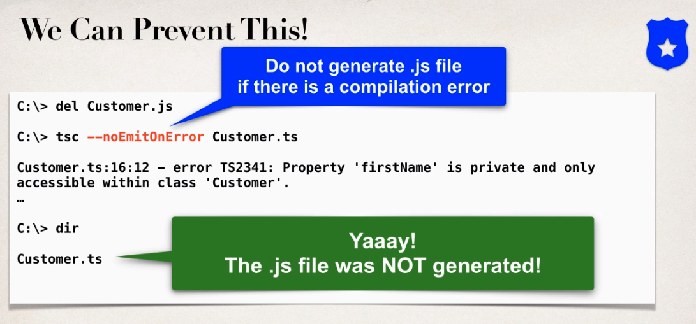
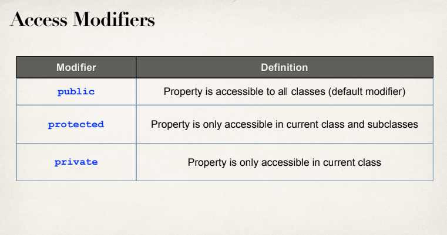
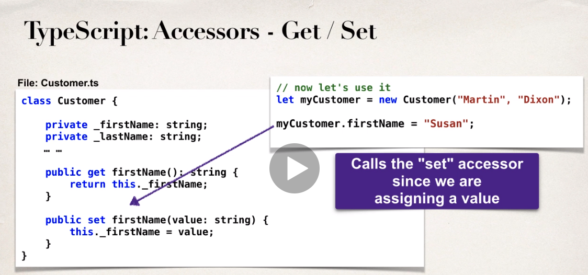
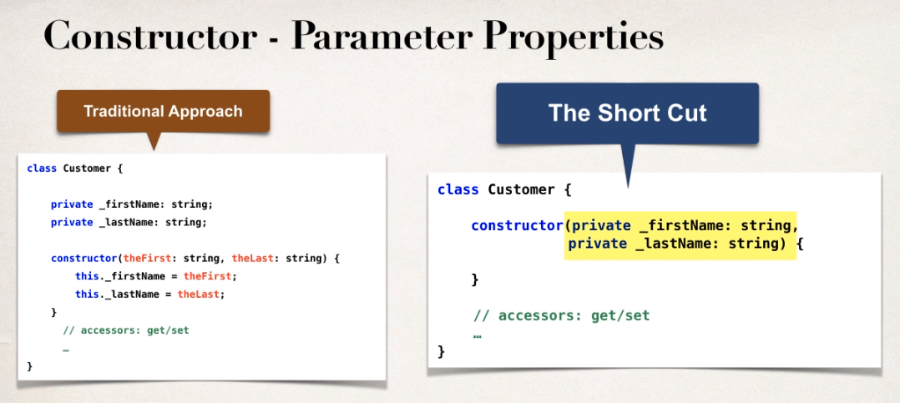

[TOC]


C:\Users\Admin\AppData\Local\Programs\Python\Python38-32\python.exe E:/programing/language/python/python-docs/readfile.py
======== name dir ========

## 1. Introduction
### 1. Introduction
### 2. How To Take This Course and How To Get Help.html

How To Take This Course and How To Get Help

**How To Take This Course**

As you go through the course, I highly recommend that you type the code along with me in the videos. This is the best way to learn the material.

Some students will watch the video first and then replay it while typing in the code. Others like to type along on the first watch. Choose whatever approach works for you.

But the important thing is that you type in the code. This is the most effective way to really learn the material.

\----

***How To Get Help\***

If you have any coding questions or have a syntax error, here's how you can get help:

**1. Download the source code.** 

Every coding video has the solution code attached. You can download the solution and compare your code against the solution code.

**2. Post a Message**

If you are not able to resolve the problem, post a message to the discussion forum. Be sure to paste your Java source code along with any relevant config files.

I'm a very responsive instructor and I'll respond to your question in 24 hours.

Enjoy the class :-)

### 3. Download the Source Code and PDF Files.html

Download the Source Code and PDF Files

**Download Source Code:**

You have two options for downloading the code.

*Option 1: Download zip file*

File: [**full-stack-angular-and-springboot-master.zip**](https://github.com/darbyluv2code/fullstack-angular-and-springboot/archive/master.zip)

*
Option 2: Download using git command-line*

You also have the option to download source code using git command-line.

```
git clone https://github.com/darbyluv2code/fullstack-angular-and-springboot.git
```


Note: Option 1 and Option 2 both reference the exact same code. You only need to choose one of the options.


\---
**Download PDF Files**

All slides which are shown during the course are available also as a reference and can be downloaded here:

http://www.luv2code.com/download-full-stack-angular-and-springboot-pdf-slides

## 2. Angular Overview
### 1. Angular Overview
## 3. Set Up Development Tools
### 1. Set Up Development Tools
## 4. TypeScript Crash Course - Fundamentals
### 1. TypeScript Overview

`tsc hello.ts`

### 2. Creating our first TypeScript application


### 3. Defining Variables - Overview
### 4. Defining Variables - Write Some Code
### 5. Creating Loops and Arrays - Overview

```ts
let reviews: number[] = [5, 5, 4.5, 1, 3];

let total: number = 0;

for (let i=0; i < reviews.length; i++) {
    console.log(reviews[i]);
    total += reviews[i];
}

let average: number = total / reviews.length;
console.log("Review average = " + average);

let sportsTwo: string[] = ["Golf", "Cricket", "Tennis"];

sportsTwo.push("Baseball");
sportsTwo.push("Futbol");

for (let tempSport of sportsTwo) {
    console.log(tempSport);
}

let sportsOne: string[] = ["Golf", "Cricket", "Tennis", "Swimming"];

for (let tempSport of sportsOne) {

    if (tempSport == "Cricket") {
        console.log(tempSport  + " << My Favorite!");
    }
    else {
        console.log(tempSport);
    }
}
```


### 6. Creating Loops and Arrays - Write Some Code - Part 1
### 7. Creating Loops and Arrays - Write Some Code - Part 2
## 5. TypeScript Crash Course - Creating Classes
### 1. Creating Classes - Overview

```ts
class Customer {

    firstName: string;
    lastName: string;

    constructor(theFirst: string, theLast: string) {
        this.firstName = theFirst;
        this.lastName = theLast;
    }
}

// let's create an instance
let myCustomer = new Customer("Martin", "Dixon");

console.log(myCustomer.firstName);
console.log(myCustomer.lastName);
```

  



### 2. Creating Classes - Write Some Code
### 3. Defining Accessors - Overview

```ts
class Customer {

    private _firstName: string;
    private _lastName: string;

    constructor(theFirst: string, theLast: string) {
        this._firstName = theFirst;
        this._lastName = theLast;
    }

    public get firstName(): string {
        return this._firstName;
    }

    public set firstName(value: string) {
        this._firstName = value;
    }

    public get lastName(): string {
        return this._lastName;
    }
    public set lastName(value: string) {
        this._lastName = value;
    }
    
}

// let's create an instance
let myCustomer = new Customer("Martin", "Dixon");

myCustomer.firstName = "Susan";
myCustomer.lastName = "Public";

console.log(myCustomer.firstName);
console.log(myCustomer.lastName);
```

  



### 4. Defining Accessors - Write Some Code
### 5. Configuring Compiler Options with tsconfig.json

`tsc --init`

### 6. Parameter Properties

  


```ts
class Customer {

    constructor(private _firstName: string, private _lastName: string) {
    }

    public get firstName(): string {
        return this._firstName;
    }

    public set firstName(value: string) {
        this._firstName = value;
    }

    public get lastName(): string {
        return this._lastName;
    }
    public set lastName(value: string) {
        this._lastName = value;
    }
    
}

// let's create an instance
let myCustomer = new Customer("Martin", "Dixon");

console.log(myCustomer.firstName);
console.log(myCustomer.lastName);
```

```shell
tsc --init
tsc --build --clean
tsc
```


### 7. TypeScript Modules Import and Export

export class ...

import {Customer} from ..

## 6. TypeScript Crash Course - Inheritance and Interfaces
### 1. Inheritance - Overview
### 2. Inheritance - Creating the Superclass and Subclass
### 3. Inheritance - Pulling it all together in a Main App
### 4. Inheritance - Developing a second Subclass
### 5. Inheritance - Adding Shapes to an Array
### 6. Abstract Classes - Overview
### 7. Abstract Classes - Write Some Code
### 8. Interfaces - Overview
### 9. Interfaces - Write Some Code
## 7. Angular Crash Course - Fundamentals
### 1. Getting Started with Angular
### 2. Exploring the Angular Project
### 3. Creating a New Angular Project
### 4. Behind The Scenes of An Angular Project - Overview
### 5. Behind The Scenes of An Angular Project - Demo
### 6. Creating a New Angular Component - Overview - Part 1
### 7. Creating a New Angular Component - Overview - Part 2
### 8. Creating a New Angular Component - Write Some Code - Part 1
### 9. Creating a New Angular Component - Write Some Code - Part 2
### 10. Creating a New Angular Component - Write Some Code - Part 3
## 8. Angular Crash Course - Bootstrap CSS, Conditionals and Formatting
### 1. Integrating Angular and Bootstrap CSS - Overview
### 2. Integrating Angular and Bootstrap CSS - Write Some Code
### 3. Angular Conditionals and Formatting - Overview
### 4. Angular Conditionals and Formatting - Write Some Code
### 5. Bonus Angular Conditionals How to highlight table row.html
## 9. eCommerce Project - Spring Boot Backend
### 1. Project Overview
### 2. Spring Boot Project Set Up
### 3. HEADS UP Eclipse and Lombok.html
### 4. Set Up Database Tables
### 5. Create Spring Boot Starter Project
### 6. Develop JPA Entities - Part 1
### 7. Develop JPA Entities - Part 2
### 8. Create REST APIs with Spring Data JPA Repositories and Spring Data REST
### 9. REST APIs - Configure for Read Only - Overview
### 10. REST APIs - Configure for Read Only - Write Some Code
## 10. eCommerce Project - Angular Front End - Product List
### 1. Angular Project Overview - Part 1
### 2. Angular Project Overview - Part 2
### 3. Angular Project - Setup
### 4. Angular Project - Create Product class and Product Service - Part 1
### 5. Angular Project - Create Product class and Product Service - Part 2
### 6. Angular Project - Update Angular Component
### 7. Angular Project - Integrating Angular and Spring Boot for Full Stack App!
### 8. Angular Project - Building an HTML Table
### 9. Angular Project - Adding Product Images
## 11. eCommerce Project - Integrating Online Shop Template
### 1. Angular Project - Template Integration Overview
### 2. Angular Project - Download Starter Files
### 2.2 Starter Files.html
### 3. Angular Project - Tour of HTML Template Files
### 4. Angular Project - Install Bootstrap CSS Styles with npm
### 5. Angular Project - Add local custom CSS styles
### 6. Angular Project - Integrate Template Files and Logos
### 7. Angular Project - Run the App
### 8. Angular Project - Add support for Product Grid
### 9. Angular Project - Enhance Application with Product Images
### 10. FAQ Should I Store Images as BLOBs in Database or Files on file system.html
## 12. eCommerce Project - Search for Products by Category
### 1. Angular Project - Search for Products by Category - Overview - Part 1
### 2. Angular Project - Search for Products by Category - Overview - Part 2
### 3. Angular Project - Search for Products by Category - Overview - Part 3
### 4. Angular Project - Search for Products by Category - Code - Define routes
### 5. Angular Project - Search for Products by Category - Code - Define Router Outlet
### 6. Angular Project - Search for Products by Category - Code - Enhance ProductList
### 7. Angular Project - Search for Products by Category - Code - Update Spring Boot
### 8. Angular Project - Search for Products by Category - Code - Update ProductService
## 13. eCommerce Project - Search for Products by Category (Dynamic Search Component)
### 1. Angular Project - Search for Products by Category (Dynamic Search Component 1)
### 2. Angular Project - Search for Products by Category (Dynamic Search Component 2)
### 3. Angular Project - Dynamic Search Component - Modify Spring Boot App
### 4. Angular Project - Dynamic Search Component - Create Component
### 5. Angular Project - Dynamic Search Component - Call Product Service
### 6. Angular Project - Dynamic Search Component - Add Dynamic Code to HTML
### 7. Angular Project - Dynamic Search Component - View Console Logs
### 8. Bonus Display Category Name in Product List Grid.html
## 14. eCommerce Project - Search for Products by Keyword
### 1. Angular Project - Search for Products by Keyword - Overview - Part 1
### 2. Angular Project - Search for Products by Keyword - Overview - Part 2
### 3. Angular Project - Search for Products by Keyword - Overview - Part 3
### 4. Angular Project - Search for Products by Keyword - Modify Spring Boot App
### 5. Angular Project - Search for Products by Keyword - Angular Search Component
### 6. Angular Project - Search for Products by Keyword - Send Data to search route
### 7. Angular Project - Search for Products by Keyword - Enhance ProductList Component
### 8. Angular Project - Search for Products by Keyword - Update ProductService API
### 9. Angular Project - Search for Products by Keyword - Handle for No Products Found
## 15. eCommerce Project - Product Master-Detail View
### 1. Angular Project - Product Master-Detail View - Overview
### 2. Angular Project - Product Master-Detail View - Create new component and route
### 3. Angular Project - Product Master-Detail View - Add router links on Master page
### 4. Angular Project - Product Master-Detail View - Enhance the Details Component
### 5. Angular Project - Product Master-Detail View - Update Product Service and HTML
### 6. Angular Project - Product Master-Detail View - Add more Product Details
### 7. Angular Project - Race Conditions
### 8. IDE Extension - Angular Language Service
## 16. eCommerce Project - Pagination
### 1. Angular Project- Pagination Overview
### 2. Angular Project - Pagination Development Process - Part 1
### 3. Angular Project - Pagination Development Process - Part 2
### 4. Angular Project - Pagination - Install ng-bootstrap
### 5. Angular Project - Pagination - Add Pagination support to Product Service
### 6. Angular Project - Pagination - Update Product List Component for Pagination
### 7. Angular Project - Pagination - Enhance HTML template to use Pagination Component
### 8. Angular Project - Pagination Demo
### 9. Angular Project - Pagination - Selecting Page Size - Part 1
### 10. Angular Project - Pagination - Selecting Page Size - Part 2
### 11. Angular Project - Pagination - Setting Max Size and Adding Boundary Links
### 12. Angular Project - Pagination - Keyword Search Overview
### 13. Angular Project - Pagingation - Keyword Search - Update ProductService
### 14. Angular Project - Pagingation - Keyword Search - Update ProductListComponent
## 17. eCommerce Project - Shopping Cart Status Component
### 1. Angular Project - Shopping Cart Status Overview - Basics
### 2. Angular Project - Shopping Cart Status - Create new component
### 3. Angular Project - Shopping Cart Status - Add Click Handler
### 4. Angular Project - Shopping Cart Status Overview - Advanced
### 5. Angular Project - Shopping Cart Status Overview - Advanced - Cart Service
### 6. Angular Project - Shopping Cart Status Overview - Create model class CartItem
### 7. Angular Project - Shopping Cart Status - Develop CartService - Add to Cart
### 8. Angular Project - Shopping Cart Status - Develop CartService - Compute Totals
### 9. Angular Project - Shopping Cart Status - Call  CartService
### 10. Angular Project - Shopping Cart Status - Subscribe to CartService Display Totals
### 11. Angular Project - Shopping Cart Status - Refactor Cart Service Overview
### 12. Angular Project - Shopping Cart Status - Refactor Cart Service - Write the Code
### 13. Angular Project - Shopping Cart Status - Add To Cart From Details View
### 14. Angular Project - Shopping Cart Status - Add To Cart From Details View - Coding
## 18. eCommerce Project - List Shopping Cart Items
### 1. Angular Project - List Shopping Cart Items - Overview
### 2. Angular Project - List Shopping Cart Items - Create CartDetailsComponent
### 3. Angular Project - List Shopping Cart Items - Create HTML Table
### 4. Angular Project - List Shopping Cart Items - Retrieve data from Cart Service
### 5. Angular Project - List Shopping Cart Items - Loop over Cart Items in HTML
### 6. Angular Project - List Shopping Cart Items - Display Cart Totals
## 19. More Content is Coming
### 1. More Content is Coming.html
## 20. Summary
### 1. Thank You
======== list file ========