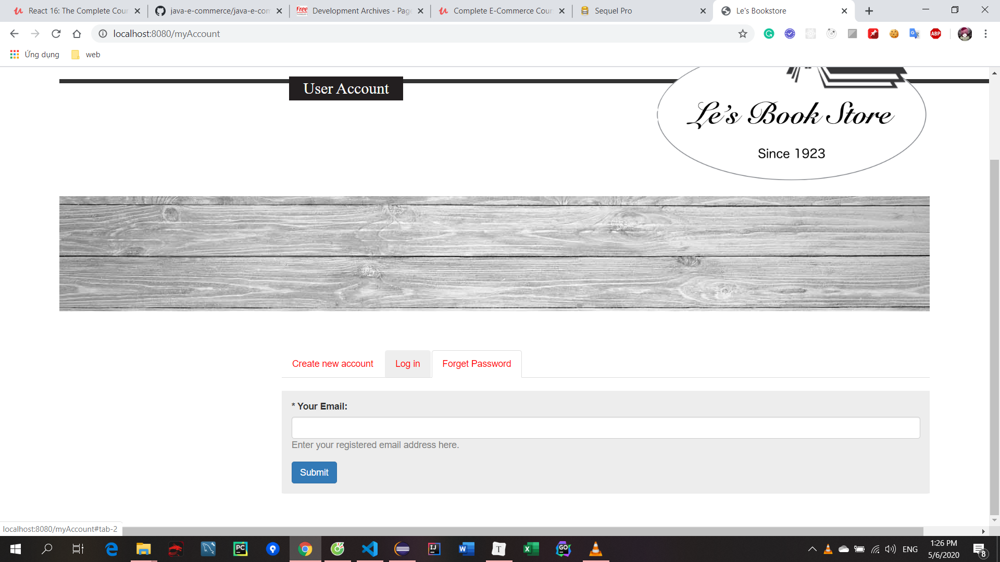

[TOC]

C:\Users\phuong\AppData\Local\Programs\Python\Python37\python.exe F:/programing/language/python/python-docs/readfile.py


## 1. Introduction and Overview
### 1. Download this source files first !!!!.html
### 2. Course Overview


### 3. Project Tour

  


### 4. Project Modules

  

  


### 5. Tools We Need

Vào marketpalce install spring tool 3

  


https://www.sequelpro.com/


## 2. Getting Started
### 1. Start Project with Index Page

https://getbootstrap.com/docs/3.4/examples/navbar/

CTRL U

download bs 3.3.7

Eclipse: file new/ Spring starter project
  

  

Check

  

Khi mới tạo file pom.xml bị lỗi

http://maven.apache.org/settings.html

https://stackoverflow.com/questions/31901320/pom-error-failure-to-find-org-springframework-boot

https://stackoverflow.com/questions/32125025/maven-and-spring-boot-non-resolvable-parent-pom-repo-spring-io-unknown-host

Obviously it's a problem with your internet connection. Check, if you can reach [http://repo.spring.io](http://repo.spring.io/) with your browser. If yes, check if you need to configure a proxy server. If no, you should contact your internet provider.

Here is the documentation, how you configure a proxy server for Maven: https://maven.apache.org/guides/mini/guide-proxies.html

old

```xml
<settings>
<proxies>
  <proxy>
    <id>proxy</id>
    <active>false</active>
    <protocol>http</protocol>
    <host>proxy.fujinet.vn</host>
    <port>8080</port>
  </proxy>
</proxies>

<mirrors>
    <mirror>
        <id>central-no-ssl</id>
        <name>Central without ssl</name>
        <url>http://repo.maven.apache.org/maven2</url>
        <mirrorOf>central</mirrorOf>
    </mirror>
  </mirrors>
  
</settings>
<!-- Author: hung-pm -->

```

new in .m2

```xml
<settings>
<proxies>
  <proxy>
    <id>proxy</id>
    <active>false</active>
    <protocol>http</protocol>
    <host>proxy.fujinet.vn</host>
    <port>8080</port>
  </proxy>
</proxies>

<mirrors>
</mirrors>
  
</settings>

```

Xóa mirror thì hết lỗi

There might have been some intermittent Internet issue or something. I was facing the same problem yesterday. Updating the the project (On STS or Eclipse, right click on the project and Maven -> Update project -> tick everything except *Offline*) after sometime fixed it.

copy all file in bs3 to static folder

Create controller package, 

HomeController

```java
package com.bookstore.controller;

import org.springframework.stereotype.Controller;
import org.springframework.web.bind.annotation.RequestMapping;

@Controller
public class HomeController {
	@RequestMapping("/")
	public String index() {
		return "index";
	}
}

```

static/style.css

```css
body {
 
}

hr {
	border: none;
	height: 1px;
	color: #333;
	background-color: #333;
}

.container {
	width: 90%;
}

.page-top {
	margin-top: -70px;
}

.navbar {
  margin-bottom: 20px;
}

.box {
	border: 1px solid red;
}

.home-headline{
	font-family: 'Times New Roman', Times, serif;
	font-size:24px;
	color: #fff;
	margin: auto;
	text-align: center;
	margin-top: -13px;
}

.home-headline span {
	background-color: #231F20;
    padding: 5px 22px;
	
}
```

template/index.html

```html

<!DOCTYPE html>
<html lang="en">
<head>
<meta charset="utf-8" />
<meta http-equiv="X-UA-Compatible" content="IE=edge" />
<meta name="viewport" content="width=device-width, initial-scale=1" />

<title>Navbar Template for Bootstrap</title>

<!-- Bootstrap core CSS -->
<link href="/css/bootstrap.min.css" rel="stylesheet" />

<!-- Custom styles for this template -->
<link href="/css/style.css" rel="stylesheet" />
</head>

<body>
	<!-- Static navbar -->
	<nav class="navbar navbar-default navbar-inverse">
		<div class="container-fluid">
			<div class="navbar-header">
				<button type="button" class="navbar-toggle collapsed"
					data-toggle="collapse" data-target="#navbar" aria-expanded="false"
					aria-controls="navbar">
					<span class="sr-only">Toggle navigation</span> <span
						class="icon-bar"></span> <span class="icon-bar"></span> <span
						class="icon-bar"></span>
				</button>
				<a class="navbar-brand" href="#">Project name</a>
			</div>
			<div id="navbar" class="navbar-collapse collapse">
				<ul class="nav navbar-nav">
					<li class="active"><a href="#">Home</a></li>
					<li><a href="#">About</a></li>
					<li><a href="#">Contact</a></li>
					<li class="dropdown"><a href="#" class="dropdown-toggle"
						data-toggle="dropdown" role="button" aria-haspopup="true"
						aria-expanded="false">Dropdown <span class="caret"></span></a>
						<ul class="dropdown-menu">
							<li><a href="#">Action</a></li>
							<li><a href="#">Another action</a></li>
							<li><a href="#">Something else here</a></li>
							<li role="separator" class="divider"></li>
							<li class="dropdown-header">Nav header</li>
							<li><a href="#">Separated link</a></li>
							<li><a href="#">One more separated link</a></li>
						</ul></li>
				</ul>
				<ul class="nav navbar-nav navbar-right">
					<li class="active"><a href="./">Default <span
							class="sr-only">(current)</span></a></li>
					<li><a href="../navbar-static-top/">Static top</a></li>
					<li><a href="../navbar-fixed-top/">Fixed top</a></li>
				</ul>
			</div>
			<!--/.nav-collapse -->
		</div>
		<!--/.container-fluid -->
	</nav>

	<div class="container box">
		<div class="row">

			<!-- carousel -->
			<div class="col-xs-8">
				<div id="carousel-example-generic" class="carousel slide"
					data-ride="carousel">
					<!-- Indicators -->
					<ol class="carousel-indicators">
						<li data-target="#carousel-example-generic" data-slide-to="0"
							class="active"></li>
						<li data-target="#carousel-example-generic" data-slide-to="1"></li>
						<li data-target="#carousel-example-generic" data-slide-to="2"></li>
					</ol>

					<!-- Wrapper for slides -->
					<div class="carousel-inner" role="listbox">
						<div class="item active">
							
							<div class="carousel-caption">
								<h4>First Thumbnail Label</h4>
								<p>Contrary to popular belief, Lorem Ipsum is not simply
									random text. It has roots in a piece of classical Latin
									literature from 45 BC, making it over 2000 years old.</p>
							</div>
						</div>
						<div class="item">
							
							<div class="carousel-caption">
								<h4>First Thumbnail Label</h4>
								<p>Contrary to popular belief, Lorem Ipsum is not simply
									random text. It has roots in a piece of classical Latin
									literature from 45 BC, making it over 2000 years old.</p>
							</div>
						</div>
						<div class="item">
							
							<div class="carousel-caption">
								<h4>First Thumbnail Label</h4>
								<p>Contrary to popular belief, Lorem Ipsum is not simply
									random text. It has roots in a piece of classical Latin
									literature from 45 BC, making it over 2000 years old.</p>
							</div>
						</div>
						...
					</div>

					<!-- Controls -->
					<a class="left carousel-control" href="#carousel-example-generic"
						role="button" data-slide="prev"> <span
						class="glyphicon glyphicon-chevron-left" aria-hidden="true"></span>
						<span class="sr-only">Previous</span>
					</a> <a class="right carousel-control" href="#carousel-example-generic"
						role="button" data-slide="next"> <span
						class="glyphicon glyphicon-chevron-right" aria-hidden="true"></span>
						<span class="sr-only">Next</span>
					</a>
				</div>
			</div>
			<div class="col-xs-4"></div>
		</div>
	</div>


	<!-- Bootstrap core JavaScript
    ================================================== -->
	<!-- Placed at the end of the document so the pages load faster -->
	<script
		src="https://ajax.googleapis.com/ajax/libs/jquery/1.12.4/jquery.min.js"></script>
	<script src="/js/bootstrap.min.js"></script>
</body>
</html>

```

pom.xml

```js
<?xml version="1.0" encoding="UTF-8"?>
<project xmlns="http://maven.apache.org/POM/4.0.0" xmlns:xsi="http://www.w3.org/2001/XMLSchema-instance"
	xsi:schemaLocation="http://maven.apache.org/POM/4.0.0 http://maven.apache.org/xsd/maven-4.0.0.xsd">
	<modelVersion>4.0.0</modelVersion>

	<groupId>com.bookstore</groupId>
	<artifactId>bookstore</artifactId>
	<version>0.0.1-SNAPSHOT</version>
	<packaging>jar</packaging>

	<name>Bookstore</name>
	<description>frontend part for our bookstore project</description>

	<parent>
		<groupId>org.springframework.boot</groupId>
		<artifactId>spring-boot-starter-parent</artifactId>
		<version>1.4.3.RELEASE</version>
		<relativePath/> <!-- lookup parent from repository -->
	</parent>

	<properties>
		<project.build.sourceEncoding>UTF-8</project.build.sourceEncoding>
		<project.reporting.outputEncoding>UTF-8</project.reporting.outputEncoding>
		<java.version>1.8</java.version>
	</properties>

	<dependencies>
		<dependency>
			<groupId>org.springframework.boot</groupId>
			<artifactId>spring-boot-starter-thymeleaf</artifactId>
		</dependency>
	
		<dependency>
			<groupId>org.springframework.boot</groupId>
			<artifactId>spring-boot-starter-web</artifactId>
		</dependency>

		<dependency>
			<groupId>org.springframework.boot</groupId>
			<artifactId>spring-boot-starter-test</artifactId>
			<scope>test</scope>
		</dependency>
	</dependencies>

	<build>
		<plugins>
			<plugin>
				<groupId>org.springframework.boot</groupId>
				<artifactId>spring-boot-maven-plugin</artifactId>
			</plugin>
		</plugins>
	</build>


</project>

```

  

Run as/ Spring boot app

http://localhost:8080/


### 2. Adding Carousel in Index Page


### 3. Adding More Pictures

index.html wrap carousel với panel class

```html
<body>
	<div class="page-top"
		style="width: 100%; height: 20px; background-color: #f46b42;"></div>
    
<!-- carousel -->
			<div class="col-xs-8">
				<div class="panel panel-default">
					<div class="panel-body">
                        ...
<!-- add -->
<div class="col-xs-4">
		
</div>
                        
div class="row">
			<div class="col-xs-4">
				<div clas="panel panel-default">
					<div class="panel-body">
						
					</div>
				</div>
			</div>
			<div class="col-xs-4">
				<div clas="panel panel-default">
					<div class="panel-body">
						
					</div>
				</div>
			</div>
			<div class="col-xs-4">
				<div clas="panel panel-default">
					<div class="panel-body">
						
					</div>
				</div>
			</div>
		</div>

		<div>
			<div class="home-headline">
				<span>Featured Books</span>
			</div>
			<hr style="margin-top: -15px;" />
		</div>


		<div class="row">
			<div id="featured-books" class="carousel slide" data-ride="carousel">
				<!-- Indicators -->
				<ol class="carousel-indicators">
					<li data-target="#featured-books" data-slide-to="0" class="active"></li>
					<li data-target="#featured-books" data-slide-to="1"></li>
					<li data-target="#featured-books" data-slide-to="2"></li>
				</ol>

				<!-- Wrapper for slides -->
				<div class="carousel-inner" role="listbox">
					<div class="item active">
						<div class="row">
							<div class="col-xs-2">
								
							</div>
							<div class="col-xs-2">
								
							</div>
							<div class="col-xs-2">
								
							</div>
							<div class="col-xs-2">
								
							</div>
							<div class="col-xs-2">
								
							</div>
							<div class="col-xs-2">
								
							</div>
						</div>
					</div>
					<div class="item">
						<div class="row">
							<div class="col-xs-2">
								
							</div>
							<div class="col-xs-2">
								
							</div>
							<div class="col-xs-2">
								
							</div>
							<div class="col-xs-2">
								
							</div>
							<div class="col-xs-2">
								
							</div>
							<div class="col-xs-2">
								
							</div>
						</div>
					</div>
					<div class="item">
						<div class="row">
							<div class="col-xs-2">
								
							</div>
							<div class="col-xs-2">
								
							</div>
							<div class="col-xs-2">
								
							</div>
							<div class="col-xs-2">
								
							</div>
							<div class="col-xs-2">
								
							</div>
							<div class="col-xs-2">
								
							</div>
						</div>
					</div>
				</div>

				<!-- Controls -->
				<a class="left carousel-control" href="##featured-books"
					role="button" data-slide="prev"> <span
					class="glyphicon glyphicon-chevron-left" aria-hidden="true"></span>
					<span class="sr-only">Previous</span>
				</a> <a class="right carousel-control" href="##featured-books"
					role="button" data-slide="next"> <span
					class="glyphicon glyphicon-chevron-right" aria-hidden="true"></span>
					<span class="sr-only">Next</span>
				</a>
			</div>
		</div>
```

  


### 4. Adding Featured-books and Non-responsive CSS

index.html

```css

<link href="/css/non-responsive.css" rel="stylesheet" />

<!-- Custom styles for this template -->
<link href="/css/style.css" rel="stylesheet" />

<link rel="icon" href="/image/apple-touch-icon.png" />

<body>
	<div class="page-top"

```

style.css

```css

.page-top {
	margin-top: -70px;
}
```

https://getbootstrap.com/docs/3.4/examples/non-responsive/

https://getbootstrap.com/docs/3.3/getting-started/#disable-responsive


### 5. Navbar

style.css

```css

.home-headline span {
	background-color: #231F20;
    padding: 5px 22px;
	
}
```

index.js thêm đoạn background img

```html
<!-- Wrapper for slides -->
				<div class="carousel-inner" role="listbox">
					<div class="item active">
						
						<div class="carousel-caption">
							<div class="row">
```

Xóa ở navbar đi

```html
<button type="button" class="navbar-toggle collapsed"
					data-toggle="collapse" data-target="#navbar" aria-expanded="false"
					aria-controls="navbar">
					<span class="sr-only">Toggle navigation</span> <span
						class="icon-bar"></span> <span class="icon-bar"></span> <span
						class="icon-bar"></span>
				</button>
```

#### Special character

& empersand

&#38

&nbsp

---


index.html

```html
<!-- Static navbar -->
		<nav class="navbar navbar-default navbar-inverse">
			<div class="container-fluid">
				<div class="navbar-header">
					<a class="navbar-brand" href="#">LE'S BOOKSTORE</a>
				</div>
				<div id="navbar">
					<ul class="nav navbar-nav navbar-left">
						<li class="dropdown"><a href="#" class="dropdown-toggle"
							data-toggle="dropdown" role="button" aria-haspopup="true"
							aria-expanded="false">BOOKS <span class="caret"></span></a>
							<ul class="dropdown-menu">
								<li><a href="#">Browse the bookshelf</a></li>
								<li><a href="#">Store hours &#38; Directions</a></li>
								<li><a href="#">FAQ</a></li>

							</ul></li>
						<form class="navbar-form">
							<div class="form-group">
								<input type="text" name="keyword" class="form-control"
									placeholder="Book title" />
							</div>
							<button type="submit" class="btn btn-default">Search</button>
						</form>
					</ul>
					<ul class="nav navbar-nav navbar-right">
						<li><a href="#">SHOPPING CART</a></li>
						<li><a href="#">MY ACCOUNT</a></li>
						<li><a href="#">LOGOUT</a></li>
					</ul>
				</div>
				<!--/.nav-collapse -->
			</div>
			<!--/.container-fluid -->
		</nav>
```


### 6. Adding Common Part of Template

common/header.html

```html
<html lang="en" xmlns:th="http://www.w3.org/1999/xhtml" >
<head th:fragment="common-header">
    
    <div th:fragment="navbar">
	<div th:fragment="body-bottom-scripts">

```

index.html

```html
<!DOCTYPE html>
<html lang="en" xmlns:th="http://www.w3.org/1000/xhtml">
<head th:replace="common/header :: common-header" />

<body>
	<div th:replace="common/header :: navbar" />
    <div th:replace="common/header :: body-bottom-scripts" />

```

  


## 3. My Account
### 1. Adding MyAccount Page

HomeController

```js
package com.bookstore.controller;

import org.springframework.stereotype.Controller;
import org.springframework.web.bind.annotation.RequestMapping;

@Controller
public class HomeController {
	@RequestMapping("/")
	public String index() {
		return "index";
	}
	
    // add
	@RequestMapping("/myAccount")
	public String myAccount() {
		return "myAccount";
	}
}

```

myAccount.html

```html

<!DOCTYPE html>
<html lang="en" xmlns:th="http://www.w3.org/1000/xhtml">
<head th:replace="common/header :: common-header" />

<body>
	<div th:replace="common/header :: navbar" />

	<div class="container">
		<div class="row" style="margin-bottom: -100px;">
			<div class="col-xs-8">
				<h2 class="section-headline"><span>User Account</span></h2>
			</div>
			<div class="col-xs-4">
				
			</div>
		</div>
		<hr style="position:absolute; width:100%; height:6px; background-color: #333; z-index:-1; margin-top:-80px;" />
		
		
		<div class="row" style="margin-top: 120px;">
			<div class="col-xs-9 col-xs-offset-3">
				
				<!-- Nav tabs -->
				<ul class="nav nav-tabs">
					<li><a href="#tab-1" data-toggle="tab"><span style="color:red;">Create new account</span></a></li>
					<li><a href="#tab-2" data-toggle="tab"><span style="color:red;">Log in</span></a></li>
					<li><a href="#tab-3" data-toggle="tab"><span style="color:red;">Forget Password</span></a></li>
				</ul>
			
			</div>
		</div>
	</div>
	<!-- end of container -->


	<div th:replace="common/header :: body-bottom-scripts" />
</body>
</html>

```

style.css

```css

.section-headline {
	font-family: 'Times New Roman', Times, serif;
	font-size:24px;
	color: #fff;
	margin: auto;
	text-align: center;
	margin-top: 90px;
}

.section-headline span {
	background-color: #231F20;
    padding: 5px 22px;
	
}
```


### 2. Adding MyAccount Page Body

myAccount.html

```html
<div class="row" style="margin-top: 60px;">
			<div class="col-xs-9 col-xs-offset-3">

				<!-- Nav tabs -->
				<ul class="nav nav-tabs">
					<li><a href="#tab-1" data-toggle="tab"><span
							style="color: red;">Create new account</span></a></li>
					<li><a href="#tab-2" data-toggle="tab"><span
							style="color: red;">Log in</span></a></li>
					<li><a href="#tab-3" data-toggle="tab"><span
							style="color: red;">Forget Password</span></a></li>
				</ul>

				<!-- Tab panels -->
				<div class="tab-content">
				
					<!-- create new user pane -->
					<div class="tab-pane fade" id="tab-1">
						<div class="panel-group">
							<div class="panel panel-default" style="border: none;">
								<div class="panel-body"
									style="background-color: #ededed; margin-top: 20px;">
									<form>
										<div class="form-group">
											<label for="newUsername">* Username: </label> <input
												required="required" type="text" class="form-control"
												id="newUsername" name="username" />
											<p style="color: #828282">Enter your username here.</p>
										</div>

										<div class="form-group">
											<label for="email">* Email Address: </label> <input
												required="required" type="text" class="form-control"
												id="email" name="email" />
											<p style="color: #828282">A valid email address. All
												emails from the system withll be sent to this address. The
												email address is not made public and will only be used if
												you wish to receive a new password or wish to receive
												certain notification.</p>
										</div>
										
										<button type="submit" class="btn btn-primary">Create new account</button>
									</form>
								</div>
							</div>
						</div>
					</div>
					
					<!-- log in -->
					<div class="tab-pane fade" id="tab-2">
						<div class="panel-group">
							<div class="panel panel-default" style="border: none;">
								<div class="panel-body"
									style="background-color: #ededed; margin-top: 20px;">
									<form>
										<div class="form-group">
											<label for="newUsername">* Username: </label> <input
												required="required" type="text" class="form-control"
												id="newUsername" name="username" />
											<p style="color: #828282">Enter your username here.</p>
										</div>

										<div class="form-group">
											<label for="password">* Password: </label> <input
												required="required" type="password" class="form-control"
												id="password" name="password" />
											<p style="color: #828282">Enter the password that accompanies your username</p>
										</div>
										
										<button type="submit" class="btn btn-primary">Log in</button>
									</form>
								</div>
							</div>
						</div>
					</div>
					
					<!-- forget password -->
					<div class="tab-pane fade" id="tab-3">
						<div class="panel-group">
							<div class="panel panel-default" style="border: none;">
								<div class="panel-body"
									style="background-color: #ededed; margin-top: 20px;">
									<form>
										<div class="form-group">
											<label for="recoverEmail">* Your Email: </label> <input
												required="required" type="text" class="form-control"
												id="recoverEmail" name="email" />
											<p style="color: #828282">Enter your registered email address here.</p>
										</div>

										<button type="submit" class="btn btn-primary">Submit</button>
									</form>
								</div>
							</div>
						</div>
					</div>
				</div>
			</div>
		</div>
```

  



### 3. Adding User Entity, JPA, Hibernate and MySQL

https://stackoverflow.com/questions/50177907/com-mysql-jdbc-exceptions-jdbc4-mysqlnontransientconnectionexception-could-not/50186856

Nếu lỗi thêm version cho mysql connector

pom.xml

```xml

		<dependency>
			<groupId>org.springframework.boot</groupId>
			<artifactId>spring-boot-starter-jdbc</artifactId>
		</dependency>

		<dependency>
			<groupId>org.springframework.boot</groupId>
			<artifactId>spring-boot-starter-data-jpa</artifactId>
		</dependency>
		
		<dependency>
			<groupId>org.springframework.boot</groupId>
			<artifactId>spring-boot-starter-security</artifactId>
		</dependency>

		<dependency>
			<groupId>mysql</groupId>
			<artifactId>mysql-connector-java</artifactId>
		</dependency>
```

domain/User.java

```java
package com.bookstore.domain;

import javax.persistence.Column;
import javax.persistence.Entity;
import javax.persistence.GeneratedValue;
import javax.persistence.GenerationType;
import javax.persistence.Id;

@Entity
public class User{
	
	@Id
	@GeneratedValue(strategy=GenerationType.AUTO)
	@Column(name="id", nullable = false, updatable = false)
	private Long id;
	private String username;
	private String password;
	private String firstName;
	private String lastName;
	
	@Column(name="email", nullable = false, updatable = false)
	private String email;
	private String phone;
	private boolean enabled=true;
	
	public Long getId() {
		return id;
	}
	public void setId(Long id) {
		this.id = id;
	}
	public String getUsername() {
		return username;
	}
	public void setUsername(String username) {
		this.username = username;
	}
	public String getPassword() {
		return password;
	}
	public void setPassword(String password) {
		this.password = password;
	}
	public String getFirstName() {
		return firstName;
	}
	public void setFirstName(String firstName) {
		this.firstName = firstName;
	}
	public String getLastName() {
		return lastName;
	}
	public void setLastName(String lastName) {
		this.lastName = lastName;
	}
	public String getEmail() {
		return email;
	}
	public void setEmail(String email) {
		this.email = email;
	}
	public String getPhone() {
		return phone;
	}
	public void setPhone(String phone) {
		this.phone = phone;
	}
	public boolean isEnabled() {
		return enabled;
	}
	public void setEnabled(boolean enabled) {
		this.enabled = enabled;
	}
	
	
}


```

application.properties

```properties
spring.thymeleaf.cache=false


# ===============================
# = DATA SOURCE
# ===============================

# Set here configurations for the database connection
spring.datasource.url=jdbc:mysql://localhost:3306/bookstoredatabase

# Username and secret
spring.datasource.username=root
spring.datasource.password=sesame

# Keep the connection alive if idle for a long time (needed in production)
spring.datasource.testWhileIdle = true
spring.datasource.validationQuery = SELECT 1

# ===============================
# = JPA / HIBERNATE
# ===============================

# Use spring.jpa.properties.* for Hibernate native properties (the prefix is
# stripped before adding them to the entity manager).

# Show or not log for each sql query
spring.jpa.show-sql=true

# Hibernate ddl auto (create, create-drop, update): with "update" the database
# schema will be automatically updated accordingly to java entities found in
# the project
spring.jpa.hibernate.ddl-auto = update

# Allows Hibernate to generate SQL optimized for a particular DBMS
spring.jpa.properties.hibernate.dialect = org.hibernate.dialect.MySQL5Dialect


```

Sau khi run app thì vào schema refresh => new table user

### 4. Adding Security and Security Entities

Create package security/Authority.java

```java
package com.bookstore.domain.security;

import org.springframework.security.core.GrantedAuthority;

public class Authority implements GrantedAuthority{
	private final String authority;
	
	public Authority(String authority) {
		this.authority = authority;
	}
	
	@Override
	public String getAuthority() {
		return authority;
	}
}

```

Role.java

```java
package com.bookstore.domain.security;

import java.util.HashSet;
import java.util.Set;

import javax.persistence.CascadeType;
import javax.persistence.Entity;
import javax.persistence.FetchType;
import javax.persistence.Id;
import javax.persistence.OneToMany;

@Entity
public class Role {

	@Id
	private int roleId;
	private String name;
	
	@OneToMany(mappedBy = "role", cascade=CascadeType.ALL, fetch=FetchType.LAZY)
	private Set<UserRole> userRoles = new HashSet<>();

	// Get set
	
	
}

```

UserRole.java

```java
package com.bookstore.domain.security;

import javax.persistence.Entity;
import javax.persistence.FetchType;
import javax.persistence.GeneratedValue;
import javax.persistence.GenerationType;
import javax.persistence.Id;
import javax.persistence.JoinColumn;
import javax.persistence.ManyToOne;
import javax.persistence.Table;

import com.bookstore.domain.User;

@Entity
@Table(name="user_role")
public class UserRole {

	@Id
	@GeneratedValue(strategy=GenerationType.AUTO)
	private Long userRoleId;
	
	@ManyToOne(fetch = FetchType.EAGER)
	@JoinColumn(name="user_id")
	private User user;
	
	@ManyToOne(fetch = FetchType.EAGER)
	@JoinColumn(name="role_id")
	private Role role;
	
	
	public UserRole(User user, Role role) {
		this.user = user;
		this.role = role;
	}
// get set
	
}

```

### 5. Adding Security Configuration

config/SecurityConfig

```java
package com.bookstore.config;

import org.springframework.beans.factory.annotation.Autowired;
import org.springframework.context.annotation.Configuration;
import org.springframework.core.env.Environment;
import org.springframework.security.config.annotation.authentication.builders.AuthenticationManagerBuilder;
import org.springframework.security.config.annotation.method.configuration.EnableGlobalMethodSecurity;
import org.springframework.security.config.annotation.web.builders.HttpSecurity;
import org.springframework.security.config.annotation.web.configuration.EnableWebSecurity;
import org.springframework.security.config.annotation.web.configuration.WebSecurityConfigurerAdapter;
import org.springframework.security.crypto.bcrypt.BCryptPasswordEncoder;
import org.springframework.security.web.util.matcher.AntPathRequestMatcher;

import com.bookstore.service.impl.UserSecurityService;

@Configuration
@EnableWebSecurity
@EnableGlobalMethodSecurity(prePostEnabled=true)
public class SecurityConfig extends WebSecurityConfigurerAdapter {
	@Autowired
	private Environment env;
	
	@Autowired
	private UserSecurityService userSecurityService;
	
	private BCryptPasswordEncoder passwordEncoder() {
		return SecurityUtility.passwordEncoder();
	}
	
	private static final String[] PUBLIC_MATCHERS = {
			"/css/**",
			"/js/**",
			"/image/**",
			"/",
			"/myAccount"
	};
	
	@Override
	protected void configure(HttpSecurity http) throws Exception {
		http
			.authorizeRequests().
		/*	antMatchers("/**").*/
			antMatchers(PUBLIC_MATCHERS).
			permitAll().anyRequest().authenticated();
		
		http
			.csrf().disable().cors().disable()
			.formLogin().failureUrl("/login?error").defaultSuccessUrl("/")
			.loginPage("/login").permitAll()
			.and()
			.logout().logoutRequestMatcher(new AntPathRequestMatcher("/logout"))
			.logoutSuccessUrl("/?logout").deleteCookies("remember-me").permitAll()
			.and()
			.rememberMe();
	}
	
	@Autowired
	public void configureGlobal(AuthenticationManagerBuilder auth) throws Exception {
		auth.userDetailsService(userSecurityService).passwordEncoder(passwordEncoder());
	}
	
}

```

service/impl/UserSecurityService

```java
package com.bookstore.service.impl;

import org.springframework.beans.factory.annotation.Autowired;
import org.springframework.security.core.userdetails.UserDetails;
import org.springframework.security.core.userdetails.UserDetailsService;
import org.springframework.security.core.userdetails.UsernameNotFoundException;
import org.springframework.stereotype.Service;

import com.bookstore.domain.User;
import com.bookstore.repository.UserRepository;

@Service
public class UserSecurityService implements UserDetailsService{
	
	@Autowired
	private UserRepository userRepository;
	
	@Override
	public UserDetails loadUserByUsername(String username) throws UsernameNotFoundException {
		User user = userRepository.findByUsername(username);
		
		if(null == user) {
			throw new UsernameNotFoundException("Username not found");
		}
		
		return user;
	}

}

```

repository/UserRepository

```java
package com.bookstore.repository;

import org.springframework.data.repository.CrudRepository;

import com.bookstore.domain.User;

public interface UserRepository extends CrudRepository<User, Long> {
	User findByUsername(String username);
}

```


Lúc này chỉ còn lỗi SecurityUtility

### 6. Adding More to Login

create package utility/SecurityUtility

```java
package com.bookstore.utility;

import java.security.SecureRandom;
import java.util.Random;

import org.springframework.context.annotation.Bean;
import org.springframework.security.crypto.bcrypt.BCryptPasswordEncoder;
import org.springframework.stereotype.Component;

@Component
public class SecurityUtility {
	private static final String SALT = "salt"; // Salt should be protected carefully
	
	@Bean
	public static BCryptPasswordEncoder passwordEncoder() {
		return new BCryptPasswordEncoder(12, new SecureRandom(SALT.getBytes()));
	}
	
	@Bean
	public static String randomPassword() {
		String SALTCHARS = "ABCEFGHIJKLMNOPQRSTUVWXYZ1234567890";
		StringBuilder salt = new StringBuilder();
		Random rnd = new Random();
		
		while (salt.length()<18) {
			int index= (int) (rnd.nextFloat()*SALTCHARS.length());
			salt.append(SALTCHARS.charAt(index));
		}
		String saltStr = salt.toString();
		return saltStr;
	}
}

```

HomeController

```java
package com.bookstore.controller;

import org.springframework.stereotype.Controller;
import org.springframework.ui.Model;
import org.springframework.web.bind.annotation.RequestMapping;

@Controller
public class HomeController {
	@RequestMapping("/")
	public String index() {
		return "index";
	}
	
	@RequestMapping("/login")
	public String login(Model model) {
		model.addAttribute("classActiveLogin", true);
		return "myAccount";
	}
	
	@RequestMapping("/forgetPassword")
	public String forgetPassword(Model model) {
		model.addAttribute("classActiveForgetPassword", true);
		return "myAccount";
	}
	
	@RequestMapping("/newUser")
	public String newUser(Model model) {
		model.addAttribute("classActiveNewUser", true);
		return "myAccount";
	}
}

```

myAccount.hmtl

```html
<!-- Nav tabs -->
				<ul class="nav nav-tabs">
					<li th:classappend="${classActiveNewAccount}? 'active'"><a href="#tab-1" data-toggle="tab"><span
							style="color: red;">Create new account</span></a></li>
					<li th:classappend="${classActiveLogin}? 'active'"><a href="#tab-2" data-toggle="tab"><span
							style="color: red;">Log in</span></a></li>
					<li th:classappend="${classActiveForgetPassword}? 'active'"><a href="#tab-3" data-toggle="tab"><span
							style="color: red;">Forget Password</span></a></li>
				</ul>

					<!-- log in -->
<div class="tab-pane fade" id="tab-2" th:classappend="${classActiveLogin}? 'in active'">

```

header.html

```html
<ul class="nav navbar-nav navbar-right">
		<li><a href="#">SHOPPING CART</a></li>
		<li><a th:href="@{/login}">MY ACCOUNT</a></li>
		<li><a href="#">LOGOUT</a></li>
</ul>
```


### 7. Adding PasswordResetToken and UserService

domain/PasswordResetToken.java

```java
package com.bookstore.domain.security;

import java.util.Calendar;
import java.util.Date;

import javax.persistence.Entity;
import javax.persistence.FetchType;
import javax.persistence.GeneratedValue;
import javax.persistence.GenerationType;
import javax.persistence.Id;
import javax.persistence.JoinColumn;
import javax.persistence.OneToOne;

import com.bookstore.domain.User;

@Entity
public class PasswordResetToken {

	private static final int EXPIRATION = 60 * 24;
	
	@Id
	@GeneratedValue(strategy = GenerationType.AUTO)
	private Long id;
	
	private String token;
	
	@OneToOne(targetEntity = User.class, fetch = FetchType.EAGER)
	@JoinColumn(nullable=false, name="user_id")
	private User user;
	
	private Date expiryDate;
	
	public PasswordResetToken(final String token, final User user) {
		super ();
		
		this.token = token;
		this.user = user;
		this.expiryDate = calculateExpiryDate(EXPIRATION);
	}
	
	private Date calculateExpiryDate (final int expiryTimeInMinutes) {
		final Calendar cal = Calendar.getInstance();
		cal.setTimeInMillis(new Date().getTime());
		cal.add(Calendar.MINUTE, expiryTimeInMinutes);
		return new Date(cal.getTime().getTime());
	}
	
	public void updateToken(final String token) {
		this.token = token;
		this.expiryDate = calculateExpiryDate(EXPIRATION);
	}

	public Long getId() {
		return id;
	}

	public void setId(Long id) {
		this.id = id;
	}

	public String getToken() {
		return token;
	}

	public void setToken(String token) {
		this.token = token;
	}

	public User getUser() {
		return user;
	}

	public void setUser(User user) {
		this.user = user;
	}

	public Date getExpiryDate() {
		return expiryDate;
	}

	public void setExpiryDate(Date expiryDate) {
		this.expiryDate = expiryDate;
	}

	public static int getExpiration() {
		return EXPIRATION;
	}

	@Override
	public String toString() {
		return "PasswordResetToken [id=" + id + ", token=" + token + ", user=" + user + ", expiryDate=" + expiryDate
				+ "]";
	}
	
	
}

```

UserService.java

```java
package com.bookstore.service;

import com.bookstore.domain.User;
import com.bookstore.domain.security.PasswordResetToken;

public interface UserService {
	PasswordResetToken getPasswordResetToken(final String token);
	
	void createPasswordResetTokenForUser(final User user, final String token);
}

```

UserServiceImpl

```java
package com.bookstore.service.impl;

import org.springframework.beans.factory.annotation.Autowired;
import org.springframework.stereotype.Service;

import com.bookstore.domain.User;
import com.bookstore.domain.security.PasswordResetToken;
import com.bookstore.repository.PasswordResetTokenRepository;
import com.bookstore.service.UserService;

@Service
public class UserServiceImpl implements UserService{
	
	@Autowired
	private PasswordResetTokenRepository passwordResetTokenRepository;
	
	@Override
	public PasswordResetToken getPasswordResetToken(final String token) {
		return passwordResetTokenRepository.findByToken(token);
	}
	
	@Override
	public void createPasswordResetTokenForUser(final User user, final String token) {
		final PasswordResetToken myToken = new PasswordResetToken(token, user);
		passwordResetTokenRepository.save(myToken);
	}

}

```

PasswordResetTokenRepository.java

```java
package com.bookstore.repository;

import java.util.Date;
import java.util.stream.Stream;

import org.springframework.data.jpa.repository.JpaRepository;
import org.springframework.data.jpa.repository.Modifying;
import org.springframework.data.jpa.repository.Query;

import com.bookstore.domain.User;
import com.bookstore.domain.security.PasswordResetToken;

public interface PasswordResetTokenRepository extends JpaRepository<PasswordResetToken, Long> {
	
	PasswordResetToken findByToken(String token);
	
	PasswordResetToken findByUser(User user);
	
	Stream<PasswordResetToken> findAllByExpiryDateLessThan(Date now);
	
	@Modifying
	@Query("delete from PasswordResetTOken t where t.expirydate <= ?1")
	void deleteAllExpiredSince(Date now);

}

```


### 8. Addin MyProfile Page

HomeController.java

```java

```

gg: thymleaf string api

https://www.thymeleaf.org/apidocs/thymeleaf/2.0.5/org/thymeleaf/expression/Strings.html

myProfile.html thêm Edit user information 

```html

<!DOCTYPE html>
<html lang="en" xmlns:th="http://www.w3.org/1000/xhtml">
<head th:replace="common/header :: common-header" />

<body>
	<div th:replace="common/header :: navbar" />

	<div class="container">
		<div class="row" style="margin-bottom: -100px;">
			<div class="col-xs-8">
				<h2 class="section-headline">
					<h2 class="section-headline">
						<span th:text="${#strings.toUpperCase{user.username}}"></span>
					</h2>
				</h2>
			</div>
			<div class="col-xs-4">
				
			</div>
		</div>
		<hr
			style="position: absolute; width: 100%; height: 6px; background-color: #333; z-index: -1; margin-top: -80px;" />
		

		<div class="row" style="margin-top: 60px;">
			<div class="col-xs-9 col-xs-offset-3">

				<!-- Nav tabs -->
				<ul class="nav nav-tabs">
					<li th:classappend="${classActiveEdit}? 'active'"><a
						href="#tab-1" data-toggle="tab"><span style="color: red;">Edit</span></a></li>
					<li th:classappend="${classActiveOrders}? 'active'"><a
						href="#tab-2" data-toggle="tab"><span style="color: red;">Orders</span></a></li>
					<li th:classappend="${classActiveBilling}? 'active'"><a
						href="#tab-3" data-toggle="tab"><span style="color: red;">Billing</span></a></li>
					<li th:classappend="${classActiveShipping}? 'active'"><a
						href="#tab-4" data-toggle="tab"><span style="color: red;">Shipping</span></a></li>
				</ul>

				<!-- Tab panels -->
				<div class="tab-content">

					<!-- Edit user information -->
					<div class="tab-pane fade" id="tab-1"
						th:classappend="${classActiveEdit}? 'in active'">
						<div class="panel-group">
							<div class="panel panel-default" style="border: none;">
								<div class="panel-body"
									style="background-color: #ededed; margin-top: 20px;">
									<form th:action="@{/updateUserInfo}" method="post">
										<input type="hidden" name="id" th:value="${user.id}">

										<div class="bg-info" th:if="${updateUserInfo}">User info
											updated.</div>

										<div class="form-group">
											<div class="row">
												<div class="col-xs-6">
													<label for="firstName">First Name</label> <input
														type="text" class="form-control" id="firstName"
														name="firstName" th:value="${user.firstName}" />
												</div>
												<div class="col-xs-6">
													<label for="lastName">Last Name</label> <input
														type="text" class="form-control" id="lastName"
														name="lastName" th:value="${user.lastName}" />
												</div>
											</div>
										</div>
										
										<div class="form-group">
											<label for="userName">Username</label> '
											<input
														type="text" class="form-control" id="userName"
														name="userName" th:value="${user.userName}" />
										</div>
										<div class="form-group">
											<label for="currentPassword">Current Password</label> '
											<input
														type="text" class="form-control" id="currentPassword"
														name="currentPassword" th:value="${currentPassword}" />
										</div>
										<p style="color:#828282">Enter your current password to change the email address or password.</p>

										<div class="form-group">
											<label for="email">* Email Address</label> '
											<input
														type="text" class="form-control" id="email"
														name="email" th:value="${user.email}" />
										</div>
										<p style="color:#828282">A valid email address. All
												emails from the system withll be sent to this address. The
												email address is not made public and will only be used if
												you wish to receive a new password or wish to receive
												certain notification.</p>
												
										<div class="form-group">
											<label for="txtNewPassword">Password</label> '
											<input
														type="password" class="form-control" id="txtNewPassword"
														name="newPassword" />
										</div>
										
										<div class="form-group">
											<label for="txtConfirmPassword">Confirm Password</label> '
											<input
														type="password" class="form-control" id="txtConfirmPassword"
														 />
										</div>
										<p style="color:#828282">To change the current user password, enter the new password in both fields.</p>
										
										<button type="submit" class="btn btn-primary">Create
											new account</button>
									</form>
								</div>
							</div>
						</div>
					</div>

					<!-- log in -->
					<div class="tab-pane fade" id="tab-2"
						th:classappend="${classActiveLogin}? 'in active'">
						<div class="panel-group">
							<div class="panel panel-default" style="border: none;">
								<div class="panel-body"
									style="background-color: #ededed; margin-top: 20px;">
									<form>
										<div class="form-group">
											<label for="newUsername">* Username: </label> <input
												required="required" type="text" class="form-control"
												id="newUsername" name="username" />
											<p style="color: #828282">Enter your username here.</p>
										</div>

										<div class="form-group">
											<label for="password">* Password: </label> <input
												required="required" type="password" class="form-control"
												id="password" name="password" />
											<p style="color: #828282">Enter the password that
												accompanies your username</p>
										</div>

										<button type="submit" class="btn btn-primary">Log in</button>
									</form>
								</div>
							</div>
						</div>
					</div>

					<!-- forget password -->
					<div class="tab-pane fade" id="tab-3"
						th:classappend="${classActiveForgetPassword}? 'in active'">
						<div class="panel-group">
							<div class="panel panel-default" style="border: none;">
								<div class="panel-body"
									style="background-color: #ededed; margin-top: 20px;">
									<form>
										<div class="form-group">
											<label for="recoverEmail">* Your Email: </label> <input
												required="required" type="text" class="form-control"
												id="recoverEmail" name="email" />
											<p style="color: #828282">Enter your registered email
												address here.</p>
										</div>

										<button type="submit" class="btn btn-primary">Submit</button>
									</form>
								</div>
							</div>
						</div>
					</div>
				</div>
			</div>
		</div>
	</div>
	<!-- end of container -->


	<div th:replace="common/header :: body-bottom-scripts" />
</body>
</html>

```


### 9. Adding New User Controller

pom.xml

```xml
<dependency>
			<groupId>org.thymeleaf.extras</groupId>
			<artifactId>thymeleaf-extras-springsecurity4</artifactId>
		</dependency>
```

header.html

```html
<html lang="en" xmlns:th="http://www.w3.org/1999/xhtml" xmlns:sec="http://www.w3.org/1999/xhtml">

    <ul class="nav navbar-nav navbar-right">
		<li><a href="#">SHOPPING CART</a></li>
		<li><a sec:authorize="isAnonymous()" th:href="@{/login}">MY ACCOUNT</a></li>
		<li><a sec:authorize="isAuthenticated()" th:href="@{/myProfile}">MY ACCOUNT</a></li>
		<li><a sec:authorize="isAuthenticated()" href="@{/logout}">LOGOUT</a></li>
	</ul>
```

HomeController

```java

	@RequestMapping(value="/newUser", method=RequestMethod.POST)
	public String newUserPost(
			HttpServletRequest request,
			@ModelAttribute("email") String userEmail,
			@ModelAttribute("username") String username,
			Model model
			) throws Exception{
		model.addAttribute("classActiveNewAccount", true);
		model.addAttribute("email", userEmail);
		model.addAttribute("username", username);
		
		if (userService.findByUsername(username) != null) {
			model.addAttribute("usernameExists", true);
			
			return "myAccount";
		}
		
		if (userService.findByEmail(userEmail) != null) {
			model.addAttribute("email", true);
			
			return "myAccount";
		}
		
		User user = new User();
		user.setUsername(username);
		user.setEmail(userEmail);
		
		String password = SecurityUtility.randomPassword();
		
		String encryptedPassword = SecurityUtility.passwordEncoder().encode(password);
		user.setPassword(encryptedPassword);
		
		Role role = new Role();
		role.setRoleId(1);
		role.setName("ROLE_USER");
		Set<UserRole> userRoles = new HashSet<>();
		userRoles.add(new UserRole(user, role));
		userService.createUser(user, userRoles);
		
		
	}
	
```

UserService.java

```java

	User findByUsername(String username);
	
	User findByEmail (String email);
```

UserServiceImpl.java

```java
@Override
	public User findByUsername(String username) {
		return userRepository.findByUsername(username);
	}
	
	public User findByEmail (String email) {
		return userRepository.findByEmail(email);
```

### 10. Adding Create User Logic

UserServiceImpl.java

```java

	public User createUser(User user, Set<UserRole> userRoles) throws Exception{
		User localUser = userRepository.findByUsername(user.getUsername());
		
		if(localUser != null) {
			throw new Exception("user already exists. Nothing will be done");
		} else {
			for (UserRole ur : userRoles) {
				roleRepository.save(ur.getRole());
			}
			
			user.getUserRoles().addAll(userRoles);
			
			localUser = userRepository.save(user);
		}
		
		return localUser;
	}
```

RoleRepository

```java
package com.bookstore.repository;

import org.springframework.data.repository.CrudRepository;

import com.bookstore.domain.security.Role;

public interface RoleRepository extends CrudRepository<Role, Long> {
	Role findByname(String name);
}

```

HomeController.java

```java
@Autowired
	private JavaMailSender mailSender;
	
	@Autowired
	private MailConstructor mailConstructor;


	@RequestMapping(value="/newUser", method=RequestMethod.POST)
	public String newUserPost(
			HttpServletRequest request,
			@ModelAttribute("email") String userEmail,
			@ModelAttribute("username") String username,
			Model model
			) throws Exception{
		model.addAttribute("classActiveNewAccount", true);
		model.addAttribute("email", userEmail);
		model.addAttribute("username", username);
		
		if (userService.findByUsername(username) != null) {
			model.addAttribute("usernameExists", true);
			
			return "myAccount";
		}
		
		if (userService.findByEmail(userEmail) != null) {
			model.addAttribute("email", true);
			
			return "myAccount";
		}
		
		User user = new User();
		user.setUsername(username);
		user.setEmail(userEmail);
		
		String password = SecurityUtility.randomPassword();
		
		String encryptedPassword = SecurityUtility.passwordEncoder().encode(password);
		user.setPassword(encryptedPassword);
		
		Role role = new Role();
		role.setRoleId(1);
		role.setName("ROLE_USER");
		Set<UserRole> userRoles = new HashSet<>();
		userRoles.add(new UserRole(user, role));
		userService.createUser(user, userRoles);
		
		String token = UUID.randomUUID().toString();
		userService.createPasswordResetTokenForUser(user, token);
		
		String appUrl = "http://"+request.getServerName()+":"+request.getServerPort()+request.getContextPath();
		
		SimpleMailMessage email = mailConstructor.constructResetTokenEmail(appUrl, request.getLocale(), token, user, password);
		
		mailSender.send(email);
		
		model.addAttribute("emailSent", "true");
		
		return "myAccount";
	}
	

```

pom.xml

```xml
		<dependency>
			<groupId>org.springframework</groupId>
			<artifactId>spring-context-support</artifactId>
		</dependency>

		<dependency>
			<groupId>javax.mail</groupId>
			<artifactId>mail</artifactId>
			<version>1.4.7</version>
		</dependency>
```

utility/MailConstructor

```java
package com.bookstore.utility;

import java.util.Locale;

import org.springframework.beans.factory.annotation.Autowired;
import org.springframework.core.env.Environment;
import org.springframework.mail.SimpleMailMessage;
import org.springframework.stereotype.Component;

import com.bookstore.domain.User;

@Component
public class MailConstructor {
	@Autowired
	private Environment env;
	
	public SimpleMailMessage constructResetTokenEmail(
			String contextPath, Locale locale, String token, User user, String password
			) {
		
		String url = contextPath = "/newUser?token="+token;
		String message = "\nPlease click on this link to verify your email and edit your personal information. Your password is: \n"+password;
		SimpleMailMessage email = new SimpleMailMessage();
		email.setTo(user.getEmail());
		email.setSubject("Le's Bookstore - New User");
		email.setText(url+message);
		email.setFrom(env.getProperty("support.email"));
		return email;
		
	}
}

```

application.properties

```properties


spring.mail.host=smtp.gmail.com
spring.mail.username=ray.deng83@gmail.com
spring.mail.password=Rochester25
spring.mail.properties.mail.smtp.auth=true
spring.mail.properties.mail.smtp.socketFactory.port=465
spring.mail.properties.mail.smtp.socketFactory.class=javax.net.ssl.SSLSocketFactory
spring.mail.properties.mail.smtp.socketFactory.fallback=false
support.email=ray.deng83@gmail.com

```

BookstoreApplication

```java

	@Override
	public void run(String... args) throws Exception {
		User user1 = new User();
		user1.setFirstName("John");
		user1.setLastName("Adams");
		user1.setUsername("j");
		user1.setPassword(SecurityUtility.passwordEncoder().encode("p"));
		user1.setEmail("JAdams@gmail.com");
		Set<UserRole> userRoles = new HashSet<>();
		Role role1= new Role();
		role1.setRoleId(1);
		role1.setName("ROLE_USER");
		userRoles.add(new UserRole(user1, role1));
		
		userService.createUser(user1, userRoles);
	}
```


### 11. Create New User Trouble Shooting

myAccount create new user

```html
<div class="alert alert-info" th:if="${emailSent}">
										An email has been sent to the email address you just registered. Please validate your email address and update your password information.
</div>

<form th:action="@{/newUser}" method="post">
```

DROP all table

SecurityConfig

```java
private static final String[] PUBLIC_MATCHERS = {
			"/css/**",
			"/js/**",
			"/image/**",
			"/",
			"/newUser",  // add
			"/forgetPassword"
	};
```

UserServiceImpl

```java
	private static final Logger LOG = LoggerFactory.getLogger(UserService.class);

public User createUser(User user, Set<UserRole> userRoles){
		User localUser = userRepository.findByUsername(user.getUsername());
		
		if(localUser != null) {
            // add
			LOG.info("user {} already exists. Nothing will be done.", user.getUsername());
		}
```

PasswordResetToken

```java
	public PasswordResetToken(){}

```

HomeController.java

```java
// line 140
		model.addAttribute("user", user);

```


### 12. Wrapping MyAccount Login

myAccount

```html
<form th:action="@{/newUser}" method="post">
<div class="form-group">
	<label for="newUsername">* Username: </label>&nbsp;<span
		style="color: red;" th:if="${usernameExists}">Username
		already exists. Choose a different one.</span> <input
		required="required" type="text" class="form-control"
		id="newUsername" name="username" />
	<p style="color: #828282">Enter your username here.</p>
</div>

<div class="form-group">
	<label for="email">* Email Address: </label><span
		style="color: red;" th:if="${emailExists}">Email
		already exists. Choose a different one.</span> <input
		required="required" type="text" class="form-control"
		id="email" name="email" />
	<p style="color: #828282">A valid email address. All
		emails from the system withll be sent to this address. The
		email address is not made public and will only be used if
		you wish to receive a new password or wish to receive
		certain notification.</p>
</div>

<button type="submit" class="btn btn-primary">Create
	new account</button>
</form>
```

SecurityConfig

```java
private static final String[] PUBLIC_MATCHERS = {
			"/css/**",
			"/js/**",
			"/image/**",
			"/",
			"/newUser",
			"/forgetPassword",
    
    // add
			"/login",
			"/fonts/**"
	};
```

HomeController

```java

	@RequestMapping("/forgetPassword")
	public String forgetPassword(
			HttpServletRequest request,
			@ModelAttribute("email") String email,
			Model model
			) {

		model.addAttribute("classActiveForgetPassword", true);
		
		User user = userService.findByEmail(email);
		
		if (user == null) {
			model.addAttribute("emailNotExist", true);
			return "myAccount";
		}
		
		String password = SecurityUtility.randomPassword();
		
		String encryptedPassword = SecurityUtility.passwordEncoder().encode(password);
		user.setPassword(encryptedPassword);
		
		userService.save(user);
		
		String token = UUID.randomUUID().toString();
		userService.createPasswordResetTokenForUser(user, token);
		
		String appUrl = "http://"+request.getServerName()+":"+request.getServerPort()+request.getContextPath();
		
		SimpleMailMessage newEmail = mailConstructor.constructResetTokenEmail(appUrl, request.getLocale(), token, user, password);
		
		mailSender.send(newEmail);
		
		model.addAttribute("forgetPasswordEmailSent", "true");
		
		
		return "myAccount";
	}
```

UserServiceImpl.java

```java
	@Override
	public User save(User user) {
		return userRepository.save(user);
	}

```

myAccount => forget password

## 4. Getting Started on Admin Portal
### 1. Entity Relationship
### 2. AdminPortal - Book Entity
### 3. AdminPortal - Home Template
### 4. AdminPortal - Login Page
### 5. AdminPortal - Add Login Function
### 6. AdminPortal - Adding New Book Form
### 7. AdminPortal - Add New Book Form - part 2
### 8. AdminPortal - Modify New Book Form
### 9. AdminPortal - Add New Book Backend Logic

### 10. AdminPortal - View BookList


## 5. BookStore Frontend
### 1. BookStore - Add Bookshelf
### 2. Bookstore - Add Book Detail Page
### 3. Bookstore - Add Book Detail Page - part 2
### 4. AdminPortal - Add BookInfo Page
### 5. AdminPortal - Add Update Book Page
### 6. AdminPortal - Add Update Book Logic
### 7. AdminPortal - Add Various Plugin
## 6. Enhance the Features
### 1. Bookstore - Adding MyProfile Controller
### 2. Bookstore - Adding UserShipping and UserPayment
### 3. Bookstore - Add UserShipping and UserBilling Logic
### 4. Bookstore - Add CreditCard Template
### 5. Bookstore - Finish the CreditCard Page
### 6. Bookstore - Add New CreditCard Post Logic
### 7. Bookstore - Add Update CreditCard Info
### 8. Bookstore - Remove CreditCard and Set Default CreditCard
### 9. Bookstore - Add UserShiping Template

### 10. Bookstore - Add New Shipping Logic

### 11. Bookstore - Update Remove and SetDefault for UserShipping

## 7. A Journey of Shopping Cart
### 1. Bookstore - Add Entities for ShoppingCart and Order
### 2. Bookstore - Add Other Entities
### 3. Bookstore - Add ShoppingCart Template
### 4. Bookstore - Add More Services and Controls
### 5. Bookstore - Add ShoppingCart Logic
### 6. Bookstore - Add Book to ShoppingCart
### 7. Bookstore - Test Adding Book to ShoppingCart
### 8. Bookstore - Update Qty and Delete function in ShoppingCart
## 8. Starting Checkout
### 1. Bookstore - Adding Checkout Page
### 2. Bookstore - Add Shipping Template
### 3. Bookstore - Add Billing Info Template
### 4. Bookstore - Add Review Items Template
### 5. Bookstore - Adding Checkout Related Services
### 6. Bookstore - Adding Checkout Info - part 2
### 7. Bookstore - Add Use This Shipping and Use This Payment
### 8. Bookstore - Add Billing the Same As Shipping
## 9. Submit Order Dance
### 1. Bookstore - Handling Order Submit
### 2. Bookstore - Add Create Order Service
### 3. Bookstore - Add Order Confirmation Email Template
### 4. Bookstore - Finish Checkout Order
### 5. Bookstore - Fix UpdateUserInfo
### 6. Bookstore - Debugging Submitting Order and Email


## 10. Some More Features

### 1. Bookstore - Add View Order Detail Template

### 2. Bookstore - Add Order Detail Controller

### 3. AdminPortal - Import Book Data

### 4. Bookstore - Scenario Testing and Bug Fixing

### 5. AdminPortal - Add Delete Book Functionality

### 6. AdminPortal - Finish Up Deleting

### 7. Bookstore - Some Other Enhancement

### 8. Bookstore - Add SearchByCategory Logic

### 9. Bookstore - Fuzzy Search

## 11. Wrap Up

### 1. Closing

======== list file ========

Process finished with exit code 0


