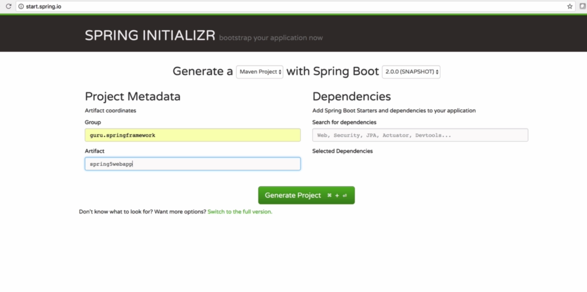
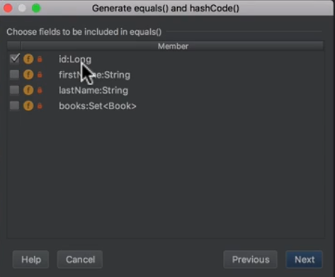
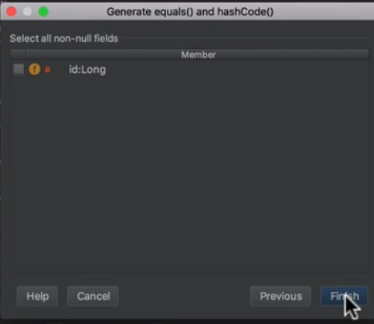

[TOC]


C:\Users\Admin\AppData\Local\Programs\Python\Python38-32\python.exe E:/programing/language/python/python-docs/readfile.py
======== name dir ========

## 1. Introduction to Spring Framework 5 Beginner to Guru
### 1. Spring Framework 5 - Course Introduction
### 2. Instructor Introduction - John Thompson, Spring Framework Guru

https://github.com/springframeworkguru/spring5webapp

### 3. Getting the Most out of Your Spring Framework 5 Course!
### 4. Setting up your Development Environment for Spring
### 4.1 DevEnvSetUp.pdf.pdf

Verify Your Environment
• Verify Java is installed: java -version
• Verify JDK is installed: javac -version
• Verify Maven is installed: mvn -v
• Verify Gradle is installed: gradle -v  

### 5. Is Your IDE Free Like a Puppy
### 6. Free 120 Day IntelliJ IDEA Trial!.html

#### Free 120 Day Trial for IntelliJ IDEA Ultimate

In this course, you will see me using the IntelliJ IDE. I feel this is the best IDE to use for Spring Framework Development. And I am not alone in that opinion, with almost 60% of the market, IntelliJ is the most popular IDE to use for Java development. 

You are welcome to use free IDEs such as Eclipse or STS. I've designed all source code examples to be IDE agnostic. 

But if you wish to give IntelliJ a try, I can help you out!

Through my partnership with JetBrains, I can get you a free 120 day trial for IntelliJ IDEA Ultimate! 

Just head over to [this link](https://springframework.guru/udemy-90-day-trial-license-intellij-spring-5/) to receive a free 120 day trial code!

John Thompson,

Become a Spring Framework Guru!


### 7. What's New in Spring Framework 5.html

Spring Framework 5.0 is the first major release of the Spring Framework since version 4 was released in December of 2013. [Juergen Hoeller](https://spring.io/team/jhoeller), Spring Framework project lead [announced](https://spring.io/blog/2016/07/28/spring-framework-5-0-m1-released) the release of the first Spring Framework 5.0 milestone (5.0 M1) on 28 July 2016.

Now, a year later, we are looking forward to Release Candidate 3 (RC3) to be released on July 18th, 2017. This is expected to be the final release on the [roadmap](https://jira.spring.io/browse/spr/?selectedTab=com.atlassian.jira.jira-projects-plugin:roadmap-panel) to the first GA (General Availability) release of Spring Framework 5.0.

I’m excited about the new features and enhancements in Spring Framework 5.0.

At a high level, features of Spring Framework 5.0 can be categorized into:

- JDK baseline update
- Core framework revision
- Core container updates
- Functional programming with Kotlin
- Reactive Programming Model
- Testing improvements
- Library support
- Discontinued support

#### JDK Baseline Update for Spring Framework 5.0

The entire Spring framework 5.0 codebase runs on Java 8. Therefore, Java 8 is the minimum requirement to work on Spring Framework 5.0.

This is actually very significant for the framework. While as developers, we’ve been able to enjoy all the new features found in modern Java releases. The framework itself was carrying a lot of baggage in supporting deprecated Java releases.

The framework now requires a minimum of Java 8.

Originally, Spring Framework 5.0 was expected to release on Java 9. However, with the Java 9 release running 18 months + behind, the [Spring team](https://twitter.com/springframework/lists/team/members) decided to decouple the Spring Framework 5.0 release from Java 9.

However, when Java 9 is released ([expected in September of 2017](http://openjdk.java.net/projects/jdk9/)), Spring Framework 5.0 will be ready.

#### Core Framework Revision

The core Spring Framework 5.0 has been revised to utilize the new features introduced in Java 8. The key ones are:

- Based on Java 8 reflection enhancements, method parameters in Spring Framework 5.0 can be efficiently accessed.
- Core Spring interfaces now provide selective declarations built on Java 8 default methods.
- @Nullable and @NotNull annotations to explicitly mark nullable arguments and return values. This enables dealing null values at compile time rather than throwing NullPointerExceptions at runtime.

On the logging front, Spring Framework 5.0 comes out of the box with Commons Logging bridge module, named spring-jcl instead of the standard Commons Logging. Also, this new version will auto detect Log4j 2.x, SLF4J, JUL ( java.util.logging) without any extra bridges.

Defensive programming also gets a thrust with the Resource abstraction providing the isFile indicator for thegetFile method.

#### Core Container Updates

Spring Framework 5.0 now supports candidate component index as an alternative to classpath scanning. This support has been added to shortcut the candidate component identification step in the classpath scanner.

An application build task can define its own META-INF/spring.components file for the current project. At compilation time, the source model is introspected and JPA entities and Spring Components are flagged.

Reading entities from the index rather than scanning the classpath does not have significant differences for small projects with less than 200 classes. However, it has significant impacts on large projects.

Loading the component index is cheap. Therefore the startup time with the index remains constant as the number of classes increase. While for a compoent scan the startup time increases significantly.

What this means for us developers on large Spring projects, the startup time for our applications will be reduced significantly. While 20 or 30 seconds does not seem like much, when you’re waiting for that dozens or hundreds of times a day, it adds up. Using the component index will help with your daily productivity.

You can find more information on the component index feature on [Spring’s Jira](https://jira.spring.io/browse/SPR-11890).

Now @Nullable annotations can also be used as indicators for optional injection points. Using @Nullableimposes an obligation on the consumers that they must prepare for a value to be null. Prior to this release, the only way to accomplish this is through [Android’s Nullable](https://developer.android.com/reference/android/support/annotation/Nullable.html), [Checker Framework’s Nullable](https://checkerframework.org/api/org/checkerframework/checker/nullness/qual/Nullable.html), and [JSR 305’s Nullable](https://jcp.org/en/jsr/detail?id=305).

Some other new and enhanced features from the release note are:

- Implementation of functional programming style in GenericApplicationContext andAnnotationConfigApplicationContext
- Consistent detection of transaction, caching, async annotations on interface methods.
- XML configuration namespaces streamlined towards unversioned schemas.

#### Functional Programming with Kotlin

Spring Framework 5.0 introduces support for JetBrains [Kotlin](https://kotlinlang.org/) language. Kotlin is an object-oriented language supporting functional programming style.

Kotlin runs on top of the JVM, but not limited to it. With Kotlin support, developers can dive into functional Spring programming, in particular for functional Web endpoints and bean registration.

In Spring Framework 5.0, you can write clean and idiomatic Kotlin code for Web functional API, like this.

```
{
("/movie" and accept(TEXT_HTML)).nest {
GET("/", movieHandler::findAllView)
GET("/{card}", movieHandler::findOneView)
}
("/api/movie" and accept(APPLICATION_JSON)).nest {
GET("/", movieApiHandler::findAll)
GET("/{id}", movieApiHandler::findOne)
}
}
```

For bean registration, as an alternative to XML or @Configuration and @Bean, you can now use Kotlin to register your Spring Beans, like this:

```
val context = GenericApplicationContext {
registerBean()
registerBean { Cinema(it.getBean()) }
}
```

#### Reactive Programming Model

An exciting feature in this Spring release is the new reactive stack Web framework.

Being fully reactive and non-blocking, this Spring Framework 5.0 is suitable for event-loop style processing that can scale with a small number of threads.

[Reactive Streams](http://springframework.guru/reactive-streams-in-java/) is an API specification developed by engineers from Netflix, Pivotal, Typesafe, Red Hat, Oracle, Twitter, and Spray.io. This provides a common API for reactive programming implementations to implement. Much like JPA for Hibernate. Where JPA is the API, and Hibernate is the implementation.

The Reactive Streams API is officially part of Java 9. In Java 8, you will need to include a dependency for the Reactive Streams API specification.

Streaming support in Spring Framework 5.0 is built upon [Project Reactor](https://projectreactor.io/), which implements the Reactive Streams API specification.

Spring Framework 5.0 has a new spring-webflux module that supports reactive HTTP and WebSocket clients. Spring Framework 5.0 also provides support for reactive web applications running on servers which includes REST, HTML, and WebSocket style interactions.

I have a detailed post about Reactive Streams [here](http://springframework.guru/reactive-streams-in-java/).

There are two distinct programming models on the server-side in spring-webflux:

- Annotation-based with @Controller and the other annotations of Spring MVC
- Functional style routing and handling with Java 8 lambda

With Spring Webflux, you can now create WebClient, which is reactive and non-blocking as an alternative toRestTemplate.

A WebClient implementation of a REST endpoint in Spring 5.0 is this.

```
WebClient webClient = WebClient.create();
Mono person = webClient.get()
.uri("http://localhost:8080/movie/42")
.accept(MediaType.APPLICATION_JSON)
.exchange()
.then(response -> response.bodyToMono(Movie.class));
```

While the new WebFlux module brings us some exciting new capabilities, traditional Spring MVC is still fully supported in Spring Framework 5.0.

#### Testing Improvements

Spring Framework 5.0 fully supports [Junit 5 Jupiter](http://junit.org/junit5/docs/current/user-guide/) to write tests and extensions in JUnit 5. In addition to providing a programming and extension model, the Jupiter sub-project provides a test engine to run Jupiter based tests on Spring.

In addition, Spring Framework 5 provides support for parallel test execution in Spring TestContext Framework. For the reactive programming model, spring-test now includes WebTestClient for integrating testing support for Spring WebFlux. The new WebTestClient, similar to MockMvc does not need a running server. Using a mock request and response, WebTestClient can bind directly to the WebFlux server infrastructure.

For a complete list enhancements in the existing TestContext framework, you can refer [here](https://github.com/spring-projects/spring-framework/wiki/What's-New-in-the-Spring-Framework#testing-improvements).

Of course, Spring Framework 5.0 still supports our old friend JUnit 4 as well! At the time of writing, JUnit 5 is just about to go GA. Support for JUnit 4 is going to be with the Spring Framework for some time into the future.

#### Library Support

Spring Framework 5.0 now supports the following upgraded library versions:

- [Jackson 2.6](https://github.com/FasterXML/jackson/wiki/Jackson-Release-2.6)+
- [EhCache](http://www.ehcache.org/documentation/3.0/) 2.10+ / 3.0 GA
- [Hibernate 5.0](https://docs.jboss.org/hibernate/orm/5.0/userguide/html_single/Hibernate_User_Guide.html)+
- [JDBC 4.0](https://docs.oracle.com/javadb/10.8.3.0/ref/rrefjdbc4_0summary.html)+
- [XmlUnit 2.x](https://github.com/xmlunit/user-guide/wiki)+
- [OkHttp 3.x](https://square.github.io/okhttp/)+
- [Netty 4.1](https://netty.io/wiki/user-guide-for-4.x.html)+

#### Discontinued Support

At the API level, Spring Framework 5.0 has discontinued support for the following packages:

- beans.factory.access
- jdbc.support.nativejdbc
- mock.staticmock of the spring-aspects module.
- web.view.tiles2M. Now Tiles 3 is the minimum requirement.
- orm.hibernate3 and orm.hibernate4. Now, Hibernate 5 is the supported framework.

Spring Framework 5.0 has also discontinued support for the following libraries:

- Portlet
- Velocity
- JasperReports
- XMLBeans
- JDO
- Guava

If you are using any of the preceding packages, it is recommended to stay on Spring Framework 4.3.x.

#### Summary

The highlight of the Spring Framework 5.0 is definitely reactive programming, which is a significant paradigm shift.

You can look at Spring Framework 5.0 as a cornerstone release for reactive programs. For the remainder of 2017 and beyond, you can expect to see child projects implement reactive features. You will see reactive programming features added to upcoming releases of Spring Data, Spring Security, Spring Integration and more.

The Spring Data team has already implemented reactive support for MongoDB and Redis.

It’s still too early to get reactive support with JDBC. The JDBC specification itself is blocking. So, its going to be some time before we see reactive programming with traditional JDBC databases.

While Reactive Programming is the shiny new toy inside of Spring Framework 5.0, it’s not going to be supported everywhere. The downstream technologies need to provide reactive support.

With the growing popularity of Reactive Programming, we can expect to see more and more technologies implement Reactive solutions. The reactive landscape is rapidly evolving. Spring Framework 5 uses Reactor, which is Reactive Streams compliant implementation. You can read more about the Reactive Streams specification [here](http://springframework.guru/reactive-streams-in-java/).

### 8. Getting Help with the Spring Framework
### 9. Course Slack Room - Chat Live with Me and Other Gurus!.html

## 2. Building a Spring Boot Web App
### 1. Introduction to Building a Spring Boot Web App

### 2. Spring Initializr

  

Chọn H2, JPA, WEB, Thymeleaf

Phần Ops chọn actuator

### 3. Open Project in IntelliJ

```shell
./mvnw spring-boot:run
# run app
```


### 3.1 Ending Source.html

https://github.com/springframeworkguru/spring5webapp

### 4. Using JPA Entities

Author 

```java
package guru.springframework.spring5webapp.model;

import javax.persistence.*;
import java.util.HashSet;
import java.util.Set;

/**
 * Created by jt on 5/16/17.
 */
@Entity
public class Author {

    @Id
    @GeneratedValue(strategy = GenerationType.AUTO)
    private Long id;
    private String firstName;
    private String lastName;

    @ManyToMany(mappedBy = "authors")
    private Set<Book> books  = new HashSet<>();

    public Author() {
    }

    public Author(String firstName, String lastName) {
        this.firstName = firstName;
        this.lastName = lastName;
    }

    public Author(String firstName, String lastName, Set<Book> books) {
        this.firstName = firstName;
        this.lastName = lastName;
        this.books = books;
    }

    public Long getId() {
        return id;
    }

    public void setId(Long id) {
        this.id = id;
    }

    public String getFirstName() {
        return firstName;
    }

    public void setFirstName(String firstName) {
        this.firstName = firstName;
    }

    public String getLastName() {
        return lastName;
    }

    public void setLastName(String lastName) {
        this.lastName = lastName;
    }

    public Set<Book> getBooks() {
        return books;
    }

    public void setBooks(Set<Book> books) {
        this.books = books;
    }
}
```

Book.java

```java
package guru.springframework.spring5webapp.model;

import javax.persistence.*;
import java.util.HashSet;
import java.util.Set;

/**
 * Created by jt on 5/16/17.
 */
@Entity
public class Book {
    @Id
    @GeneratedValue(strategy = GenerationType.AUTO)
    private Long id;
    private String title;
    private String isbn;
    private String publisher;

    @ManyToMany
    @JoinTable(name = "author_book", joinColumns = @JoinColumn(name = "book_id"),
    inverseJoinColumns = @JoinColumn(name = "author_id"))
    private Set<Author> authors = new HashSet<>();

    public Book() {
    }

    public Book(String title, String isbn, String publisher) {
        this.title = title;
        this.isbn = isbn;
        this.publisher = publisher;
    }

    public Book(String title, String isbn, String publisher, Set<Author> authors) {
        this.title = title;
        this.isbn = isbn;
        this.publisher = publisher;
        this.authors = authors;
    }

    public Long getId() {
        return id;
    }

    public void setId(Long id) {
        this.id = id;
    }

    public String getTitle() {
        return title;
    }

    public void setTitle(String title) {
        this.title = title;
    }

    public String getIsbn() {
        return isbn;
    }

    public void setIsbn(String isbn) {
        this.isbn = isbn;
    }

    public String getPublisher() {
        return publisher;
    }

    public void setPublisher(String publisher) {
        this.publisher = publisher;
    }

    public Set<Author> getAuthors() {
        return authors;
    }

    public void setAuthors(Set<Author> authors) {
        this.authors = authors;
    }
}
```

application.properties

```properties
spring.h2.console.enabled=true

```


### 4.1 Starting Source.html
### 4.2 Ending Source.html
### 4.2 Starting Source.html
### 4.3 Ending Source.html

https://github.com/springframeworkguru/spring5webapp/tree/jpa-entities

### 5. Equality in Hibernate

Thêm equals toString 

Chỉ chọn id 

  

Phần này để trống

  

Author

```java
 @Override
    public boolean equals(Object o) {
        if (this == o) return true;
        if (o == null || getClass() != o.getClass()) return false;

        Author author = (Author) o;

        return id != null ? id.equals(author.id) : author.id == null;
    }

    @Override
    public int hashCode() {
        return id != null ? id.hashCode() : 0;
    }

    @Override
    public String toString() {
        return "Author{" +
                "id=" + id +
                ", firstName='" + firstName + '\'' +
                ", lastName='" + lastName + '\'' +
                ", books=" + books +
                '}';
    }
```


### 5.1 Ending Source.html

https://github.com/springframeworkguru/spring5webapp/tree/equals

### 5.2 Starting Source.html
### 6. Using GitHub
### 6.1 UsingGitHub.pdf.pdf
### 6.2 GitHub and Git Foundations.html
### 6.2 What is Github.html

https://www.youtube.com/watch?v=w3jLJU7DT5E

### 6.3 GitHub and Git Foundations.html

https://www.youtube.com/watch?v=HwrPhOp6-aM&list=PL0lo9MOBetEHhfG9vJzVCTiDYcbhAiEqL

### 6.3 What is Github.html
### 7. Code Examples in GitHub
### 7.1 Ending Source.html
### 7.2 Starting Source.html
### 8. Spring Data JPA Repositories
### 8.1 Ending Source.html
### 8.1 Starting Source.html
### 8.2 Ending Source.html
### 8.2 Starting Source.html
### 8.3 UsingSpringDataJPA.pdf.pdf
### 9. Initializing Data with Spring Framework Events
### 9.1 Ending Source.html
### 9.2 Starting Source.html
### 10. Assignment - Add Publisher Entity
### 10.1 Starting Source.html
### 10.2 AssignmentPublisherEntity.pdf.pdf
### 11. Assignment Review of Add Publisher Entity
### 11.1 Ending Source.html
### 11.1 Starting Source.html
### 11.2 Ending Source.html
### 11.2 Starting Source.html
### 12. Introduction to Spring MVC
### 13. Configuring Spring MVC Controllers
### 13.1 Ending Source.html
### 13.1 Starting Source.html
### 13.2 ConfiguringSpringControllers.pdf.pdf
### 13.2 Starting Source.html
### 13.3 ConfiguringSpringControllers.pdf.pdf
### 13.3 Ending Source.html
### 14. Thymeleaf Templates
### 14.1 IntroThymeleafTemplates.pdf.pdf
### 14.2 Starting Source.html
### 14.3 Ending Source.html
### 15. Assignment - Display List of Authors
### 15.1 AssginmentDisplayListOfAuthors.pdf.pdf
### 16. Assignment Review - Display List of Authors
### 16.1 Starting Source.html
### 16.2 Ending Source.html
### 17. Introduction to Spring Pet Clinic
### 17.1 Starting Source.html
### 17.2 2017-01-springframeworkpetclinic-170209204315.pdf.pdf
### 17.2 Ending Source.html
### 17.3 2017-01-springframeworkpetclinic-170209204315.pdf.pdf
### 17.3 Other Source.html
### 17.4 Ending Source.html
### 17.4 Other Source.html
### 18. Running Spring Pet Clinic
### 18.1 Starting Source.html
### 19. Intro to SFG Version of Spring PetClinic Application
### 19.1 IntroSFGSpringPetClinic.pdf.pdf
### 20. Spring Pet Clinic - Initializing Spring PetClinic Application
### 21. Spring Pet Clinic - Task Planning
### 22. Conclusion

## 3. Dependency Injection with the Spring Framework
### 1. Introduction to Dependency Injection with Spring
### 10. Spring Profiles
### 10.1 Starting Source.html
### 10.2 Ending Source.html
### 11. Default Profile Behavior for Spring Context
### 11.1 Ending Source.html
### 11.1 Starting Source.html
### 11.2 Ending Source.html
### 11.2 Starting Source.html
### 12. Spring Bean Life Cycle
### 12.1 SpringBeanLifeCycle.pdf.pdf
### 13. Dependency Injection Assignment
### 13.1 Starting Source.html
### 14. Dependency Injection Assignment Review
### 14.1 Ending Source.html
### 14.1 Starting Source.html
### 14.2 Ending Source.html
### 14.2 Starting Source.html
### 15. Spring Bean Life Cycle Demo
### 15.1 Starting Source.html
### 15.2 Ending Source.html
### 16. Flashcards
### 16.1 Section3FlashCards.pdf.pdf
### 17. Single Responsibility Principle.html
### 18. Open Closed Principle.html
### 19. Liskov Substitution Principle.html
### 2. SOLID Principles of OOP
### 2.1 SOLIDOOP.pdf.pdf
### 20. Interface Segregation Principle.html
### 21. Dependency Inversion Principle.html
### 22. Interface Naming Conventions
### 22.1 InterfaceNamingConvetions.pdf.pdf
### 23. Spring Pet Clinic - POJO Data Model
### 24. Spring Pet Clinic - Multi-Module Maven Builds
### 24.1 Change for Spring Boot 2.1+ (cant find main class error).html
### 25. Spring Pet Clinic - Using the Maven Release Plugin
### 26. Spring Pet Clinic - Create Interfaces for Services
### 27. Spring Pet Clinic - Implement Base Entity
### 28. Conclusion
### 3. Create an Spring Framework DI Example Project
### 3.1 Ending Source.html
### 4. The Spring Framework Context
### 4.1 Ending Source.html
### 4.2 Starting Source.html
### 5. Basics of DI
### 5.1 DependencyInjection.pdf.pdf
### 6. Dependency Injection without the Spring Framework
### 6.1 Ending Source.html
### 6.1 Starting Source.html
### 6.2 Ending Source.html
### 6.2 Starting Source.html
### 7. Dependency Injection using Spring Framework
### 7.1 Ending Source.html
### 7.1 Starting Source.html
### 7.2 Ending Source.html
### 7.2 Starting Source.html
### 8. Using Spring Qualifier Annotations
### 8.1 Starting Source.html
### 8.2 Ending Source.html
### 9. Primary Annotation for Spring Beans
### 9.1 Ending Source.html
### 9.1 Starting Source.html
### 9.2 Ending Source.html
### 9.2 Starting Source.html

## 4. Building A Spring Boot Jokes App
### 1. Introduction to Building a Spring Boot Jokes App
### 10. Spring Pet Clinic - Implement Map Based Services
### 11. Spring Pet Clinic - Using and Image for Custom Banner
### 12. Spring Pet Clinic - Create Index Page and Controller
### 13. Spring Pet Clinic - Task Planning
### 14. Spring Pet Clinic - Create Vet Page and Controller
### 15. Spring Pet Clinic - Create Owner Page and Controller
### 16. Conclusion
### 2. Assignment - Build a Spring Boot Jokes App
### 2.1 SpringBootJokeApp.pdf.pdf
### 3. Creating the Spring Boot Project
### 3.1 Ending Source.html
### 4. Adding Maven Dependencies
### 4.1 Ending Source.html
### 4.1 Starting Source.html
### 4.2 Ending Source.html
### 4.2 Starting Source.html
### 5. Creating the Spring Service Layer
### 5.1 Ending Source.html
### 5.2 Starting Source.html
### 6. Creating the Spring MVC Controller
### 6.1 Ending Source.html
### 6.1 Starting Source.html
### 6.2 Ending Source.html
### 6.2 Starting Source.html
### 7. Creating the View Layer
### 7.1 Ending Source.html
### 7.1 Starting Source.html
### 7.2 Ending Source.html
### 7.2 Starting Source.html
### 8. Tips and Tricks - Custom Banner
### 8.1 Starting Source.html
### 8.2 Ending Source.html
### 9. Spring Pet Clinic - Refactor Services to Common Interface
## 5. Spring Framework Configuration
### 1. Introduction to Spring Framework Configuration
### 10. Spring Bean Scope
### 10.1 SpringBeanScopes.pdf.pdf
### 11. Spring Framework Configuration Flashcards
### 11.1 ConfigurationFlashCards.pdf.pdf
### 12. Spring Pet Clinic - Load Data on Startup with Java
### 13. Spring Pet Clinic - Implement Spring Configuration
### 14. Spring Pet Clinic - List Owners
### 15. Spring Pet Clinic - List Vets
### 16. Spring Pet Clinic - Auto Generate Map IDs
### 17. Conclusion
### 2. Spring Configuration Options
### 2.1 SpringConfigurationOptions.pdf.pdf
### 3. Spring Framework Stereotypes
### 3.1 SpringStereoTypes.pdf.pdf
### 4. Spring Component Scan
### 4.1 Starting Source.html
### 4.2 Ending Source.html
### 5. Java Configuration Example
### 5.1 Ending Source.html
### 5.1 Starting Source.html
### 5.2 Ending Source.html
### 5.2 Starting Source.html
### 6. Spring XML Configuration Example
### 6.1 Starting Source.html
### 6.2 Ending Source.html
### 7. Using Spring Factory Beans
### 7.1 Ending Source.html
### 7.1 Starting Source.html
### 7.2 Ending Source.html
### 7.2 Starting Source.html
### 8. Spring Boot Configuration
### 8.1 SpringBootConfiguration.pdf.pdf
### 9. Spring Boot Configuration Demo
## 6. External Properties with Spring Framework
### 1. Section Overview
### 10. Conclusion
### 2. Property Source
### 2.1 Ending Source.html
### 2.1 Starting Source.html
### 2.2 Ending Source.html
### 2.2 Starting Source.html
### 3. Spring Environment Properties
### 3.1 Ending Source.html
### 3.2 Starting Source.html
### 4. Multiple Property Files
### 4.1 Ending Source.html
### 4.2 Starting Source.html
### 5. Spring Boot Application.properties
### 5.1 Ending Source.html
### 5.1 Starting Source.html
### 5.2 Ending Source.html
### 5.2 Starting Source.html
### 6. Introduction to YAML
### 6.1 Starting Source.html
### 6.2 Ending Source.html
### 7. Spring Boot YAML Properties
### 7.1 Ending Source.html
### 7.2 Starting Source.html
### 8. Property Hierarchy Used by Spring Boot
### 8.1 Starting Source.html
### 8.2 Ending Source.html
### 9. Spring Boot Profile Properties
### 9.1 Spring Documentation.html
## 7. Web Development with Spring MVC
### 1. Introduction to Web Development with Spring MVC
### 1.1 WebDevWithSpringMVC.pdf.pdf
### 10. Firefox Developer Edition
### 11. Safari Web Inspector
### 12. Axis TCPMon
### 13. Spring Boot Development Tools
### 13.1 SpringBootDeveloperTools.pdf.pdf
### 14. IntelliJ Compiler Configuration for Spring Boot Development Tools
### 15. Spring Pet Clinic - Static Resources
### 16. Spring Pet Clinic - Copy Master Template from Spring Pet Clinic
### 17. Spring Pet Clinic - Implement Web Resource Optimizer for Java
### 18. Spring Pet Clinic - Apply Master Layout to Index Page
### 19. Spring Pet Clinic - Internationalization Properties
### 2. Assignment Create a Recipe Project using Spring Boot
### 2.1 AssignmentCreateRecipeProject.pdf.pdf
### 20. Spring Pet Clinic - Apply Master Layout to Owner Page
### 21. Spring Pet Clinic - Apply Master Layout to Vet Page
### 22. Spring Pet Clinic - Task Planning
### 23. Spring Pet Clinic - Create Pet Type, Pet, and Visit Entities
### 24. Spring Pet Clinic - Create Vet Speciality Entity, Add to Vet
### 25. Spring Pet Clinic - Add Contact Info to Owner
### 26. Spring Pet Clinic - Create Pet Type Map Service
### 27. Spring Pet Clinic - Pet Type Data on Startup
### 28. Spring Pet Clinic - Enhance Owners with Pets and Contact Info
### 29. Spring Pet Clinic - Create Specialty Map Service
### 3. Assignment Review - Create Recipe Project
### 3.1 Ending Source.html
### 30. Spring Pet Clinic - Add Specialities to Vets on Startup
### 31. Spring Pet Clinic - Fixing Broken Links
### 32. Conclusion
### 4. Introduction to Thymeleaf
### 4.1 IntroductionToThymeleaf.pdf.pdf
### 5. Create Index Page
### 5.1 Ending Source.html
### 5.1 Starting Source.html
### 5.2 Ending Source.html
### 5.2 Starting Source.html
### 6. HTTP Protocol
### 6.1 HTTP Protocol.pdf.pdf
### 7. HTTP Request Methods
### 7.1 HTTP RequestMethods.pdf.pdf
### 8. Chrome Developer Tools
### 9. Firefox Firebug
## 8. JPA Data Modeling with Spring and Hibernate
### 1. Introduction - JPA Data Modeling with Spring and Hibernate
### 1.1 JPA DataModlingIntro.pdf.pdf
### 10. Many To Many JPA Relationships
### 10.1 Starting Source.html
### 10.2 Ending Source.html
### 11. Creating Spring Data Repositories
### 11.1 Ending Source.html
### 11.2 Starting Source.html
### 12. Database Initialization with Spring
### 12.1 Starting Source.html
### 12.2 Ending Source.html
### 12.3 DatabaseInitializationWithSpring.pdf.pdf
### 13. Spring Data JPA Query Methods
### 13.1 Ending Source.html
### 13.1 Starting Source.html
### 13.2 Ending Source.html
### 13.2 Starting Source.html
### 14. Assignment Display List of Recipes on Index Page
### 14.1 AssignmentDisplayListofRecipes.pdf.pdf
### 14.1 Starting Source.html
### 14.2 Perfect Guacamole.html
### 14.2 Starting Source.html
### 14.3 Grilled Chicken Tacos.html
### 14.4 AssignmentDisplayListofRecipes.pdf.pdf
### 14.4 Perfect Guacamole.html
### 15. Assignment Review Display List of Recipes
### 15.1 Ending Source.html
### 15.1 Starting Source.html
### 15.2 Ending Source.html
### 15.2 Starting Source.html
### 16. Pro-Tips - Using Setters for JPA Bidirectional Relationships
### 16.1 Starting Source.html
### 16.2 Ending Source.html
### 17. Flashcards
### 17.1 JPADataModelFlashCards.pdf.pdf
### 18. Spring Pet Clinic - Create Base Entity
### 19. Spring Pet Clinic - Convert Owners to JPA Entities
### 2. JPA Entity Relationships
### 2.1 JPA Entity Relationships.pdf.pdf
### 20. Spring Pet Clinic - Convert Vets to JPA Entities
### 21. Spring Pet Clinic - Create Visit Entity
### 22. Spring Pet Clinic - Add Spring Data JPA Repositories
### 23. Spring Pet Clinic - Add Spring Data JPA Owner Service
### 24. Spring Pet Clinic - Add Spring Data JPA Vet Service
### 25. Spring Pet Clinic - Add Spring Data JPA Pet Type Service
### 26. Spring Pet Clinic - Add Spring Data JPA Pet Service
### 27. Spring Pet Clinic - Add Spring Data JPA Vet Speciality Service
### 28. Spring Pet Clinic - Task Planning
### 29. Spring Pet Clinic - Add Map Based Visit Service
### 3. Recipe Data Model
### 30. Spring Pet Clinic - Add Spring Data JPA Visit Service
### 31. Spring Pet Clinic - Using Spring Profiles for Configuration
### 32. Conclusion
### 4. Forking in GitHub
### 4.1 Fork a Repo.html
### 4.1 Syncing a Fork.html
### 4.2 Fork a Repo.html
### 4.2 Syncing a Fork.html
### 4.3 Starting Source.html
### 5. One To One JPA Relationships
### 5.1 Starting Source.html
### 5.2 Ending Source.html
### 6. One To Many JPA Relationships
### 6.1 Ending Source.html
### 6.1 Starting Source.html
### 6.2 Ending Source.html
### 6.2 Starting Source.html
### 7. Assignment - Create One to One Relationship
### 7.1 AssignmentCreateOnetoOneJPA.pdf.pdf
### 7.1 Starting Source.html
### 7.2 AssignmentCreateOnetoOneJPA.pdf.pdf
### 7.2 Starting Source.html
### 8. Assignment - Review
### 8.1 Ending Source.html
### 8.1 Starting Source.html
### 8.2 Ending Source.html
### 8.2 Starting Source.html
### 9. JPA Enumerations
### 9.1 Starting Source.html
### 9.2 Ending Source.html
## 9. Project Lombok
### 1. Introduction to Project Lombok
### 2. Project Lombok Features
### 2.1 ProjectLombokFeatures.pdf.pdf
### 3. Adding Project Lombok and IDE Configuration
### 3.1 Ending Source.html
### 3.1 Starting Source.html
### 3.2 Ending Source.html
### 3.2 Starting Source.html
### 4. Using Project Lombok
### 4.1 Ending Source.html
### 4.1 Starting Source.html
### 4.2 Ending Source.html
### 4.2 Starting Source.html
### 5. Assignment - Complete Refactoring with Project Lombok
### 5.1 Starting Source.html
### 5.2 ProjectLombokAssignment.pdf.pdf
### 6. Assignment Review
### 6.1 Ending Source.html
### 6.1 Starting Source.html
### 6.2 Ending Source.html
### 6.2 Starting Source.html
### 7. Gotchas with Project Lombok
### 7.1 Ending Source.html
### 7.1 Starting Source.html
### 7.2 Ending Source.html
### 7.2 Starting Source.html
### 8. Spring Pet Clinic - Refactoring for Project Lombok
### 9. Spring Pet Clinic - Amending Commit Messages

## 10. Testing Spring Framework Applications
### 1. Introduction to Testing Spring Framework Applications

### 2. Using Bootstrap CSS
### 2.1 Ending Source.html
### 2.1 Starting Source.html
### 2.2 Ending Source.html
### 2.2 Starting Source.html

### 3. Introduction to Testing Spring Framework Apps
### 3.1 IntroTestingSpring.pdf.pdf
### 4. Creating a JUnit Test
### 4.1 Ending Source.html
### 4.1 Starting Source.html
### 4.2 Ending Source.html
### 4.2 Starting Source.html
### 5. Using Mockito Mocks
### 5.1 Ending Source.html
### 5.1 Starting Source.html
### 5.2 Ending Source.html
### 5.2 Starting Source.html
### 6. Assignment - Write Test for IndexController
### 6.1 Starting Source.html
### 6.1 TestIndexController.pdf.pdf
### 6.2 Starting Source.html
### 6.2 TestIndexController.pdf.pdf
### 7. Assignment Review
### 7.1 Ending Source.html
### 7.1 Starting Source.html
### 7.2 Ending Source.html
### 7.2 Starting Source.html
### 8. Mockito Argument Capture
### 8.1 Starting Source.html
### 8.2 Ending Source.html
### 9. Introduction to Spring MockMVC
### 9.1 Ending Source.html
### 9.1 Starting Source.html
### 9.2 Ending Source.html
### 9.2 Starting Source.html

### 10. Spring Integration Test
### 10.1 Ending Source.html
### 10.2 Starting Source.html
### 11. Maven Failsafe Plugin
### 11.1 Starting Source.html
### 11.2 Ending Source.html
### 12. Continuous Integration Testing with Circle CI
### 13. Introduction to JUnit 5
### 13.1 IntroToJUnit5.pdf.pdf
### 14. Spring Pet Clinic - Convert to JUnit 5
### 15. Spring Pet Clinic - i18N French Message Properties
### 16. Spring Pet Clinic - CRUD Tests for Owner Map Service
### 17. Spring Pet Clinic - CRUD Tests for Owner SD JPA Service
### 18. Spring Pet Clinic - Testing Owner Controller with MockMVC
### 19. Spring Pet Clinic - CI with CircleCI

### 20. Spring Pet Clinic - CircleCI Build Badge
### 21. Spring Pet Clinic - Bug - JUnit 5 Tests not running from Maven
### 22. Conclusion
## 11. CRUD Operations with Spring MVC
### 1. Introduction

### 2. Using WebJars with Spring Boot
### 2.1 Ending Source.html
### 2.1 Starting Source.html
### 2.2 Ending Source.html
### 2.2 Starting Source.html

### 3. Display a Recipe by ID
### 3.1 Ending Source.html
### 3.1 Starting Source.html
### 3.2 Ending Source.html
### 3.2 Starting Source.html


### 4. Assignment - Display remaining recipe properties
### 4.1 Starting Source.html
### 4.2 AssignmentDisplayRemainingRecipePropertes.pdf.pdf
### 5. Assignment Review - Display Remaing Recipe Properties
### 5.1 Starting Source.html
### 5.2 Ending Source.html
### 6. Processing Form Posts with Spring MVC
### 7. Creating a Command Object and Type Conversions in Spring
### 7.1 Starting Source.html
### 7.2 Ending Source.html
### 8. Create a Recipe
### 8.1 Ending Source.html
### 8.1 Starting Source.html
### 8.2 Ending Source.html
### 8.2 Starting Source.html
### 9. Update a Recipe
### 9.1 Ending Source.html
### 9.2 Starting Source.html

### 10. Delete a Recipe
### 10.1 Starting Source.html
### 10.2 Ending Source.html
### 11. View Ingredients
### 11.1 Ending Source.html
### 11.2 Starting Source.html
### 12. Show Ingredient
### 12.1 Ending Source.html
### 12.1 Starting Source.html
### 12.2 Ending Source.html
### 12.2 Starting Source.html
### 13. Update Ingredient
### 13.1 Starting Source.html
### 13.2 Ending Source.html
### 14. Create an Ingredient
### 14.1 Ending Source.html
### 14.2 Starting Source.html
### 15. Assignment - Delete an Ingredient
### 15.1 Starting Source.html
### 16. Assignment Review - Delete Ingredient
### 16.1 Starting Source.html
### 16.2 Ending Source.html
### 17. Enumeration Dropdowns with Spring MVC and Thymeleaf
### 17.1 Ending Source.html
### 17.1 Starting Source.html
### 17.2 Ending Source.html
### 17.2 Starting Source.html
### 18. Using the Debugger
### 19. Uploading Images with Spring MVC
### 19.1 Ending Source.html
### 19.1 Starting Source.html
### 19.2 Ending Source.html
### 19.2 Starting Source.html
### 20. Persisting images to Database
### 20.1 Starting Source.html
### 20.2 Ending Source.html
### 21. Displaying images from Database
### 21.1 Ending Source.html
### 21.1 Starting Source.html
### 21.2 Ending Source.html
### 21.2 Starting Source.html
### 22. Spring Pet Clinic - Display Owner Record
### 23. Spring Pet Clinic - Git Feature Branch
### 24. Spring Pet Clinic - Web Data Binder
### 25. Spring Pet Clinic - Implement Find Owner
### 26. Spring Pet Clinic - Fix Find Owner Like
### 27. Spring Pet Clinic - Create or Update Owner
### 28. Spring Pet Clinic - Model Attribute
### 29. Spring Pet Clinic - Create or Update Pet
### 30. Spring Pet Clinic - Bug - Create Pet Not working
### 31. Spring Pet Clinic - Create or Update Visit
### 32. Spring Pet Clinic - Task Planning
### 33. Conclusion
## 12. Validation and Constraints with Spring MVC
### 1. Introduction to Validation and Constraints with Spring MVC
### 10. Data Validation with Spring MVC
### 10.1 Ending Source.html
### 10.1 Starting Source.html
### 10.2 Ending Source.html
### 10.2 Starting Source.html
### 11. Displaying Validation Errors with Thymeleaf
### 11.1 Ending Source.html
### 11.1 Starting Source.html
### 11.2 Ending Source.html
### 11.2 Starting Source.html
### 12. Customizing Error Messages with Message Source
### 12.1 Ending Source.html
### 12.1 Starting Source.html
### 12.2 Ending Source.html
### 12.2 Starting Source.html
### 13. Introduction to Internationalization
### 13.1 12.13InternationalizationSpringMVC.pdf.pdf
### 14. Internationalization with Spring MVC
### 15. Spring Pet Clinic - Java 8 Bug Crashing CircleCI Builds
### 16. Spring Pet Clinic - Upgrading to Java 11
### 17. Spring Pet Clinic - Test Contribution
### 18. Spring Pet Clinic - Visit Controller Tests
### 19. Spring Pet Clinic - Pet Birthdate Binding
### 2. Overview of Exception Handling
### 2.1 OverviewOfExceptionHandling.pdf.pdf
### 20. Spring Pet Clinic - CRUD Tests Pet Map Service
### 21. Spring Pet Clinic - Implement Vets List View
### 22. Spring Pet Clinic - Implement Vets JSON Endpoint
### 23. Conclusion
### 3. Using Spring MVC Annotation @ResponseStatus
### 3.1 Ending Source.html
### 3.1 Starting Source.html
### 3.2 Ending Source.html
### 3.2 Starting Source.html
### 4. Spring MVC Exception Handler
### 4.1 Starting Source.html
### 4.2 Ending Source.html
### 5. Showing Error Data on 404 Error Page
### 5.1 Ending Source.html
### 5.2 Starting Source.html
### 6. Assignment Handle Number Format Exception
### 6.1 Starting Source.html
### 7. Assignment Review Handle Number Format Exception
### 7.1 Ending Source.html
### 7.1 Starting Source.html
### 7.2 Ending Source.html
### 7.2 Starting Source.html
### 8. Spring MVC Controller Advice
### 8.1 Starting Source.html
### 8.2 Ending Source.html
### 9. Data Validation with JSR-303
### 9.1 DataValidationWithSpring.pdf.pdf
## 13. Introduction to Docker
### 1. Course Extra - Docker
### 10. Assignment - Run Hello World Nginx
### 11. Conclusion
### 2. Discussion about Docker with Rob A
### 3. Introduction
### 4. What is Docker
### 4.1 WhatIsDocker.pdf.pdf
### 5. Docker Editions
### 5.1 DockerEditions.pdf.pdf
### 6. Installing Docker
### 7. Hello World with Docker
### 8. Docker Hub
### 9. Introducing KiteMatic
## 14. Working with Containers and Images
### 1. Introduction
### 10. Assignment Review
### 11. Assignment - Run MySQL in a Container
### 12. Assignment Review
### 13. Docker House Keeping
### 13.1 DockerHouseKeeping.pdf.pdf
### 14. Flash Cards
### 14.1 Section3FlashCards.pdf.pdf
### 15. Conclusion
### 2. Running Mongo DB Docker Container
### 3. Assignment - Download and Run Spring Boot Project
### 3.1 Starting Source.html
### 4. Assignment Review
### 5. Docker Images
### 5.1 DockerImages.pdf.pdf
### 6. Docker Files
### 7. Non Persistent Container Storage
### 8. Assigning Storage
### 9. Assignment - Run Rabbit MQ Container
## 15. Running Spring Boot in a Centos Image
### 1. Introduction
### 10. Docker Section Conclusion
### 2. Preparing CentOS for Java development
### 3. Sample Spring Boot Application
### 3.1 Starting Source.html
### 4. Running Spring Boot from Docker
### 5. Assignment Run Your Own Spring Boot App
### 6. Assignment - Fix Dockerfile
### 7. Assignment Review
### 8. Interview with James Labocki of Red Hat
### 9. Conclusion
## 16. Introduction and Installation of MySQL
### 1. Introduction
### 10. MySQL Linux Installation Quick Start.html
### 11. MySQL Linux Installation Ubuntu
### 12. MySQL Linux Installation CentOS
### 12.1 Download MySQL Yum Repository.html
### 2. History of MySQL
### 2.1 HIstoryOfMySQL spring.pdf.pdf
### 3. RDBMS Deployment Architectures
### 3.1 RDBMSDeploymentArchtectures_spring.pdf.pdf
### 4. SQL Data Types
### 4.1 MySQLDataTypes_spring.pdf.pdf
### 5. Review of MySQL Installation Options
### 5.1 MySQLInstallationOptions_spring.pdf.pdf
### 6. MySQL Windows Quick Start.html
### 7. MySQL Windows 10 Installation
### 7.1 MySQL on Windows Download Link.html
### 8. MySQL OSX Quick Start.html
### 9. MySQL OSX Installation
### 9.1 Installing MySQL on OS X Using Native Packages.html
## 17. Connecting to MySQL
### 1. Introduction
### 2. Connecting to MySQL Overview
### 2.1 ConnectingToMySQLOverview_spring.pdf.pdf
### 3. MySQL Command Line for OSX & Linux
### 4. MySQL Command Line for Docker
### 5. MySQL Workbench Windows Installation Quick Start.html
### 6. MySQL Workbench OSX Installation Quick Start.html
### 7. MySQL Workbench OSX Installation
### 8. MySQL Workbench Linux Installation Quick Start.html
## 18. Using MySQL with Spring Boot
### 1. Introduction
### 10. Refactor Database Initialization for MySQL
### 10.1 Ending Source.html
### 10.2 Starting Source.html
### 11. Conclusion
### 2. Introduction to MySQL
### 2.1 IntroductionToMySQL.pdf.pdf
### 3. Application Code Review
### 3.1 Starting Source.html
### 4. Assignment - Configure MySQL
### 4.1 AssignmentConfigureMySQL.pdf.pdf
### 5. Assignment Review - Configuration of MySQL
### 5.1 Ending Source.html
### 5.2 Starting Source.html
### 6. CircleCI Configuration
### 6.1 Starting Source.html
### 7. Code Coverage Configuration for CodeCov.io
### 7.1 Starting Code.html
### 8. Spring Boot Configuration for MySQL
### 8.1 Ending Source Code.html
### 8.1 Starting Code.html
### 8.2 Ending Source Code.html
### 8.2 Starting Code.html
### 9. Schema Generation With Hibernate
### 9.1 Ending Source.html
### 9.2 Starting Source.html
## 19. Spring Data MongoDB
### 1. Introduction to Spring Data MongoDB
### 10. Conclusion
### 2. Introduction to MongoDB
### 2.1 IntroductionToMongoDB.pdf.pdf
### 3. Mongo Application Code Review
### 3.1 Starting Source.html
### 4. CircleCI Configuration
### 4.1 Starting Source.html
### 5. Code Coverage Configuration for CodeCov.io
### 5.1 Starting Source.html
### 6. Embedded MongoDB Configuration
### 6.1 Ending Source.html
### 6.1 Starting Source.html
### 6.2 Ending Source.html
### 6.2 Starting Source.html
### 7. Refactoring Data Model for MongoDB
### 7.1 Ending Source.html
### 7.2 Starting Source.html
### 8. Correcting Application Defects Under MongoDB
### 8.1 Ending Source.html
### 8.1 Starting Source.html
### 8.2 Ending Source.html
### 8.2 Starting Source.html
### 9. Integration Testing with MongoDB
### 9.1 Ending Source Code.html
### 9.1 Starting Source.html
### 9.2 Ending Source Code.html
### 9.2 Starting Source.html

## 20. Introduction to Reactive Programming
### 1. Introduction to Reactive Programming with Spring Framework 5
### 2. Reactive Manifesto
### 2.1 ReactiveManifesto.pdf.pdf
### 3. What is Reactive Programming
### 3.1 WhatisReactiveProgramming.pdf.pdf
### 4. Reactive Streams
### 4.1 ReactiveStreams.pdf.pdf
### 5. Reactive Programming Examples
### 5.1 Starting Code.html
### 6. Conclusion
## 21. Reactive Programming with Spring and MongoDB
### 1. Introduction
### 10. Refactoring Data Model for Reactive MongoDB
### 10.1 Ending Source.html
### 10.1 Starting Source.html
### 10.2 Ending Source.html
### 10.2 Starting Source.html
### 11. Assignment - Refactor Recipe Service
### 11.1 Starting Source.html
### 11.2 AssignRefactorRecipeService.pdf.pdf
### 12. Assignment Review - Refactor Recipe Service
### 13. Assignment - Refactor Image Service
### 13.1 Starting Source.html
### 13.2 AssignRefactorImageService.pdf.pdf
### 14. Assignment Review - Refactor Image Service
### 14.1 Ending Source.html
### 14.1 Starting Source.html
### 14.2 Ending Source.html
### 14.2 Starting Source.html
### 15. Conclusion
### 2. Reactive Repositories
### 2.1 Starting Source Code.html
### 2.2 Ending Source Code.html
### 3. Assignment - Convert to Reactive Repositories
### 3.1 Starting Code.html
### 3.2 AssignCreateReactiveRepos.pdf.pdf
### 4. Assignment Review - Convert to Reactive Repositories
### 4.1 Ending Source Code.html
### 4.2 Starting Code.html
### 5. Reactive Service Layer
### 5.1 Ending Source Code.html
### 5.2 Starting Code.html
### 6. Assignment - Refactor Ingredient Service
### 6.1 Starting Code.html
### 6.2 AssignRefactorIngredientService.pdf.pdf
### 7. Assignment Review - Refactor Ingredient Service
### 7.1 Ending Source Code.html
### 7.1 Starting Code.html
### 7.2 Ending Source Code.html
### 7.2 Starting Code.html
### 8. A Better Way with Reactive Streams
### 8.1 Ending Source.html
### 8.1 Starting Source.html
### 8.2 Ending Source.html
### 8.2 Starting Source.html
### 9. Failed CI Build
## 22. Introduction to Spring Framework WebFlux
### 1. Introduction to Spring Web Flux
### 10. Common Model Attributes
### 10.1 Starting Source.html
### 10.2 Ending Source.html
### 11. WebFlux Exception Handling
### 11.1 Starting Code.html
### 11.2 Ending Source Code.html
### 12. WebFlux Controller Advice
### 12.1 Ending Source Code.html
### 12.1 Starting Code.html
### 12.2 Ending Source Code.html
### 12.2 Starting Code.html
### 13. Multipart Upload
### 14. Introduction to Router Functions
### 14.1 Starting Code.html
### 14.2 Ending Source Code.html
### 15. Introduction to Spring WebTestClient
### 15.1 Ending Source Code.html
### 15.1 Starting Code.html
### 15.2 Ending Source Code.html
### 15.2 Starting Code.html
### 16. Spring WebFlux Conclusion
### 2. Spring WebFlux Dependencies
### 2.1 Starting Source.html
### 2.2 Ending Source.html
### 3. Reactive Thymeleaf Configuration
### 4. Going Reactive With Thymeleaf
### 4.1 Ending Source.html
### 4.2 Starting Source.html
### 5. Assignment - Refactor Recipe and Ingredient Controllers
### 5.1 AssignRefactorRecipeAndIngredientControllers.pdf.pdf
### 5.1 Starting Source.html
### 5.2 AssignRefactorRecipeAndIngredientControllers.pdf.pdf
### 5.2 Starting Source.html
### 6. Assignment Review - Refactor Recipe and Ingredient Controllers
### 6.1 Ending Source.html
### 6.1 Starting Source.html
### 6.2 Ending Source.html
### 6.2 Starting Source.html
### 7. Binding Validation
### 7.1 Ending Source Code.html
### 7.1 Starting Code.html
### 7.2 Ending Source Code.html
### 7.2 Starting Code.html
### 8. Assignment - Update Binding Validation for Ingredient Controller
### 8.1 Starting Source.html
### 8.2 AssignAddValidationToIngredient.pdf.pdf
### 9. Assignment Review - Update Binding Validation for Ingredient Controller
### 9.1 Starting Code.html
### 9.2 Ending Source Code.html
## 23. Introduction to RESTFul Web Services
### 1. Introduction to RESTFul Web Services
### 10. Rest Template Examples
### 10.1 Ending Source.html
### 10.1 Starting Source.html
### 10.2 Ending Source.html
### 10.2 Starting Source.html
### 11. Going Reactive with Spring WebClient
### 11.1 Ending Source.html
### 11.1 Starting Source.html
### 11.2 Ending Source.html
### 11.2 Starting Source.html
### 12. Conclusion
### 2. Beginners Guide to REST
### 2.1 BeginnersGuideToREST.pdf.pdf
### 3. Richardson Maturity Model
### 3.1 RichardsonMaturityModel.pdf.pdf
### 4. Introduction to Postman
### 5. Assignment - Create Data Model
### 5.1 Starting Source.html
### 5.2 AssignmentCreateDataModelForUser.pdf.pdf
### 6. Assignment Review - Create Data Model
### 6.1 Ending Source.html
### 6.2 Starting Source.html
### 7. Introduction to Spring RestTemplate
### 7.1 Ending Source.html
### 7.2 Starting Source.html
### 8. Using WebFlux to Display API Data
### 8.1 Ending Source.html
### 8.1 Starting Source.html
### 8.2 Ending Source.html
### 8.2 Starting Source.html
### 9. URI Components Builder
### 9.1 Starting Source.html
### 9.2 Ending Source.html
## 24. RESTFul WebServices with Spring MVC
### 1. Introduction to RESTFul Web Services with Spring MVC
### 10. Assignment - Create Get API for Customers
### 10.1 AssnCreateGetAPIForCustomers.pdf.pdf
### 10.1 Starting Source.html
### 10.2 AssnCreateGetAPIForCustomers.pdf.pdf
### 10.2 Starting Source.html
### 11. Assignment Review
### 11.1 Ending Source.html
### 11.1 Starting Source.html
### 11.2 Ending Source.html
### 11.2 Starting Source.html
### 12. Create New Customer With Post
### 12.1 Ending Source.html
### 12.1 Starting Source.html
### 12.2 Ending Source.html
### 12.2 Starting Source.html
### 13. Update Customer with PUT
### 13.1 Starting Source.html
### 13.2 Ending Source.html
### 14. Integration Testing with DataJPATest
### 14.1 Ending Source.html
### 14.1 Starting Source.html
### 14.2 Ending Source.html
### 14.2 Starting Source.html
### 15. Update Customer with PATCH
### 15.1 Ending Source.html
### 15.1 Starting Source.html
### 15.2 Ending Source.html
### 15.2 Starting Source.html
### 16. Delete Customer
### 16.1 Starting Source.html
### 16.2 Ending Source.html
### 17. Externalize API URL Value
### 17.1 Starting Source.html
### 17.2 Ending Source.html
### 18. Exception Handling
### 18.1 Ending Source.html
### 18.2 Starting Source.html
### 19. Spring Rest Controller
### 19.1 Starting Source.html
### 19.2 Ending Source.html
### 2. New Spring Boot Project
### 2.1 Starting Source.html
### 20. Assignment Create Vendors API
### 20.1 AssnCreateVendorsAPI.pdf.pdf
### 20.1 Starting Source.html
### 20.2 AssnCreateVendorsAPI.pdf.pdf
### 20.2 Starting Source.html
### 21. Assignment Review
### 21.1 Ending Source.html
### 21.1 Starting Source.html
### 21.2 Ending Source.html
### 21.2 Starting Source.html
### 22. Conclusion
### 3. Spring Boot Command Line Runner
### 3.1 Ending Source.html
### 3.2 Starting Source.html
### 4. Introduction to MapStruct
### 4.1 IntroductionToMapStruct.pdf.pdf
### 5. Using MapStruct
### 5.1 Ending Source.html
### 5.1 Starting Source.html
### 5.2 Ending Source.html
### 5.2 Starting Source.html
### 6. MapStruct IntelliJ Plugin
### 7. Category Service
### 7.1 Ending Source.html
### 7.1 Starting Source.html
### 7.2 Ending Source.html
### 7.2 Starting Source.html
### 8. List Categories
### 8.1 Ending Source.html
### 8.2 Starting Source.html
### 9. Testing with Postman
## 25. Using Swagger with Spring Boot
### 1. Introduction to Swagger
### 10. Swagger Code Gen
### 11. Conclusion
### 2. What is Swagger
### 2.1 WhatIsSwagger.pdf.pdf
### 3. Configuring Swagger
### 3.1 Ending Source.html
### 3.1 Starting Source.html
### 3.2 Ending Source.html
### 3.2 Starting Source.html
### 4. Swagger UI
### 4.1 Ending Source.html
### 4.1 Starting Source.html
### 4.2 Ending Source.html
### 4.2 Starting Source.html
### 5. Customizing Swagger with Meta Data
### 5.1 Starting Source.html
### 5.2 Ending Source.html
### 6. Customizing Endpoint Documention
### 6.1 Starting Source.html
### 6.2 Ending Source.html
### 7. Assignment Customize Vendors
### 7.1 Starting Source.html
### 7.1 SwaggerAssnCustomizeVendor.pdf.pdf
### 7.2 Starting Source.html
### 7.2 SwaggerAssnCustomizeVendor.pdf.pdf
### 8. Assignment Review
### 8.1 Starting Source.html
### 8.2 Ending Source.html
### 9. Introduction to Swagger Editor
## 26. RESTFul WebServices with Spring WebFlux
### 1. Introduction
### 10. Create Category with POST
### 10.1 Starting Source.html
### 10.2 Ending Source.html
### 11. Update Category with PUT
### 11.1 Ending Source.html
### 11.1 Starting Source.html
### 11.2 Ending Source.html
### 11.2 Starting Source.html
### 12. Assignment Implement POST for Vendors
### 12.1 AssImplPOSTforVendors.pdf.pdf
### 12.1 Starting Source.html
### 12.2 AssImplPOSTforVendors.pdf.pdf
### 12.2 Starting Source.html
### 13. Assignment Review Implement POST for Vendors
### 13.1 Ending Source.html
### 13.2 Starting Source.html
### 14. Assignment Implement PUT for Vendors
### 14.1 AssginImplPUTforVendors.pdf.pdf
### 14.1 Starting Source.html
### 14.2 AssginImplPUTforVendors.pdf.pdf
### 14.2 Starting Source.html
### 15. Assignment Review Implement PUT for Vendors
### 15.1 Starting Source.html
### 15.2 Ending Source.html
### 16. Update Category with PATCH
### 16.1 Ending Source.html
### 16.2 Starting Source.html
### 17. Assignment Implement PATCH for Vendors
### 17.1 AssImplPOSTforVendors.pdf.pdf
### 17.1 Starting Source.html
### 17.2 AssImplPOSTforVendors.pdf.pdf
### 17.2 Starting Source.html
### 18. Assignment Review Implement PATCH for Vendors
### 18.1 Ending Source.html
### 18.1 Starting Source.html
### 18.2 Ending Source.html
### 18.2 Starting Source.html
### 19. Conclusion
### 2. New Spring Boot Project
### 2.1 Ending Source.html
### 3. Creating Data Model and Repositories
### 3.1 Starting Source.html
### 3.2 Ending Source.html
### 4. Assignment - Create Vendor Data Model, Populate Data
### 4.1 Starting Source.html
### 4.2 AssignCreateEntityPopData.pdf.pdf
### 5. Assignment Review
### 5.1 Starting Source.html
### 5.2 Ending Source.html
### 6. Create Category Controller
### 6.1 Ending Source.html
### 6.1 Starting Source.html
### 6.2 Ending Source.html
### 6.2 Starting Source.html
### 7. Testing Category Controller
### 7.1 Starting Source.html
### 7.2 Ending Source.html
### 8. Assignment Create Get Endpoints for Vendors
### 8.1 AssignCreatejGetEndpointForVendors.pdf.pdf
### 8.1 Starting Source.html
### 8.2 AssignCreatejGetEndpointForVendors.pdf.pdf
### 8.2 Starting Source.html
### 9. Assignment Review Create Get Endpoints for Vendors
### 9.1 Ending Source.html
### 9.1 Starting Source.html
### 9.2 Ending Source.html
### 9.2 Starting Source.html
## 27. Spring MVC Content Negotiation
### 1. Introduction
### 2. Spring MVC Content Negotiation Overview
### 2.1 ContentNegotiation.pdf.pdf
### 3. Maven Dependencies to Render XML with Spring MVC
### 3.1 Ending Source.html
### 3.1 Starting Source.html
### 3.2 Ending Source.html
### 3.2 Starting Source.html
### 4. Introduction to XML Schema
### 4.1 Ending Source.html
### 4.1 Starting Source.html
### 4.2 Ending Source.html
### 4.2 Starting Source.html
### 5. Using Multi-Module Maven Builds with Spring Boot
### 5.1 Ending Source.html
### 5.1 Starting Source.html
### 5.2 Ending Source.html
### 5.2 Starting Source.html
### 6. Using JAXB to Generate Java Classes
### 6.1 Ending Source.html
### 6.1 Starting Source.html
### 6.2 Ending Source.html
### 6.2 Starting Source.html
### 7. Refactor for JAXB Generated Classes
### 7.1 Ending Source.html
### 7.1 Starting Source.html
### 7.2 Ending Source.html
### 7.2 Starting Source.html
### 8. Testing and Running JAXB Generated Classes in Spring Boot Application
### 8.1 Starting Source.html
### 9. Conclusion
## 28. Troubleshooting Spring
### 1. Debugging Thymeleaf
### 10. Troubleshooting Maven Release Plugin
### 2. Problems with Spring Security and H2 Database Console
### 3. Configuring Spring Sec DAO Provider
### 4. Troubleshooting Spring MVC Request Mapping
### 5. H2 Database Connection Timeouts
### 6. Troubleshooting Spring Cloud Sleuth
### 7. Troubleshooting NPE with Mockito Mocks
### 8. 500 Error from Thymeleaf
### 9. Missing tables in H2 Console
## 29. Spring Boot Cookbook
### 1. Spring Boot Cookbook Introduction
### 10. Spring Boot Cassandra Example
### 10.1 Starting Source.html
### 11. Spring Boot Active MQ Example
### 11.1 Starting Source.html
### 12. Spring Boot RabbitMQ Example
### 12.1 Starting Source.html
### 13. Spring Framework Guru - August 2017 Group Coaching Call
### 14. Bonus Lecture Get My Other Udemy Courses!.html
### 2. Spring Boot Mongo DB
### 2.1 Starting Source.html
### 3. Spring Boot MySQL
### 3.1 Starting Source.html
### 4. Spring Boot Postgres Example
### 4.1 Starting Source.html
### 5. Spring Boot Maria DB Example
### 5.1 Starting Source.html
### 6. Spring Boot DB2 Express Example
### 6.1 Starting Source.html
### 7. Spring Boot Oracle Database Example
### 7.1 Starting Source.html
### 8. Spring Boot Redis Example
### 8.1 Starting Source.html
### 9. Spring Boot Neo4J Example
### 9.1 Starting Source.html
## 30. Appendix A Using GitHub
### 1. Git and GitHub Basics - Start here!.html
## 31. Appendix B Spring Framework YouTube Tutorials
### 1. RESTful Webservices with Spring MVC 5
### 2. Dependency Injection Best Practices with Spring
### 3. Introduction to Testing with Spring

======== list file ========