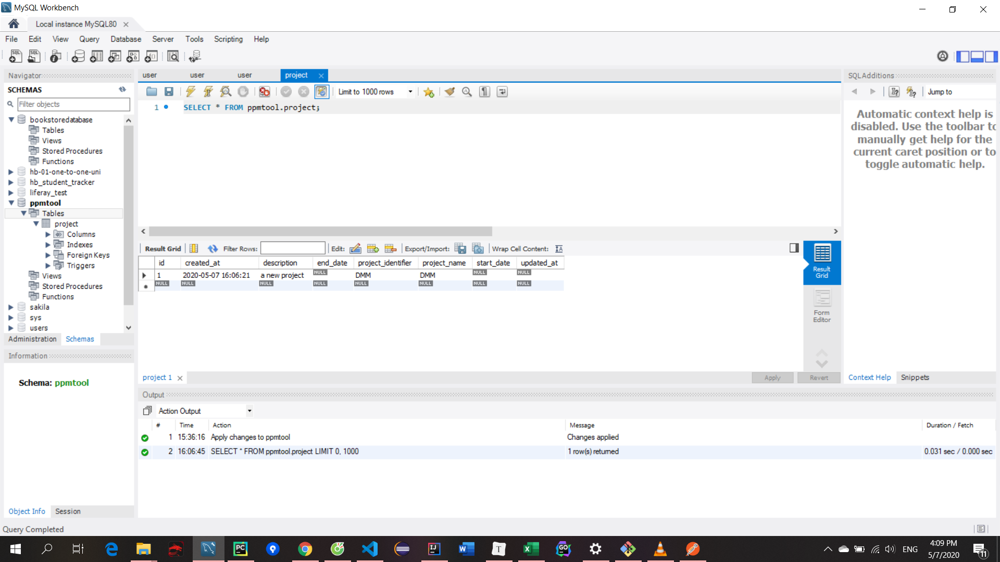
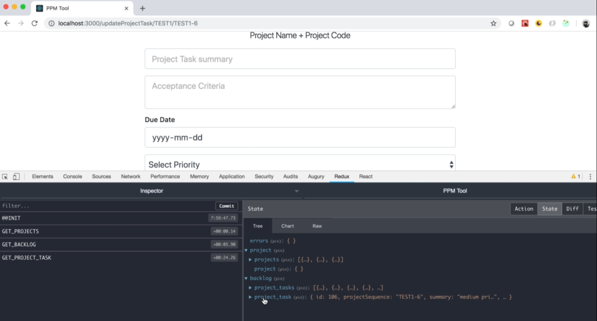

[TOC]


---


C:\Users\phuong\AppData\Local\Programs\Python\Python37\python.exe F:/programing/language/python/python-docs/readfile.py
======== name dir ========
## 1. Introduction
### 1. Introduction


### 2. IMPORTANT BROWSERS FOR THIS COURSE.html

#### `**IF YOU ARE JUST STARTING OUT, PLEASE READ THE WHOLE ARTICLE**`


```
UPDATE:
```

***THESE ISSUES HAVE BEEN RESOLVED***

Please wait until you get to those sections of the course so it is not out of context, you need chrome with extensions for the development phase anyway:


FIX #1: https://www.udemy.com/full-stack-project-spring-boot-20-react-redux/learn/v4/t/lecture/12143810?start=75

FIX #2: https://www.udemy.com/full-stack-project-spring-boot-20-react-redux/learn/v4/t/lecture/12201742?start=0

```
INITIAL PROBLEM:
```

**Please note that this app works fine on: Firefox, Safari and Chrome. If you are on Chrome and it loads blank, then please install react dev tools and redux dev tools on Chrome. You need Chrome and these dev tools to follow the course.**

https://chrome.google.com/webstore/detail/react-developer-tools/fmkadmapgofadopljbjfkapdkoienihi?hl=en

https://chrome.google.com/webstore/detail/redux-devtools/lmhkpmbekcpmknklioeibfkpmmfibljd?hl=en

**Please also note that this is a known issue in the React/Redux community:** https://github.com/reduxjs/redux/issues/2359

**I'll be investigating how to configure the store for Internet Explorer and Edge, but for now in order to check the prototype in Heroku (**https://agileintppmtool.herokuapp.com/) **please use Chrome (with extensions) or Firefox (MacOS and Windows) or Safari (MacOS)**

### 3. WATCH BEFORE YOU BUY App Demo (Prototype)


### 3.1 httpsagileintppmtool.herokuapp.com.html


### 4. WATCH BEFORE YOU BUY Requirements, IDEs, Support

https://agileintppmtool.herokuapp.com/


123456

  


  

  


### 5. REVIEW BEFORE YOU START- Mindset and Course's scope.html

Please have the right mindset for this course and for any other software development course that you are taking or planning to take.

> #### **Here is a torpedo of truth:**

#### **No** six-figure worth, debt-binding university degree, **no** hefty 5-figure worth coding bootcamp, **no** course or book **covers it all**. **No one does**, **no one can!**


The times I have seen people trying to cover it all then one of two things happen:

· A good chunk of those topics are covered in a very contrive and virtually useless way just to say “I covered it all”

· And THE VERY FEW who did covered it all ended up releasing an ENDLESS course or book THAT NO ONE FINISHES ANYWAY!

No project that I have ever worked on has ever used all of JAVA or all of any tech stack involved. In some projects you use some features, in some you use others. **This course is a project so we will only use and explain the features of the TECH STACK that we need to use in order for us to implement and \*manually\* test the functionality that is in scope.**

**With that in mind, when you join this course you do so completely aware that anything that is not explicitly covered in this course is out of scope, no exceptions.** If you have recommendations, please let me know. Depending on the topic I might include it in upcoming courses or create a course on the matter.

Software development courses should be seen as a “**gateway**” for you to grab new skills and also to have a better understanding of how far you want to go. No educational material should ever be seen as “All that you need for a brilliant Software Developer career”. They are all stepping stones for you to build your skills and compete in the job market.

**Please have the right expectations at all times.**

## 2. Spring Backend - Basic CRUD Operations - Project
### 1. IMPORTANT PLEASE USE JAVA 8.html

Hi Team: `***\**No TLDR!!! This is important, make sure you scroll all the way down\**\***`

In the next video you will notice that I set my project to work with Java 8. Please make sure that you are using Java 8 in you environment for this project.

**How can I check this?**

In your terminal please run the following command: java -version

If you see anything that is **not** Java 8, then you need to set your env to this version.

In case you need to have several versions of Java in you env, a good option, that I personally use, is sdkman.io, this allows you to install the versions of Java that you need and jump from one to the other when needed. again: sdkman.io. You need to read the documentation and install it properly, **please note that supporting this is not in the scope of this course**. Follow the instructions and you should be fine.

***Why is that, I mean Java 9 and Java 10 are out? Why not use the latest?\***

First let me say this, Java 8 is an LTS (Long term support) version of Java, while Java 9 and 10 are actually non-LTS, moreover Oracle is not even supporting them anymore. Java 9 was supported until March 2018 and 10 was supported until September 2018, see for yourselves: https://www.oracle.com/technetwork/java/javase/eol-135779.html.

It is a common recommendation to always stick to LTS versions of the stack you are using. With java 9 there is a lot that breaks (google it, many complains about this particular version) and too many work arounds required. We are not doing anything that requires features in Java 9 or 10 so please refrain from using those versions for this project.

Please stick with Java 8 for now. Once the landscape is clearer around Java11 (Released on September 2018) then I will be sure to update you all accordingly.

**Issues running spring-boot 2.0 on Java 9:** https://github.com/**spring-projects**/**spring-boot**/issues/12462

### 
### 2. Folder Structure and Github setup

https://start.spring.io/

hoặc có thể dùng intelliji

Adding screenshot from latest 2019.2 IDEA Ultimate Edition:

- Go to `File -> Settings -> Plugins`
- search for `spring boot` under `Installed` plugins list
- Press the `Enable` button
- Restart IDE

https://stackoverflow.com/questions/32476228/intellij-spring-initializr-not-available


  

  

Chọn location D:\Source\spring boot\ppmtool

```shell
git branch
git branch branch0
git checkout branch0
git push --set-upstream origin branch0
git merge branch0 # merge to master
git push

```


### 2.1 branch0.html

https://github.com/AgileIntelligence/AgileIntPPMTool/tree/branch0

### 2.2 Initial Repository.html

https://github.com/AgileIntelligence/ppmtool

### 2.3 Git Branch Tutorial.html

https://www.atlassian.com/git/tutorials/using-branches

### 3. IMPORTANT - READ THROUGH About H2 Database.html

**Please read through.**

In the next video, we are going to create our object and test whether or not the table gets created in the H2 database. I have received an unexpected number of reports that after opening the H2 database console, the table is not present.

**I want to clarify the following pointers:**

1. I want to remind you, that **previous basic experience with the Spring Framework is expected for this course**. This was clearly discussed in the **"WATCH BEFORE YOU BUY: Requirements, IDEs, Support"** video **(Do not skip this video)**

   https://www.udemy.com/full-stack-project-spring-boot-20-react-redux/learn/v4/t/lecture/11792132/?instructorPreviewMode=student_v4

2. You need to make sure that you have **the correct folder structure for your Spring Boot project**

3. Check the **Q&A in this lecture**, read through, and **try a different JDBC URL** if the one out of the box doesn't work for you

4. Make sure that you have the right **@Entity import (Please, check your code against mine)**

5. Finally, since you have previous experience, **do not get hung up on the H2 database not working** (which should not be the case) **just set up MySQL or any other DB that you are already comfortable with**. Later in the course we will set up MySQL anyway.

Thank you for your attention.

### 4. Project Object & Project Repository- branch1

Project.java

```java
package io.agileintelligence.ppmtool.domain;


import javax.persistence.*;
import java.util.Date;

@Entity
public class Project {

    @Id
    @GeneratedValue(strategy = GenerationType.IDENTITY)
    private Long id;
    private String projectName;
    private String projectIdentifier;
    private String description;
    private Date start_date;
    private Date end_date;

    private Date created_At;
    private Date updated_At;

    public Project() {
    }

    public Long getId() {
        return id;
    }

    public void setId(Long id) {
        this.id = id;
    }

    public String getProjectName() {
        return projectName;
    }

    public void setProjectName(String projectName) {
        this.projectName = projectName;
    }

    public String getProjectIdentifier() {
        return projectIdentifier;
    }

    public void setProjectIdentifier(String projectIdentifier) {
        this.projectIdentifier = projectIdentifier;
    }

    public String getDescription() {
        return description;
    }

    public void setDescription(String description) {
        this.description = description;
    }

    public Date getStart_date() {
        return start_date;
    }

    public void setStart_date(Date start_date) {
        this.start_date = start_date;
    }

    public Date getEnd_date() {
        return end_date;
    }

    public void setEnd_date(Date end_date) {
        this.end_date = end_date;
    }

    public Date getCreated_At() {
        return created_At;
    }

    public void setCreated_At(Date created_At) {
        this.created_At = created_At;
    }

    public Date getUpdated_At() {
        return updated_At;
    }

    public void setUpdated_At(Date updated_At) {
        this.updated_At = updated_At;
    }

    @PrePersist
    protected void onCreate(){
        this.created_At = new Date();
    }

    @PreUpdate
    protected void onUpdate(){
        this.updated_At = new Date();
    }

}

```

Thêm PrePersist và PreUpdate

ProjectRepository.java

```java
package io.agileintelligence.ppmtool.repositories;

import io.agileintelligence.ppmtool.domain.Project;
import org.springframework.data.repository.CrudRepository;
import org.springframework.stereotype.Repository;

@Repository
public interface ProjectRepository extends CrudRepository<Project, Long> {

    @Override
    Iterable<Project> findAllById(Iterable<Long> iterable);
}

```

Config connect to mysql

```pro
spring.thymeleaf.cache=false


# ===============================
# = DATA SOURCE
# ===============================

# Set here configurations for the database connection
spring.datasource.url=jdbc:mysql://localhost:3306/ppmtool

# Username and secret
spring.datasource.username=root
spring.datasource.password=1234

# Keep the connection alive if idle for a long time (needed in production)
spring.datasource.testWhileIdle = true
spring.datasource.validationQuery = SELECT 1


# ===============================
# = JPA / HIBERNATE
# ===============================

# Use spring.jpa.properties.* for Hibernate native properties (the prefix is
# stripped before adding them to the entity manager).

# Show or not log for each sql query
spring.jpa.show-sql=true

# Hibernate ddl auto (create, create-drop, update): with "update" the database
# schema will be automatically updated accordingly to java entities found in
# the project
spring.jpa.hibernate.ddl-auto = update

# Allows Hibernate to generate SQL optimized for a particular DBMS
spring.jpa.properties.hibernate.dialect = org.hibernate.dialect.MySQL5Dialect


```

Run app và check db thấy table person được tạo mới

### 4.1 branch1.html

https://github.com/AgileIntelligence/AgileIntPPMTool/tree/branch1

### 5. Project Service & Project Controller  Create first project - branch2

service/ProjectService

```java
package io.agileintelligence.ppmtool.services;

import io.agileintelligence.ppmtool.domain.Project;
import io.agileintelligence.ppmtool.repositories.ProjectRepository;
import org.springframework.beans.factory.annotation.Autowired;
import org.springframework.stereotype.Service;

@Service
public class ProjectService {

    @Autowired
    private ProjectRepository projectRepository;

    public Project saveOrUpdateProject(Project project){

        //Logic

        return projectRepository.save(project);
    }

}

```

web/ProjectController

```java
package io.agileintelligence.ppmtool.web;


import io.agileintelligence.ppmtool.domain.Project;
import io.agileintelligence.ppmtool.services.ProjectService;
import org.springframework.beans.factory.annotation.Autowired;
import org.springframework.http.HttpStatus;
import org.springframework.http.ResponseEntity;
import org.springframework.web.bind.annotation.PostMapping;
import org.springframework.web.bind.annotation.RequestBody;
import org.springframework.web.bind.annotation.RequestMapping;
import org.springframework.web.bind.annotation.RestController;

@RestController
@RequestMapping("/api/project")
public class ProjectController {

    @Autowired
    private ProjectService projectService;


    @PostMapping("")
    public ResponseEntity<Project> createNewProject(@RequestBody Project project){
        Project project1 = projectService.saveOrUpdateProject(project);
        return new ResponseEntity<Project>(project, HttpStatus.CREATED);
    }
}

```

data test post man

```json
{
	"projectName": "DMM",
	"projectIdentifier": "DMM",
	"description": "a new project"
}
```

http://localhost:8080/api/project/

  




### 5.1 branch2.html

https://github.com/AgileIntelligence/AgileIntPPMTool/tree/branch2

### 6. Set up project object validation - branch3

Project

```java
package io.agileintelligence.ppmtool.domain;


import com.fasterxml.jackson.annotation.JsonFormat;

import javax.persistence.*;
import javax.validation.constraints.NotBlank;
import javax.validation.constraints.Size;
import java.util.Date;

@Entity
public class Project {

    @Id
    @GeneratedValue(strategy = GenerationType.IDENTITY)
    private Long id;
    @NotBlank(message = "Project name is required")
    private String projectName;
    @NotBlank(message ="Project Identifier is required")
    @Size(min=4, max=5, message = "Please use 4 to 5 characters")
    @Column(updatable = false, unique = true)
    private String projectIdentifier;
    @NotBlank(message = "Project description is required")
    private String description;
    @JsonFormat(pattern = "yyyy-mm-dd")
    private Date start_date;
    @JsonFormat(pattern = "yyyy-mm-dd")
    private Date end_date;
    @JsonFormat(pattern = "yyyy-mm-dd")
    private Date created_At;
    @JsonFormat(pattern = "yyyy-mm-dd")
    private Date updated_At;

    

    @PrePersist
    protected void onCreate(){
        this.created_At = new Date();
    }

    @PreUpdate
    protected void onUpdate(){
        this.updated_At = new Date();
    }

}

```


### 6.1 branch3.html

https://github.com/AgileIntelligence/AgileIntPPMTool/tree/branch3

### 7. Project Object Validation part1 - branch4

Nếu để {} => server trả về lỗi 500


Thêm annotation @Valid


ProjectController.java

```java
package io.agileintelligence.ppmtool.web;


import io.agileintelligence.ppmtool.domain.Project;
import io.agileintelligence.ppmtool.services.ProjectService;
import org.springframework.beans.factory.annotation.Autowired;
import org.springframework.http.HttpStatus;
import org.springframework.http.ResponseEntity;
import org.springframework.validation.BindingResult;
import org.springframework.validation.FieldError;
import org.springframework.web.bind.annotation.PostMapping;
import org.springframework.web.bind.annotation.RequestBody;
import org.springframework.web.bind.annotation.RequestMapping;
import org.springframework.web.bind.annotation.RestController;

import javax.validation.Valid;
import java.util.HashMap;
import java.util.List;
import java.util.Map;

@RestController
@RequestMapping("/api/project")
public class ProjectController {

    @Autowired
    private ProjectService projectService;


    @PostMapping("")
    public ResponseEntity<?> createNewProject(@Valid @RequestBody Project project, BindingResult result){

        if(result.hasErrors()){
         //   return new ResponseEntity<String>("errorMap", HttpStatus.BAD_REQUEST);
            
        //
            Map<String, String> errorMap = new HashMap<>();

            for(FieldError error: result.getFieldErrors()){
                errorMap.put(error.getField(), error.getDefaultMessage());
            }
            return new ResponseEntity<Map<String, String>>(errorMap, HttpStatus.BAD_REQUEST);
        }


        Project project1 = projectService.saveOrUpdateProject(project);
        return new ResponseEntity<Project>(project1, HttpStatus.CREATED);
    }
}

```


### 7.1 branch4.html

https://github.com/AgileIntelligence/AgileIntPPMTool/tree/branch4

### 8. Project Object Validation part2 - branch5


### 8.1 branch5.html
### 9. Refactor Project Controller -branch6

MapValidationErrorService.java

```java
package io.agileintelligence.ppmtool.services;

import org.springframework.http.HttpStatus;
import org.springframework.http.ResponseEntity;
import org.springframework.stereotype.Service;
import org.springframework.validation.BindingResult;
import org.springframework.validation.FieldError;

import java.util.HashMap;
import java.util.Map;

@Service
public class MapValidationErrorService {

    public ResponseEntity<?> MapValidationService(BindingResult result){

        if(result.hasErrors()){
            Map<String, String> errorMap = new HashMap<>();

            for(FieldError error: result.getFieldErrors()){
                errorMap.put(error.getField(), error.getDefaultMessage());
            }
            return new ResponseEntity<Map<String, String>>(errorMap, HttpStatus.BAD_REQUEST);
        }

        return null;

    }
}

```

ProjectController

```java
@PostMapping("")
    public ResponseEntity<?> createNewProject(@Valid @RequestBody Project project, BindingResult result){

        ResponseEntity<?> errorMap = mapValidationErrorService.MapValidationService(result);
        if(errorMap!=null) return errorMap;

        Project project1 = projectService.saveOrUpdateProject(project);
        return new ResponseEntity<Project>(project1, HttpStatus.CREATED);
    }
```


Nếu pass cùng ID 


### 9.1 branch6.html

### 10. Custom Exceptions for Unique Project Identifiers - branch7

Khi update nó k đợi check trong db có id chưa 

Create package exceptions

ProjectIdExceptionResponse.java

```java
package io.agileintelligence.ppmtool.exceptions;

public class ProjectIdExceptionResponse {

    // name of field is displayed
    private String projectIdentifier;

    public ProjectIdExceptionResponse(String projectIdentifier) {
        this.projectIdentifier = projectIdentifier;
    }

    public String getProjectIdentifier() {
        return projectIdentifier;
    }

    public void setProjectIdentifier(String projectIdentifier) {
        this.projectIdentifier = projectIdentifier;
    }
}

```

ProjectIdException.java

```java
package io.agileintelligence.ppmtool.exceptions;

import org.springframework.http.HttpStatus;
import org.springframework.web.bind.annotation.ResponseStatus;

@ResponseStatus(HttpStatus.BAD_REQUEST)
public class ProjectIdException extends RuntimeException {

    public ProjectIdException(String message) {
        super(message);
    }
}

```

CustomResponseEntityExceptionHandler.java

```java
package io.agileintelligence.ppmtool.exceptions;


import org.springframework.http.HttpStatus;
import org.springframework.http.ResponseEntity;
import org.springframework.web.bind.annotation.ControllerAdvice;
import org.springframework.web.bind.annotation.ExceptionHandler;
import org.springframework.web.bind.annotation.RestController;
import org.springframework.web.context.request.WebRequest;
import org.springframework.web.servlet.mvc.method.annotation.ResponseEntityExceptionHandler;

@ControllerAdvice
@RestController
public class CustomResponseEntityExceptionHandler extends ResponseEntityExceptionHandler {

    @ExceptionHandler
    public final ResponseEntity<Object> handleProjectIdException(ProjectIdException ex, WebRequest request){
        ProjectIdExceptionResponse exceptionResponse = new ProjectIdExceptionResponse(ex.getMessage());
        return new ResponseEntity(exceptionResponse, HttpStatus.BAD_REQUEST);
    }

}

```

ProjectService.java

```java
package io.agileintelligence.ppmtool.services;

import io.agileintelligence.ppmtool.domain.Project;
import io.agileintelligence.ppmtool.exceptions.ProjectIdException;
import io.agileintelligence.ppmtool.repositories.ProjectRepository;
import org.springframework.beans.factory.annotation.Autowired;
import org.springframework.stereotype.Service;

@Service
public class ProjectService {

    @Autowired
    private ProjectRepository projectRepository;

    public Project saveOrUpdateProject(Project project){
        // add
        try{
            project.setProjectIdentifier(project.getProjectIdentifier().toUpperCase());
            return projectRepository.save(project);
        }catch (Exception e){
            throw new ProjectIdException("Project ID '"+project.getProjectIdentifier().toUpperCase()+"' already exists");
        }

    }

}

```


### 10.1 branch7.html

### 11. Find Project by Identifier - branch8

ProjectRepository.java

```java

@Repository
public interface ProjectRepository extends CrudRepository<Project, Long> {
	// Gõ findBy và tên id will display prompt
    Project findByProjectIdentifier(String projectId);
}

```

Service

```java
public Project findProjectByIdentifier(String projectId){

        Project project = projectRepository.findByProjectIdentifier(projectId.toUpperCase());

        if(project == null){
            throw new ProjectIdException("Project ID '"+projectId+"' does not exist");

        }


        return project;
    }
```

controller

```java

    @GetMapping("/{projectId}")
    public ResponseEntity<?> getProjectById(@PathVariable String projectId){

        Project project = projectService.findProjectByIdentifier(projectId);

        return new ResponseEntity<Project>(project, HttpStatus.OK);
    }
```


### 11.1 branch8.html

### 12. Find All Projects - branch9

repository

```java
	@Override
    Iterable<Project> findAll();
```

service

```java
public Iterable<Project> findAllProjects(){
        return projectRepository.findAll();
    }

public void deleteProjectByIdentifier(String projectid){
        Project project = projectRepository.findByProjectIdentifier(projectid.toUpperCase());

        if(project == null){
            throw  new  ProjectIdException("Cannot Project with ID '"+projectid+"'. This project does not exist");
        }

        projectRepository.delete(project);
    }
```

controller

```java
@GetMapping("/all")
    public Iterable<Project> getAllProjects(){return projectService.findAllProjects();}

@DeleteMapping("/{projectId}")
    public ResponseEntity<?> deleteProject(@PathVariable String projectId){
        projectService.deleteProjectByIdentifier(projectId);

        return new ResponseEntity<String>("Project with ID: '"+projectId+"' was deleted", HttpStatus.OK);
    }
```

http://localhost:8080/api/project/Id03

http://localhost:8080/api/project/all

### 12.1 branch9.html

### 13. Delete an existing project - branch10

### 13.1 branch10.html

### 14. Update an existing project

JPA update cho chúng ta nên chỉ cần truyền id vào là được

data

```json
{
	"id": "1",
	"projectName": "DMM",
	"projectIdentifier": "ID01",
	"description": "a new project update"
}
```


## 3. React & Redux Front-end Project CRUD Operations
### 1. Introduction to React and Redux

#### POTENTIAL ISSUE- create-react-app as of January 2020

If you run into a message like this when using create-react-app:

```
Creating a new React app in /Users/user/Desktop/my-app. Installing packages. This might take a couple of minutes.Installing react, react-dom, and react-scripts........ nothing out of the ordinary here .....✨  Done in 27.28s. A template was not provided. This is likely because you're using an outdated version of create-react-app.Please note that global installs of create-react-app are no longer supported.
```


Then please make sure that you try one of following commands instead of the one shown in the lecture

https://stackoverflow.com/questions/59188624/template-not-provided-using-create-react-app

```shell
npx create-react-app my-app
npm init react-app my-app
```

### 2. Set up development Environment for React Development


Vào setting check format on save

Ấn CTRL ,


  

Edit setting.json

```js
"emmet.includeLanguages": {
    "javascript": "javascriptreact"
  }
```


### 3. Create and review Boiler Plate react app - branch11

```shell
create-react-app ppmtool-react-client

```


### 3.1 branch11.html
### 4. first react component - branch12

Tạo folder components/Dashboard

Gõ rccc => create component

Dashboard

```js
import React, { Component } from "react";

class Dashboard extends Component {
  render() {
    return <h1>Welcome to the Dashboard</h1>;
  }
}

export default Dashboard;

```


### 4.1 branch12.html

### 5. Project and header components - branch13

Layout/Header.js

```js
import React, { Component } from "react";

class Header extends Component {
  render() {
    return (
      <div>
        <h1>Navbar</h1>
      </div>
    );
  }
}

export default Header;

```

Project/ProjectItem.js

```js
import React, { Component } from "react";

class ProjectItem extends Component {
  render() {
    return <h1>Project Item</h1>;
  }
}

export default ProjectItem;

```

Dashboard.js

```js
import React, { Component } from "react";
import ProjectItem from "./Project/ProjectItem";

class Dashboard extends Component {
  render() {
    return (
      <div>
        <h1>Welcome to the Dashboard</h1>
        <ProjectItem />
        <ProjectItem />
        <ProjectItem />
      </div>
    );
  }
}

export default Dashboard;

```

App.js

```js
import React, { Component } from "react";
import "./App.css";
import Dashboard from "./components/Dashboard";
import Header from "./components/Layout/Header";

class App extends Component {
  render() {
    return (
      <div className="App">
        <Header />
        <Dashboard />
      </div>
    );
  }
}

export default App;

```


### 5.1 branch13.html
### 6. Bringing Bootstrap 4+ - branch14

`npm install bootstrap`

App.js

```js
import React, { Component } from "react";
import "./App.css";
import Dashboard from "./components/Dashboard";
import Header from "./components/Layout/Header";
// add
import "bootstrap/dist/css/bootstrap.min.css";

class App extends Component {
  render() {
    return (
      <div className="App">
        <Header />
        <Dashboard />
      </div>
    );
  }
}

export default App;

```

Dashboard

```js
        <h1 className="alert alert-warning">Welcome to the Dashboard</h1>

```

### 6.1 branch14.html
### 7. Style our Dashboard, Navbar, ProjectItem - branch15

Override app.css

Copy NavBar trong Dashboard vào Header

Header.js

```js
import React, { Component } from "react";

class Header extends Component {
  render() {
    return (
      <nav className="navbar navbar-expand-sm navbar-dark bg-primary mb-4">
        <div className="container">
          <a className="navbar-brand" href="Dashboard.html">
            Personal Project Management Tool
          </a>
          <button
            className="navbar-toggler"
            type="button"
            data-toggle="collapse"
            data-target="#mobile-nav"
          >
            <span className="navbar-toggler-icon" />
          </button>

          <div className="collapse navbar-collapse" id="mobile-nav">
            <ul className="navbar-nav mr-auto">
              <li className="nav-item">
                <a className="nav-link" href="/dashboard">
                  Dashboard
                </a>
              </li>
            </ul>

            <ul className="navbar-nav ml-auto">
              <li className="nav-item">
                <a className="nav-link " href="register.html">
                  Sign Up
                </a>
              </li>
              <li className="nav-item">
                <a className="nav-link" href="login.html">
                  Login
                </a>
              </li>
            </ul>
          </div>
        </div>
      </nav>
    );
  }
}

export default Header;

```

ProjectItem.js

```js
import React, { Component } from "react";

class ProjectItem extends Component {
  render() {
    return (
      <div className="container">
        <div className="card card-body bg-light mb-3">
          <div className="row">
            <div className="col-2">
              <span className="mx-auto">REACT</span>
            </div>
            <div className="col-lg-6 col-md-4 col-8">
              <h3>Spring / React Project</h3>
              <p>Project to create a Kanban Board with Spring Boot and React</p>
            </div>
            <div className="col-md-4 d-none d-lg-block">
              <ul className="list-group">
                <a href="#">
                  <li className="list-group-item board">
                    <i className="fa fa-flag-checkered pr-1"> Project Board </i>
                  </li>
                </a>
                <a href="#">
                  <li className="list-group-item update">
                    <i className="fa fa-edit pr-1"> Update Project Info</i>
                  </li>
                </a>
                <a href="">
                  <li className="list-group-item delete">
                    <i className="fa fa-minus-circle pr-1"> Delete Project</i>
                  </li>
                </a>
              </ul>
            </div>
          </div>
        </div>
      </div>
    );
  }
}

export default ProjectItem;

```

Dashboard.js

```js
import React, { Component } from "react";
import ProjectItem from "./Project/ProjectItem";

class Dashboard extends Component {
  render() {
    return (
      <div className="projects">
        <div className="container">
          <div className="row">
            <div className="col-md-12">
              <h1 className="display-4 text-center">Projects</h1>
              <br />
              <a href="ProjectForm.html" className="btn btn-lg btn-info">
                Create a Project
              </a>
              <br />
              <hr />
              <ProjectItem />
            </div>
          </div>
        </div>
      </div>
    );
  }
}

export default Dashboard;

```

index.html

```html
// thêm
 <link rel="stylesheet" href="https://use.fontawesome.com/releases/v5.2.0/css/all.css" integrity="sha384-hWVjflwFxL6sNzntih27bfxkr27PmbbK/iSvJ+a4+0owXq79v+lsFkW54bOGbiDQ"
    crossorigin="anonymous">
  <title>PPM Tool</title>
```


### 7.1 branch15.html
### 8. React Router, first Functional component - branch16

`npm install react-router-dom`

CreateProjectButton.js

```js
import React from "react";
import { Link } from "react-router-dom";

const CreateProjectButton = () => {
  return (
    <React.Fragment>
      <Link to="/addProject" className="btn btn-lg btn-info">
        Create a Project
      </Link>
    </React.Fragment>
  );
};

export default CreateProjectButton;

```

App.js

```js
import { BrowserRouter as Router, Route } from "react-router-dom";
import AddProject from "./components/Project/AddProject";

class App extends Component {
  render() {
    return (
      <Router>
        <div className="App">
          <Header />
          <Route exact path="/dashboard" component={Dashboard} />
          <Route exact path="/addProject" component={AddProject} />
        </div>
      </Router>
    );
  }
}
```

AddProject

```js
import React, { Component } from "react";

class AddProject extends Component {
  render() {
    return (
      <div>
        <h1>Add Project Form</h1>
      </div>
    );
  }
}

export default AddProject;

```

Khi ấn vào button navigate to Add Project page

### 8.1 branch16.html
### 9. AddProject Component - controlled form - branch 17

AddProject

```js
import React, { Component } from "react";

class AddProject extends Component {
  constructor() {
    super();

    this.state = {
      projectName: "",
      projectIdentifier: "",
      description: "",
      start_date: "",
      end_date: ""
    };

    this.onChange = this.onChange.bind(this);
    this.onSubmit = this.onSubmit.bind(this);
  }

  onChange(e) {
    this.setState({ [e.target.name]: e.target.value });
  }

  onSubmit(e) {
    e.preventDefault();
    const newProject = {
      projectName: this.state.projectName,
      projectIdentifier: this.state.projectIdentifier,
      description: this.state.description,
      start_date: this.state.start_date,
      end_date: this.state.end_date
    };

    console.log(newProject);
  }

  render() {
    return (
      <div>
        {
          //check name attribute input fields
          //create constructor
          //set state
          //set value on input fields
          //create onChange function
          //set onChange on each input field
          //bind on constructor
          //check state change in the react extension
        }

        <div className="project">
          <div className="container">
            <div className="row">
              <div className="col-md-8 m-auto">
                <h5 className="display-4 text-center">Create Project form</h5>
                <hr />
                <form onSubmit={this.onSubmit}>
                  <div className="form-group">
                    <input
                      type="text"
                      className="form-control form-control-lg "
                      placeholder="Project Name"
                      name="projectName"
                      value={this.state.projectName}
                      onChange={this.onChange}
                    />
                  </div>
                  <div className="form-group">
                    <input
                      type="text"
                      className="form-control form-control-lg"
                      placeholder="Unique Project ID"
                      name="projectIdentifier"
                      value={this.state.projectIdentifier}
                      onChange={this.onChange}
                    />
                  </div>
                  <div className="form-group">
                    <textarea
                      className="form-control form-control-lg"
                      placeholder="Project Description"
                      name="description"
                      value={this.state.description}
                      onChange={this.onChange}
                    />
                  </div>
                  <h6>Start Date</h6>
                  <div className="form-group">
                    <input
                      type="date"
                      className="form-control form-control-lg"
                      name="start_date"
                      value={this.state.start_date}
                      onChange={this.onChange}
                    />
                  </div>
                  <h6>Estimated End Date</h6>
                  <div className="form-group">
                    <input
                      type="date"
                      className="form-control form-control-lg"
                      name="end_date"
                      value={this.state.end_date}
                      onChange={this.onChange}
                    />
                  </div>

                  <input
                    type="submit"
                    className="btn btn-primary btn-block mt-4"
                  />
                </form>
              </div>
            </div>
          </div>
        </div>
      </div>
    );
  }
}

export default AddProject;

```

add on change and submit data test

### 9.1 ReactJS documentation on controlled forms.html

https://reactjs.org/docs/forms.html

### 9.2 branch17.html

### 10. IMPORTANT React + Redux Architecture and Support

  


### 11. Create Redux Store - branch18

`npm i redux react-redux redux-thunk axios `

store.js

```js
import { createStore, applyMiddleware, compose } from "redux";
import thunk from "redux-thunk";
import rootReducer from "./reducers";

const initalState = {};
const middleware = [thunk];

let store;

if (window.navigator.userAgent.includes("Chrome")) {
  store = createStore(
    rootReducer,
    initalState,
    compose(
      applyMiddleware(...middleware),
      window.__REDUX_DEVTOOLS_EXTENSION__ &&
        window.__REDUX_DEVTOOLS_EXTENSION__()
    )
  );
} else {
  store = createStore(
    rootReducer,
    initalState,
    compose(applyMiddleware(...middleware))
  );
}

export default store;

```

reducer/index.js

```js
import { combineReducers } from "redux";

export default combineReducers({});

```

App.js

```js
import { Provider } from "react-redux"; // add
import store from "./store";

class App extends Component {
  render() {
    return (
      <Provider store={store}>
        <Router>
          <div className="App">
            <Header />
            <Route exact path="/dashboard" component={Dashboard} />
            <Route exact path="/addProject" component={AddProject} />
          </div>
        </Router>
      </Provider>
    );
  }
}

```


### 11.1 branch18.html

### 12. Create Project from React - branch19

projectActions.js

```js
import axios from "axios";
import { GET_ERRORS } from "./types";

export const createProject = (project, history) => async dispatch => {
  try {
    const res = await axios.post("http://localhost:8080/api/project", project);
    history.push("/dashboard");
  } catch (err) {
    dispatch({
      type: GET_ERRORS,
      payload: err.response.data
    });
  }
};

```

errorReducer.js

```js
import { GET_ERRORS } from "../actions/types";

const initialState = {};

export default function(state = initialState, action) {
  switch (action.type) {
    case GET_ERRORS:
      return action.payload;

    default:
      return state;
  }
}

```

index.js

```js
import { combineReducers } from "redux";
import errorReducer from "./errorReducer";

export default combineReducers({
  errors: errorReducer
});

```

AddProject

```js
onSubmit(e) {
    e.preventDefault();
    const newProject = {
      projectName: this.state.projectName,
      projectIdentifier: this.state.projectIdentifier,
      description: this.state.description,
      start_date: this.state.start_date,
      end_date: this.state.end_date
    };
    // add
    this.props.createProject(newProject, this.props.history);
  }


AddProject.propTypes = {
  createProject: PropTypes.func.isRequired
};

export default connect(
  null,
  { createProject }
)(AddProject);

```

  

```java
@RestController
@RequestMapping("/api/project")
@CrossOrigin // add
public class ProjectController 
```


### 12.1 branch19.html

### 13. Get validation errors from Redux - branch20

AddProject

```js
// state thêm field errors = {}

//life cycle hooks
  componentWillReceiveProps(nextProps) {
    if (nextProps.errors) {
      this.setState({ errors: nextProps.errors });
    }
  }

 render() {
     // add
    const { errors } = this.state;

// add
AddProject.propTypes = {
  createProject: PropTypes.func.isRequired,
  errors: PropTypes.object.isRequired
};

const mapStateToProps = state => ({
  errors: state.errors
});

export default connect(
  mapStateToProps,
  { createProject }
)(AddProject);

```

#### TypeError: Cannot read property 'apply' of undefined

Khi chạy source client lên

fix bằng cách

store.js

```js
import { createStore, applyMiddleware, compose } from 'redux';
import thunk from 'redux-thunk';
import rootReducer from './reducers';
import { composeWithDevTools } from 'redux-devtools-extension';

const initalState = {};
const middleware = [thunk];

// let store;

// if (window.navigator.userAgent.includes('Chrome')) {
//   store = createStore(
//     rootReducer,
//     initalState,
//     compose(
//       applyMiddleware(...middleware),
//       window.__REDUX_DEVTOOLS_EXTENSION__ &&
//         window.__REDUX_DEVTOOLS_EXTENSION__()
//     )
//   );
// } else {
//   store = createStore(
//     rootReducer,
//     initalState,
//     compose(applyMiddleware(...middleware))
//   );
// }

const store = createStore(
  rootReducer,
  initalState,
  composeWithDevTools(applyMiddleware(...middleware))
);

export default store;

```


### 13.1 branch20.html

### 14. Style validation errors with classnames - branch21

`npm install classnames`

AddProject.js

```js
<form onSubmit={this.onSubmit}>
                  <div className="form-group">
                    <input
                      type="text"
                      className={classnames("form-control form-control-lg", {
                        "is-invalid": errors.projectName
                      })}
                      placeholder="Project Name"
                      name="projectName"
                      value={this.state.projectName}
                      onChange={this.onChange}
                    />
                    {errors.projectName && (
                      <div className="invalid-feedback">
                        {errors.projectName}
                      </div>
                    )}
                  </div>
```

Sau đó thực hiện tương tự với các field khác

### 14.1 branch21.html

### 15. Get Projects - redux only - branch22

projectReducer.js

```js
import { GET_PROJECTS } from "../actions/types";

const initialState = {
  projects: [],
  project: {}
};

export default function(state = initialState, action) {
  switch (action.type) {
    case GET_PROJECTS:
      return {
        ...state,
        projects: action.payload
      };
    default:
      return state;
  }
}

```

projectActions.js

```js

export const getProjects = () => async dispatch => {
  const res = await axios.get("http://localhost:8080/api/project/all");
  dispatch({
    type: GET_PROJECTS,
    payload: res.data
  });
};

```

index.js

```js
import { combineReducers } from "redux";
import errorReducer from "./errorReducer";
import projectReducer from "./projectReducer";

export default combineReducers({
  errors: errorReducer,
  project: projectReducer
});

```

Dashboard.js

```js
import React, { Component } from "react";
import ProjectItem from "./Project/ProjectItem";
import CreateProjectButton from "./Project/CreateProjectButton";
import { connect } from "react-redux";
import { getProjects } from "../actions/projectActions";
import PropTypes from "prop-types";

class Dashboard extends Component {
  componentDidMount() {
    this.props.getProjects();
  }

  render() {
    return (
      <div className="projects">
        <div className="container">
          <div className="row">
            <div className="col-md-12">
              <h1 className="display-4 text-center">Projects</h1>
              <br />
              <CreateProjectButton />

              <br />
              <hr />
              <ProjectItem />
            </div>
          </div>
        </div>
      </div>
    );
  }
}

Dashboard.propTypes = {
  project: PropTypes.object.isRequired,
  getProjects: PropTypes.func.isRequired
};

const mapStateToProps = state => ({
  project: state.project
});

export default connect(
  mapStateToProps,
  { getProjects }
)(Dashboard);

```


### 15.1 branch22 - made offline changes, check both commit 3e53bc8  and 1 parent 71370a3.html

https://github.com/AgileIntelligence/AgileIntPPMTool/tree/branch22

### 16. Get Projects - final step - branch23

ProjectItem.js

```js

class ProjectItem extends Component {
  render() {
    const { project } = this.props;
```

Dashboard.js

```js

class Dashboard extends Component {
  componentDidMount() {
    this.props.getProjects();
  }

  render() {
    const { projects } = this.props.project;
      
    <hr />
              {projects.map(project => (
                <ProjectItem key={project.id} project={project} />
              ))}
```


### 16.1 branch23.html


### 17. Update Project use case architecture

  

Khi click vào update project

  


### 18. Update Project form and route

UpdateProject.js

```js
import React, { Component } from "react";

export default class UpdateProject extends Component {
  render() {
    return (
      <div className="project">
        <div className="container">
          <div className="row">
            <div className="col-md-8 m-auto">
              <h5 className="display-4 text-center">Update Project form</h5>
              <hr />
              <form>
                <div className="form-group">
                  <input
                    type="text"
                    className="form-control form-control-lg "
                    placeholder="Project Name"
                  />
                </div>
                <div className="form-group">
                  <input
                    type="text"
                    className="form-control form-control-lg"
                    placeholder="Unique Project ID"
                    disabled
                  />
                </div>
                <div className="form-group">
                  <textarea
                    className="form-control form-control-lg"
                    placeholder="Project Description"
                  />
                </div>
                <h6>Start Date</h6>
                <div className="form-group">
                  <input
                    type="date"
                    className="form-control form-control-lg"
                    name="start_date"
                  />
                </div>
                <h6>Estimated End Date</h6>
                <div className="form-group">
                  <input
                    type="date"
                    className="form-control form-control-lg"
                    name="end_date"
                  />
                </div>

                <input
                  type="submit"
                  className="btn btn-primary btn-block mt-4"
                />
              </form>
            </div>
          </div>
        </div>
      </div>
    );
  }
}

```

App.js

```js
<Route exact path="/updateProject/:id" component={UpdateProject} />

```

ProjectItem.js

```js
<Link to={`/updateProject/${project.projectIdentifier}`}>
    <li className="list-group-item update">
    <i className="fa fa-edit pr-1"> Update Project Info</i>
	</li>
</Link>
```

copy từ projectForm.html

### 18.1 branch24.html

### 19. Get Project by Id, Update use case part 1 - commit id b13741f

projectActions.js

```js

export const getProject = (id, history) => async dispatch => {
  const res = await axios.get(`http://localhost:8080/api/project/${id}`);
  dispatch({
    type: GET_PROJECT,
    payload: res.data
  });
};
```

projectReducer.js

```js
case GET_PROJECT:
      return {
        ...state,
        project: action.payload
      };
    default:
      return state;
  }
```

UpdateProject.js

```js
import React, { Component } from "react";
import { getProject } from "../../actions/projectActions";
import PropTypes from "prop-types";
import { connect } from "react-redux";
import classnames from "classnames";

class UpdateProject extends Component {
  //set state
  componentDidMount() {
    const { id } = this.props.match.params;
    this.props.getProject(id, this.props.history);
  }
  render() {
    return (
      <div className="project">
        <div className="container">
          <div className="row">
            <div className="col-md-8 m-auto">
              <h5 className="display-4 text-center">Update Project form</h5>
              <hr />
              <form>
                <div className="form-group">
                  <input
                    type="text"
                    className="form-control form-control-lg "
                    placeholder="Project Name"
                    name="projectName"
                    value={this.state.projectName}
                  />
                </div>
               
              </form>
            </div>
          </div>
        </div>
      </div>
    );
  }
}

UpdateProject.propTypes = {
  getProject: PropTypes.func.isRequired,
  project: PropTypes.object.isRequired
};

const mapStateToProps = state => ({
  project: state.project.project
});

export default connect(
  mapStateToProps,
  { getProject }
)(UpdateProject);

```


### 19.1 commit.html

https://github.com/AgileIntelligence/AgileIntPPMTool/commit/b13741fcff1e23f67355623d7c9ef7db8f855dd8

### 20. Persist Project Object Updates - branch26

UpdateProject.js

```js
class UpdateProject extends Component {
  //set state
  constructor() {
    super();
// add
    this.state = {
      id: "",
      projectName: "",
      projectIdentifier: "",
      description: "",
      start_date: "",
      end_date: ""
    };
    this.onChange = this.onChange.bind(this);
    this.onSubmit = this.onSubmit.bind(this);
  }
    
  
  componentWillReceiveProps(nextProps) {
    const {
      id,
      projectName,
      projectIdentifier,
      description,
      start_date,
      end_date
    } = nextProps.project;

    this.setState({
      id,
      projectName,
      projectIdentifier,
      description,
      start_date,
      end_date
    });
  }
    
  
  onChange(e) {
    this.setState({ [e.target.name]: e.target.value });
  }

  onSubmit(e) {
    e.preventDefault();

    const updateProject = {
      id: this.state.id,
      projectName: this.state.projectName,
      projectIdentifier: this.state.projectIdentifier,
      description: this.state.description,
      start_date: this.state.start_date,
      end_date: this.state.end_date
    };

    this.props.createProject(updateProject, this.props.history);
  }

    ...
    
     <input
                    type="text"
                   className="form-control form-control-lg "
                    placeholder="Project Name"
                    name="projectName"
// add -----------
                    value={this.state.projectName}
                    onChange={this.onChange}
```

Project.java

```java
@JsonFormat(pattern = "yyyy-mm-dd")
@Column(updatable = false)
private Date created_At;
```


### 20.1 branch26.html

### 20.2 branch26.html

### 21. Handle Errors in UpdateProject.js  - branch27

khi nhập link bất kì với id không tồn tại

projectAction.js

```js
export const getProject = (id, history) => async dispatch => {
    // add try catch
  try {
    const res = await axios.get(`http://localhost:8080/api/project/${id}`);
    dispatch({
      type: GET_PROJECT,
      payload: res.data
    });
  } catch (error) {
    history.push("/dashboard");
  }
};
```

UpdateProject.js

```js

componentWillReceiveProps(nextProps) {
    // add
    if (nextProps.errors) {
      this.setState({ errors: nextProps.errors });
    }
    
   render() {
       // add
    const { errors } = this.state;
       
       <input
             type="text"
             className={classnames("form-control form-control-lg", {
              "is-invalid": errors.projectName
               })}
                    placeholder="Project Name"
                    name="projectName"
                    value={this.state.projectName}
                    onChange={this.onChange}
                  />
                  {errors.projectName && (
                    <div className="invalid-feedback">{errors.projectName}</div>
                  )}
    
UpdateProject.propTypes = {
  getProject: PropTypes.func.isRequired,
  createProject: PropTypes.func.isRequired,
  project: PropTypes.object.isRequired,
  errors: PropTypes.object.isRequired // add
};

const mapStateToProps = state => ({
  project: state.project.project,
  errors: state.errors // add
});
```


### 21.1 branch27.html

### 22. BUG FIX Strange Update Behaviour

Nếu success clear error

projectActions.js

```js
export const createProject = (project, history) => async dispatch => {
  try {
    const res = await axios.post("http://localhost:8080/api/project", project);
    history.push("/dashboard");
    
      // add 
    dispatch({
      type: GET_ERRORS,
      payload: {}
    });
```


### 22.1 branch28.html

### 23. Delete Project Architecture


### 24. Delete an existing project - branch29

ProjectReducer.js

```js
case DELETE_PROJECT:
      return {
        ...state,
        projects: state.projects.filter(
          project => project.projectIdentifier !== action.payload
        )
      };
```

projectActions.js

```js

export const deleteProject = id => async dispatch => {
  await axios.delete(`http://localhost:8080/api/project/${id}`);
  dispatch({
    type: DELETE_PROJECT,
    payload: id
  });
};

```

ProjectItem

```js


class ProjectItem extends Component {
  onDeleteClick = id => {
    this.props.deleteProject(id);
  };

<li className="list-group-item delete"
                  onClick={this.onDeleteClick.bind(
                    this,
                    project.projectIdentifier
                  )}
                >
                  <i className="fa fa-minus-circle pr-1"> Delete Project</i>
                </li>

ProjectItem.propTypes = {
  deleteProject: PropTypes.func.isRequired
};

export default connect(
  null,
  { deleteProject }
)(ProjectItem);
```


### 24.1 branch29.html

### 25. Refactor Delete Operation and Proxy

package.json

```json
  "proxy": "http://localhost:8080"
```

projectActions.js

```js

export const deleteProject = id => async dispatch => {
    // add
  if (
    window.confirm(
      "Are you sure? This will delete the project and all the data related to it"
    )
  )
```


### 25.1 branch30.html

## 4. Add Project Tasks - Backend
### 1. Backlog and ProjectTask Entities - branch31

Backlog

```java
package io.agileintelligence.ppmtool.domain;


import javax.persistence.Entity;
import javax.persistence.GeneratedValue;
import javax.persistence.GenerationType;
import javax.persistence.Id;

@Entity
public class Backlog {

    @Id
    @GeneratedValue(strategy = GenerationType.IDENTITY)
    private Long id;
    private Integer PTSequence = 0;
    private String projectIdentifier;

    //OneToOne with project

    //OneToMany projecttasks


    public Backlog() {
    }

    public Long getId() {
        return id;
    }

    public void setId(Long id) {
        this.id = id;
    }

    public Integer getPTSequence() {
        return PTSequence;
    }

    public void setPTSequence(Integer PTSequence) {
        this.PTSequence = PTSequence;
    }

    public String getProjectIdentifier() {
        return projectIdentifier;
    }

    public void setProjectIdentifier(String projectIdentifier) {
        this.projectIdentifier = projectIdentifier;
    }
}

```

ProjectTask

```java
package io.agileintelligence.ppmtool.domain;

import javax.persistence.*;
import javax.validation.constraints.NotBlank;
import java.util.Date;

@Entity
public class ProjectTask {

    @Id
    @GeneratedValue(strategy = GenerationType.IDENTITY)
    private Long id;
    @Column(updatable = false)
    private String projectSequence;
    @NotBlank(message = "Please include a project summary")
    private String summary;
    private String acceptanceCriteria;
    private String status;
    private Integer priority;
    private Date dueDate;
    //ManyToOne with Backlog

    @Column(updatable = false)
    private String projectIdentifer;
    private Date create_At;
    private Date update_At;

    public ProjectTask() {
    }

    public Long getId() {
        return id;
    }

    public void setId(Long id) {
        this.id = id;
    }

    public String getProjectSequence() {
        return projectSequence;
    }

    public void setProjectSequence(String projectSequence) {
        this.projectSequence = projectSequence;
    }

    public String getSummary() {
        return summary;
    }

    public void setSummary(String summary) {
        this.summary = summary;
    }

    public String getAcceptanceCriteria() {
        return acceptanceCriteria;
    }

    public void setAcceptanceCriteria(String acceptanceCriteria) {
        this.acceptanceCriteria = acceptanceCriteria;
    }

    public String getStatus() {
        return status;
    }

    public void setStatus(String status) {
        this.status = status;
    }

    public Integer getPriority() {
        return priority;
    }

    public void setPriority(Integer priority) {
        this.priority = priority;
    }

    public Date getDueDate() {
        return dueDate;
    }

    public void setDueDate(Date dueDate) {
        this.dueDate = dueDate;
    }

    public String getProjectIdentifer() {
        return projectIdentifer;
    }

    public void setProjectIdentifer(String projectIdentifer) {
        this.projectIdentifer = projectIdentifer;
    }

    public Date getCreate_At() {
        return create_At;
    }

    public void setCreate_At(Date create_At) {
        this.create_At = create_At;
    }

    public Date getUpdate_At() {
        return update_At;
    }

    public void setUpdate_At(Date update_At) {
        this.update_At = update_At;
    }

    @PrePersist
    protected void onCreate(){
        this.create_At = new Date();
    }

    @PreUpdate
    protected void onUpdate(){
        this.update_At = new Date();
    }

    @Override
    public String toString() {
        return "ProjectTask{" +
                "id=" + id +
                ", projectSequence='" + projectSequence + '\'' +
                ", summary='" + summary + '\'' +
                ", acceptanceCriteria='" + acceptanceCriteria + '\'' +
                ", status='" + status + '\'' +
                ", priority=" + priority +
                ", dueDate=" + dueDate +
                ", projectIdentifer='" + projectIdentifer + '\'' +
                ", create_At=" + create_At +
                ", update_At=" + update_At +
                '}';
    }
}

```


### 1.1 branch31.html
BacklogRepository

```java
package io.agileintelligence.ppmtool.repositories;

import io.agileintelligence.ppmtool.domain.Backlog;
import org.springframework.data.repository.CrudRepository;
import org.springframework.stereotype.Repository;

@Repository
public interface BacklogRepository extends CrudRepository<Backlog, Long> {
}

```

ProjectTaskRepository

```java
package io.agileintelligence.ppmtool.repositories;

import io.agileintelligence.ppmtool.domain.ProjectTask;
import org.springframework.data.repository.CrudRepository;
import org.springframework.stereotype.Repository;

@Repository
public interface ProjectTaskRepository extends CrudRepository<ProjectTask, Long> {
}

```


### 2. Entity Relationships Project and Backlog - branch32

Project.java

```java
@OneToOne(fetch = FetchType.EAGER, cascade = CascadeType.ALL, mappedBy = "project")
    // thêm getter and setter
    private Backlog backlog;
```

BackLog.java

```java
//OneToOne with project
    @OneToOne(fetch = FetchType.EAGER)
    @JoinColumn(name="project_id",nullable = false)
    @JsonIgnore // tranh loop err
    private Project project;

// getter setter
```

ProjectService.java

```java
try{
            project.setProjectIdentifier(project.getProjectIdentifier().toUpperCase());
// add
            if(project.getId()==null){
                Backlog backlog = new Backlog();
                project.setBacklog(backlog);
                backlog.setProject(project);
                backlog.setProjectIdentifier(project.getProjectIdentifier().toUpperCase());
            }
// khi update backlog = null => fix
            if(project.getId()!=null){
                project.setBacklog(backlogRepository.findByProjectIdentifier(project.getProjectIdentifier().toUpperCase()));
            }

            return projectRepository.save(project);

        }
```

BacklogRepository

```java
package io.agileintelligence.ppmtool.repositories;

import io.agileintelligence.ppmtool.domain.Backlog;
import org.springframework.data.repository.CrudRepository;
import org.springframework.stereotype.Repository;

@Repository
public interface BacklogRepository extends CrudRepository<Backlog, Long> {
	// add
    Backlog findByProjectIdentifier(String Identifier);
}

```


### 2.1 branch32.html
### 3. Backlog - ProjectTask relationship - branch33

Must add getter and setter

BackLog.java

```java
//OneToMany projecttasks
    @OneToMany(cascade = CascadeType.ALL, fetch = FetchType.EAGER, mappedBy = "backlog")
    private List<ProjectTask> projectTasks = new ArrayList<>();
```

ProjectTask

```java
//ManyToOne with Backlog
    @ManyToOne(fetch = FetchType.EAGER, cascade = CascadeType.REFRESH)
    @JoinColumn(name="backlog_id", updatable = false, nullable = false)
    @JsonIgnore
    private Backlog backlog;
```


### 3.1 branch33.html
### 4. Design discussion around creating a Project Task

explainaton sequence

ProjectTaskService

```java
package io.agileintelligence.ppmtool.services;

import io.agileintelligence.ppmtool.domain.Backlog;
import io.agileintelligence.ppmtool.domain.ProjectTask;
import io.agileintelligence.ppmtool.repositories.BacklogRepository;
import io.agileintelligence.ppmtool.repositories.ProjectTaskRepository;
import org.springframework.beans.factory.annotation.Autowired;
import org.springframework.stereotype.Service;

@Service
public class ProjectTaskService {


    @Autowired
    private BacklogRepository backlogRepository;

    @Autowired
    private ProjectTaskRepository projectTaskRepository;


    public ProjectTask addProjectTask(String projectIdentifier, ProjectTask projectTask){

        //Exceptions: Project not found

        //PTs to be added to a specific project, project != null, BL exists
        Backlog backlog = backlogRepository.findByProjectIdentifier(projectIdentifier);
        //set the bl to pt
        projectTask.setBacklog(backlog);
        //we want our project sequence to be like this: IDPRO-1  IDPRO-2  ...100 101
        Integer BacklogSequence = backlog.getPTSequence();
        // Update the BL SEQUENCE
        BacklogSequence++;

        //Add Sequence to Project Task
        projectTask.setProjectSequence(projectIdentifier+"-"+BacklogSequence);
        projectTask.setProjectIdentifer(projectIdentifier);

        //INITIAL priority when priority null
//        if(projectTask.getPriority()==0||projectTask.getPriority()==null){
//            projectTask.setPriority(3);
//        }
        //INITIAL status when status is null
        if(projectTask.getStatus()==""|| projectTask.getStatus()==null){
            projectTask.setStatus("TO_DO");
        }

        return projectTaskRepository.save(projectTask);
    }
}

```

BackLogController.java

```java
package io.agileintelligence.ppmtool.web;

import io.agileintelligence.ppmtool.domain.ProjectTask;
import io.agileintelligence.ppmtool.services.MapValidationErrorService;
import io.agileintelligence.ppmtool.services.ProjectTaskService;
import org.springframework.beans.factory.annotation.Autowired;
import org.springframework.http.HttpStatus;
import org.springframework.http.ResponseEntity;
import org.springframework.validation.BindingResult;
import org.springframework.web.bind.annotation.*;

import javax.validation.Valid;

@RestController
@RequestMapping("/api/backlog")
@CrossOrigin
public class BacklogController {

    @Autowired
    private ProjectTaskService projectTaskService;

    @Autowired
    private MapValidationErrorService mapValidationErrorService;


    @PostMapping("/{backlog_id}")
    public ResponseEntity<?> addPTtoBacklog(@Valid @RequestBody ProjectTask projectTask,
                                            BindingResult result, @PathVariable String backlog_id){

        ResponseEntity<?> erroMap = mapValidationErrorService.MapValidationService(result);
        if (erroMap != null) return erroMap;

        ProjectTask projectTask1 = projectTaskService.addProjectTask(backlog_id, projectTask);

        return new ResponseEntity<ProjectTask>(projectTask1, HttpStatus.CREATED);

    }


}

```

data postman

```json
{
    "summary": "TEST1"
}
```


### 5. Persist Project Task (Bug fix pending setPriority) - branch34

ProjectTaskService.java

```java

// add
backlog.setPTSequence(BacklogSequence);

        //Add Sequence to Project Task
        projectTask.setProjectSequence(backlog.getProjectIdentifier()+"-"+BacklogSequence);
        projectTask.setProjectIdentifier(projectIdentifier);
//INITIAL priority when priority null

        //INITIAL status when status is null
        if(projectTask.getStatus()==""|| projectTask.getStatus()==null){
            projectTask.setStatus("TO_DO");
        }

        if(projectTask.getPriority()==null){ //In the future we need projectTask.getPriority()== 0 to handle the form
            projectTask.setPriority(3);
        }
```

https://github.com/AgileIntelligence/AgileIntPPMTool/commit/45848308e4faa8f69266ce298f7ea4c12d97990e


### 5.1 branch34.html
### 6. BUG FIX ProjectTask priority, projectIdentifier, PTSequence - branch35


### 6.1 branch35.html
### 7. Get Project Backlog (happy path) - branch36

When get project by id => in post man the number of data retrieve is very large

Project.java

```java
// add
	@OneToOne(fetch = FetchType.EAGER, cascade = CascadeType.ALL, mappedBy = "project")
    @JsonIgnore // add
    private Backlog backlog;
```

BackLogController

```java
@GetMapping("/{backlog_id}")
    public Iterable<ProjectTask> getProjectBacklog(@PathVariable String backlog_id){

      return projectTaskService.findBacklogById(backlog_id);

    }
```

ProjectTaskService.java

```java
public Iterable<ProjectTask>findBacklogById(String id){
        return projectTaskRepository.findByProjectIdentifierOrderByPriority(id);
    }
```


### 7.1 branch36.html
### 8. SET UP THE PROJECT TO USE MYSQL, NO MORE H2!

application.properties

```properties
spring.jpa.show-sql=true

spring.datasource.url = jdbc:mysql://localhost:3306/ppmtcourse
spring.datasource.username=agileintelligence
spring.datasource.password=password

#Using the right database platform is extremly important on Spring Boot 2.0
spring.jpa.database-platform=org.hibernate.dialect.MySQL5Dialect


#CONFLICTS WITH HEROKU from local host
spring.jpa.properties.hibernate.dialect = org.hibernate.dialect.MySQL57Dialect
spring.jpa.hibernate.ddl-auto=update
```


### 9. Handle Project Not Found Exception  Project Tasks-branch37

  

khi add project nếu gửi ID không tồn tại

ProjectNotFoundExceptionResponse

```java
package io.agileintelligence.ppmtool.exceptions;

public class ProjectNotFoundExceptionResponse {

    private String ProjectNotFound;

    public ProjectNotFoundExceptionResponse(String projectNotFound) {
        ProjectNotFound = projectNotFound;
    }

    public String getProjectNotFound() {
        return ProjectNotFound;
    }

    public void setProjectNotFound(String projectNotFound) {
        ProjectNotFound = projectNotFound;
    }
}

```

ProjectNotFoundException

```java
package io.agileintelligence.ppmtool.exceptions;


import org.springframework.http.HttpStatus;
import org.springframework.web.bind.annotation.ResponseStatus;

@ResponseStatus(HttpStatus.BAD_REQUEST)
public class ProjectNotFoundException extends RuntimeException {
    public ProjectNotFoundException(String message) {
        super(message);
    }
}

```

CustomResponseEntityExceptionHandler

```java
@ExceptionHandler
    public final ResponseEntity<Object> handleProjectNotFoundException(ProjectNotFoundException ex, WebRequest request){
        ProjectNotFoundExceptionResponse exceptionResponse = new ProjectNotFoundExceptionResponse(ex.getMessage());
        return new ResponseEntity(exceptionResponse, HttpStatus.BAD_REQUEST);
    }
```

ProjectTaskService.java

```java
// thêm
    try{
 // code in here
}catch (Exception e){
            throw new ProjectNotFoundException("Project not Found");
        }


public Iterable<ProjectTask>findBacklogById(String id){

        Project project = projectRepository.findByProjectIdentifier(id);

    // add
        if(project==null){
            throw new ProjectNotFoundException("Project with ID: '"+id+"' does not exist");
        }

        return projectTaskRepository.findByProjectIdentifierOrderByPriority(id);
    }
```


### 9.1 branch37.html

### 10. Find ProjectTask by projectSequence (happy path)-branch38

ProjectTask.java

```java
@Column(updatable = false, unique = true)
    private String projectSequence;
```

ProjectTaskRepository

```java
    ProjectTask findByProjectSequence(String sequence);
```

ProjectTaskService

```java
public ProjectTask findPTByProjectSequence(String backlog_id, String pt_id){

     //make sure we are searching on the right backlog

  return projectTaskRepository.findByProjectSequence(pt_id);
 }
```

ProjectController

```java
	@GetMapping("/{backlog_id}/{pt_id}")
    public ResponseEntity<?> getProjectTask(@PathVariable String backlog_id, @PathVariable String pt_id){
        ProjectTask projectTask = projectTaskService.findPTByProjectSequence(backlog_id, pt_id);
        return new ResponseEntity<ProjectTask>( projectTask, HttpStatus.OK);
    }
```

explain

### 10.1 branch38.html

### 11. Find ProjectTask by projectSequence wValidation - branch39

ProjectTaskService.java

```java

    public ProjectTask findPTByProjectSequence(String backlog_id, String pt_id){

        //make sure we are searching on an existing backlog
        Backlog backlog = backlogRepository.findByProjectIdentifier(backlog_id);
        if(backlog==null){
            throw new ProjectNotFoundException("Project with ID: '"+backlog_id+"' does not exist");
        }

        //make sure that our task exists
        ProjectTask projectTask = projectTaskRepository.findByProjectSequence(pt_id);

        if(projectTask == null){
            throw new ProjectNotFoundException("Project Task '"+pt_id+"' not found");
        }

        //make sure that the backlog/project id in the path corresponds to the right project
        if(!projectTask.getProjectIdentifier().equals(backlog_id)){
            throw new ProjectNotFoundException("Project Task '"+pt_id+"' does not exist in project: '"+backlog_id);
        }


        return projectTask;
    }
```


### 11.1 branch39.html

### 12. Update project task (happy path)-branch40

ProjectTaskService.java

```java
public ProjectTask updateByProjectSequence(ProjectTask updatedTask, String backlog_id, String pt_id){
        ProjectTask projectTask = projectTaskRepository.findByProjectSequence(pt_id);

        projectTask = updatedTask;

        return projectTaskRepository.save(projectTask);
    }
```

Controller

```java
@PatchMapping("/{backlog_id}/{pt_id}")
    public ResponseEntity<?> updateProjectTask(@Valid @RequestBody ProjectTask projectTask, BindingResult result,
                                               @PathVariable String backlog_id, @PathVariable String pt_id ){

        ResponseEntity<?> errorMap = mapValidationErrorService.MapValidationService(result);
        if (errorMap != null) return errorMap;

        ProjectTask updatedTask = projectTaskService.updateByProjectSequence(projectTask,backlog_id,pt_id);

        return new ResponseEntity<ProjectTask>(updatedTask,HttpStatus.OK);

    }
```


### 12.1 branch40.html

### 13. Finish up with update validation and delete - branch41

service

```java

    public void deletePTByProjectSequence(String backlog_id, String pt_id){
        ProjectTask projectTask = findPTByProjectSequence(backlog_id, pt_id);

        Backlog backlog = projectTask.getBacklog();
        List<ProjectTask> pts = backlog.getProjectTasks();
        pts.remove(projectTask);
        backlogRepository.save(backlog);

        projectTaskRepository.delete(projectTask);
    }
```


controller

```java

    @DeleteMapping("/{backlog_id}/{pt_id}")
    public ResponseEntity<?> deleteProjectTask(@PathVariable String backlog_id, @PathVariable String pt_id){
        projectTaskService.deletePTByProjectSequence(backlog_id, pt_id);

        return new ResponseEntity<String>("Project Task "+pt_id+" was deleted successfully", HttpStatus.OK);
    }
```

ProjectTask.java thêm REFRESH

```java
//ManyToOne with Backlog
    @ManyToOne(fetch = FetchType.EAGER, cascade = CascadeType.REFRESH)
    @JoinColumn(name="backlog_id", updatable = false, nullable = false)
    @JsonIgnore
    private Backlog backlog;
```


### 13.1 branch41.html

### 14. BUG FIX delete operation, improved backlogproject task rel - branch42

Test postman: create project, create project task by backlog id

Khi xóa deletePTByProjectSequence thì refresh mysql không xóa được

ProjectTaskService

```java
public void deletePTByProjectSequence(String backlog_id, String pt_id){
        ProjectTask projectTask = findPTByProjectSequence(backlog_id, pt_id);
    // remove some code
        projectTaskRepository.delete(projectTask);
    }
```

ProjectTask.java

```java
//ManyToOne with Backlog
    @ManyToOne(fetch = FetchType.EAGER) //REMOVE REFRESH
    @JoinColumn(name="backlog_id", updatable = false, nullable = false)
    @JsonIgnore
    private Backlog backlog;
```

Backlog.java

```java
//OneToMany projecttasks
    @OneToMany(cascade = CascadeType.REFRESH, fetch = FetchType.EAGER, mappedBy = "backlog", orphanRemoval = true)
    private List<ProjectTask> projectTasks = new ArrayList<>();
    //Cascade REFRESH
    //ORPHAN REMOVAL
```

Khi delete project tất cả sẽ bị xóa theo

### 14.1 branch42.html

## 5. Add Project Tasks - React  Redux
### 1. Intro to Section, Demo of what we are implementing
### 1.1 checkout the prototype in this demo.html

https://agileintppmtool.herokuapp.com/

### 2. BUG FIX Import error in Backlog reducer - branch43.html

***IMPORTANT: PLEASE READ BEFORE MOVING FORWARD***

Hey Team:

In the next video, I am about to make a mistake which I caught later in the course. When wiring up the backlogReducer.js, I imported the types incorrectly which will prevent the app from running properly

> import { GET_BACKLOG, GET_PROJECT_TASK, DELETE_PROJECT_TASK} from "../actions/***projectAction\***s";


I fixed this in branch45, the right import in the backlogReducer.js file is:


#### **GET_BACKLOG, GET_PROJECT_TASK, DELETE_PROJECT_TASK}** `**from "../actions/types";**`

### 3. Types and Reducers for Project Tasks - branch43

backlogReducer.js

```js
import {
  GET_BACKLOG,
  GET_PROJECT_TASK,
  DELETE_PROJECT_TASK
} from "../actions/types";

const initialState = {
  project_tasks: [],
  project_task: {}
};

export default function(state = initialState, action) {
  switch (action.type) {
    case GET_BACKLOG:
      return {
        ...state,
        project_tasks: action.payload
      };

    case GET_PROJECT_TASK:
      return {
        ...state,
        project_task: action.payload
      };

    case DELETE_PROJECT_TASK:
      return {
        ...state

        // TO_DO
      };

    default:
      return state;
  }
}

```

index.js

```js

export default combineReducers({
  errors: errorReducer,
  project: projectReducer,
  backlog: backlogReducer // add
});

```


### 3.1 branch43.html
### 4. Section designs and Folder Structure - branch44


### 4.1 branch44.html
### 5. Routes to ProjectBoard and AddProjectTask - branch45

ProjectItem.js

```js
<Link to={`/projectBoard/${project.projectIdentifier}`}>
                  <li className="list-group-item board">
                    <i className="fa fa-flag-checkered pr-1"> Project Board </i>
                  </li>
                </Link>
```

App.js

```js
<Route exact path="/projectBoard/:id" component={ProjectBoard} />

```

copy từ projectBoard.html qua

projectBoard.js

```js
import React, { Component } from "react";
import { Link } from "react-router-dom";

class ProjectBoard extends Component {
  render() {
    const { id } = this.props.match.params;
    return (
      <div className="container">
        <Link to={`/addProjectTask/${id}`} className="btn btn-primary mb-3">
          <i className="fas fa-plus-circle"> Create Project Task</i>
        </Link>
        <br />
        <hr />
        {
          // <!-- Backlog STARTS HERE -->
        }
        <div className="container">
          <div className="row">
            <div className="col-md-4">
              <div className="card text-center mb-2">
                <div className="card-header bg-secondary text-white">
                  <h3>TO DO</h3>
                </div>
              </div>
              {
                // <!-- SAMPLE PROJECT TASK STARTS HERE -->
              }
              <div className="card mb-1 bg-light">
                <div className="card-header text-primary">
                  ID: projectSequence -- Priority: priorityString
                </div>
                <div className="card-body bg-light">
                  <h5 className="card-title">project_task.summary</h5>
                  <p className="card-text text-truncate ">
                    project_task.acceptanceCriteria
                  </p>
                  <a href="" className="btn btn-primary">
                    View / Update
                  </a>

                  <button className="btn btn-danger ml-4">Delete</button>
                </div>
              </div>

              {
                // <!-- SAMPLE PROJECT TASK ENDS HERE -->
              }
            </div>
            <div className="col-md-4">
              <div className="card text-center mb-2">
                <div className="card-header bg-primary text-white">
                  <h3>In Progress</h3>
                </div>
              </div>
              {
                //  <!-- SAMPLE PROJECT TASK STARTS HERE -->
                //         <!-- SAMPLE PROJECT TASK ENDS HERE -->
              }
            </div>
            <div className="col-md-4">
              <div className="card text-center mb-2">
                <div className="card-header bg-success text-white">
                  <h3>Done</h3>
                </div>
              </div>
              {
                // <!-- SAMPLE PROJECT TASK STARTS HERE -->
                // <!-- SAMPLE PROJECT TASK ENDS HERE -->
              }
            </div>
          </div>
        </div>
      </div>
    );
  }
}

export default ProjectBoard;

```

  

ProjectTaskForm.html to here

AddProjectTask.js

```js
import React, { Component } from "react";
import { Link } from "react-router-dom";

class AddProjectTask extends Component {
  render() {
    const { id } = this.props.match.params;

    return (
      <div className="add-PBI">
        <div className="container">
          <div className="row">
            <div className="col-md-8 m-auto">
              <Link to={`/projectBoard/${id}`} className="btn btn-light">
                Back to Project Board
              </Link>
              <h4 className="display-4 text-center">Add Project Task</h4>
              <p className="lead text-center">Project Name + Project Code</p>
              <form>
                <div className="form-group">
                  <input
                    type="text"
                    className="form-control form-control-lg"
                    name="summary"
                    placeholder="Project Task summary"
                  />
                </div>
                <div className="form-group">
                  <textarea
                    className="form-control form-control-lg"
                    placeholder="Acceptance Criteria"
                    name="acceptanceCriteria"
                  />
                </div>
                <h6>Due Date</h6>
                <div className="form-group">
                  <input
                    type="date"
                    className="form-control form-control-lg"
                    name="dueDate"
                  />
                </div>
                <div className="form-group">
                  <select
                    className="form-control form-control-lg"
                    name="priority"
                  >
                    <option value={0}>Select Priority</option>
                    <option value={1}>High</option>
                    <option value={2}>Medium</option>
                    <option value={3}>Low</option>
                  </select>
                </div>

                <div className="form-group">
                  <select
                    className="form-control form-control-lg"
                    name="status"
                  >
                    <option value="">Select Status</option>
                    <option value="TO_DO">TO DO</option>
                    <option value="IN_PROGRESS">IN PROGRESS</option>
                    <option value="DONE">DONE</option>
                  </select>
                </div>

                <input
                  type="submit"
                  className="btn btn-primary btn-block mt-4"
                />
              </form>
            </div>
          </div>
        </div>
      </div>
    );
  }
}

export default AddProjectTask;

```

Thêm vào app.js


### 5.1 branch45.html
### 6. AddProjectTask action ( )path) AddProjectTask form controlled part 1 -branch46

backlogActions.js

```js
import axios from "axios";

export const addProjectTask = (
  backlog_id,
  project_task,
  history
) => async dispatch => {
  await axios.post(`/api/backlog/${backlog_id}`, project_task);
  history.push(`/projectBoard/${backlog_id}`);
};

```

AddProjectTask.js

```js

class AddProjectTask extends Component {
  constructor(props) {
    super(props);
      // add
    const { id } = this.props.match.params;

    this.state = {
      summary: "",
      acceptanceCriteria: "",
      status: "",
      priority: 0,
      dueDate: "",
      projectIdentifier: id,
      errors: {}
    };
  }

  render() {
    const { id } = this.props.match.params;
      
 // add
AddProjectTask.propTypes = {
  addProjectTask: PropTypes.func.isRequired
};

export default connect(
  null,
  { addProjectTask }
)(AddProjectTask);

```

Backend

ProjectTaskService

```java
if(projectTask.getPriority()==0||projectTask.getPriority()==null){ 
    //In the future we need projectTask.getPriority()== 0 to handle the form
                projectTask.setPriority(3);
  }
```


### 6.1 branch46.html
### 7. AddProjectTask action ( )path) AddProjectTask form controlled part 2 -branch47

AddProjectTask.java

```java
 	// add
	this.onChange = this.onChange.bind(this);
    this.onSubmit = this.onSubmit.bind(this);
  }

  // on change
  onChange(e) {
    this.setState({ [e.target.name]: e.target.value });
  }
  //on submit
  onSubmit(e) {
    e.preventDefault();

    const newTask = {
      summary: this.state.summary,
      acceptanceCriteria: this.state.acceptanceCriteria,
      status: this.state.status,
      priority: this.state.priority,
      dueDate: this.state.dueDate
    };
    this.props.addProjectTask(
      this.state.projectIdentifier,
      newTask,
      this.props.history
    );
  }
```


### 7.1 branch47.html
### 8. Finish AddProjectTask action, handle errors part3 - branch48

AddProjectTask thêm display error

```java
// add
componentWillReceiveProps(nextProps) {
    if (nextProps.errors) {
      this.setState({ errors: nextProps.errors });
    }
  }


render() {
    const { id } = this.props.match.params;
    const { errors } = this.state; // add
<input
                    type="text"
                    className={classnames("form-control form-control-lg", {
                      "is-invalid": errors.summary
                    })}
                    name="summary"
                    placeholder="Project Task summary"
                    value={this.state.summary}
                    onChange={this.onChange}
                  />
                  {errors.summary && (
                    <div className="invalid-feedback">{errors.summary}</div>
                  )}


AddProjectTask.propTypes = {
  addProjectTask: PropTypes.func.isRequired,
  errors: PropTypes.object.isRequired // add
};

// add
const mapStateToProps = state => ({
  errors: state.errors
});

export default connect(
  mapStateToProps,
  { addProjectTask }
)(AddProjectTask);
```

backlogActions

```js
import axios from "axios";
import { GET_ERRORS } from "./types";

export const addProjectTask = (
  backlog_id,
  project_task,
  history
) => async dispatch => {
  try {
    await axios.post(`/api/backlog/${backlog_id}`, project_task);
    history.push(`/projectBoard/${backlog_id}`);
    dispatch({
      type: GET_ERRORS,
      payload: {}
    });
  } catch (err) {
    dispatch({
      type: GET_ERRORS,
      payload: err.response.data
    });
  }
};

```


### 8.1 branch48.html
### 9. Set up ProjectBoard, Backlog, ProjectTask components - branch49

copy từ ProjectBoard

BackLog.js

```js
import React, { Component } from "react";
import ProjectTask from "./ProjectTasks/ProjectTask";

class Backlog extends Component {
  render() {
    return (
      <div className="container">
        <div className="row">
          <div className="col-md-4">
            <div className="card text-center mb-2">
              <div className="card-header bg-secondary text-white">
                <h3>TO DO</h3>
              </div>
            </div>
            <ProjectTask />
          </div>
          <div className="col-md-4">
            <div className="card text-center mb-2">
              <div className="card-header bg-primary text-white">
                <h3>In Progress</h3>
              </div>
            </div>
            {
              //  <!-- SAMPLE PROJECT TASK STARTS HERE -->
              //         <!-- SAMPLE PROJECT TASK ENDS HERE -->
            }
          </div>
          <div className="col-md-4">
            <div className="card text-center mb-2">
              <div className="card-header bg-success text-white">
                <h3>Done</h3>
              </div>
            </div>
            {
              // <!-- SAMPLE PROJECT TASK STARTS HERE -->
              // <!-- SAMPLE PROJECT TASK ENDS HERE -->
            }
          </div>
        </div>
      </div>
    );
  }
}

export default Backlog;

```

ProjectTask.js

```js
import React, { Component } from "react";

class ProjectTask extends Component {
  render() {
    return (
      <div className="card mb-1 bg-light">
        <div className="card-header text-primary">
          ID: projectSequence -- Priority: priorityString
        </div>
        <div className="card-body bg-light">
          <h5 className="card-title">project_task.summary</h5>
          <p className="card-text text-truncate ">
            project_task.acceptanceCriteria
          </p>
          <a href="" className="btn btn-primary">
            View / Update
          </a>

          <button className="btn btn-danger ml-4">Delete</button>
        </div>
      </div>
    );
  }
}
export default ProjectTask;

```

ProjectBoard

```js
import React, { Component } from "react";
import { Link } from "react-router-dom";
import Backlog from "./Backlog";

class ProjectBoard extends Component {
  render() {
    const { id } = this.props.match.params;
    return (
      <div className="container">
        <Link to={`/addProjectTask/${id}`} className="btn btn-primary mb-3">
          <i className="fas fa-plus-circle"> Create Project Task</i>
        </Link>
        <br />
        <hr />
        <Backlog />
      </div>
    );
  }
}

export default ProjectBoard;

```

  


### 9.1 branch49.html

### 10. Load ProjectTasks to the state - branch50

backlockActions.java

```java

export const getBacklog = backlog_id => async dispatch => {
  try {
    const res = await axios.get(`/api/backlog/${backlog_id}`);
    dispatch({
      type: GET_BACKLOG,
      payload: res.data
    });
  } catch (err) {}
};
```

ProjectBoard

```java
import React, { Component } from "react";
import { Link } from "react-router-dom";
import Backlog from "./Backlog";
import { connect } from "react-redux";
import PropTypes from "prop-types";
import { getBacklog } from "../../actions/backlogActions";

class ProjectBoard extends Component {
  //constructor to handle errors

  componentDidMount() {
    const { id } = this.props.match.params;
    this.props.getBacklog(id);
  }

  render() {
    const { id } = this.props.match.params;
    return (
      <div className="container">
        <Link to={`/addProjectTask/${id}`} className="btn btn-primary mb-3">
          <i className="fas fa-plus-circle"> Create Project Task</i>
        </Link>
        <br />
        <hr />
        <Backlog />
      </div>
    );
  }
}

ProjectBoard.propTypes = {
  backlog: PropTypes.object.isRequired,
  getBacklog: PropTypes.func.isRequired // add
};

// add
const mapStateToProps = state => ({
  backlog: state.backlog
});

export default connect(
  mapStateToProps,
  { getBacklog }
)(ProjectBoard);

```


### 10.1 branch50.html

### 11. Load Project Tasks to UI step 1 - branch51

ProjectBoard

```java

class ProjectBoard extends Component {
  //constructor to handle errors

  componentDidMount() {
    const { id } = this.props.match.params;
    this.props.getBacklog(id); // add
  }

  render() {
    const { id } = this.props.match.params;
    const { project_tasks } = this.props.backlog; // add
    return (
      <div className="container">
        <Link to={`/addProjectTask/${id}`} className="btn btn-primary mb-3">
          <i className="fas fa-plus-circle"> Create Project Task</i>
        </Link>
        <br />
        <hr />
        <Backlog project_tasks_prop={project_tasks} />
      </div>
    );
  }
}
```

Backlog

```java

class Backlog extends Component {
  render() {
    const { project_tasks_prop } = this.props;

    const tasks = project_tasks_prop.map(project_task => (
      <ProjectTask key={project_task.id} project_task={project_task} />
    ));

```

ProjectTask

```js
import React, { Component } from "react";

class ProjectTask extends Component {
  render() {
      // add
    const { project_task } = this.props;
    return (
      <div className="card mb-1 bg-light">
        <div className="card-header text-primary">
          ID: {project_task.projectSequence} -- Priority:{" "}
          {project_task.priority}
        </div>
        <div className="card-body bg-light">
          <h5 className="card-title">{project_task.summary}</h5>
          <p className="card-text text-truncate ">
            {project_task.acceptanceCriteria}
          </p>
          <a href="" className="btn btn-primary">
            View / Update
          </a>

          <button className="btn btn-danger ml-4">Delete</button>
        </div>
      </div>
    );
  }
}
export default ProjectTask;

```


### 11.1 branch51.html

### 12. Organize Project Tasks by status and priority - branch52

BackLog.js

```js

    let todoItems = [];
    let inProgressItems = [];
    let doneItems = [];

    for (let i = 0; i < tasks.length; i++) {
      console.log(tasks[i]);

      if (tasks[i].props.project_task.status === "TO_DO") {
        todoItems.push(tasks[i]);
      }

      if (tasks[i].props.project_task.status === "IN_PROGRESS") {
        inProgressItems.push(tasks[i]);
      }

      if (tasks[i].props.project_task.status === "DONE") {
        doneItems.push(tasks[i]);
      }
    }
```

ProjectTask

```js
class ProjectTask extends Component {
  render() {
    const { project_task } = this.props;
    let priorityString;
    let priorityClass;

    if (project_task.priority === 1) {
      priorityClass = "bg-danger text-light";
      priorityString = "HIGH";
    }

    if (project_task.priority === 2) {
      priorityClass = "bg-warning text-light";
      priorityString = "MEDIUM";
    }

    if (project_task.priority === 3) {
      priorityClass = "bg-info text-light";
      priorityString = "LOW";
    }

    return (
      <div className="card mb-1 bg-light">
        <div className={`card-header text-primary ${priorityClass}`}>
          ID: {project_task.projectSequence} -- Priority: {priorityString}
        </div>
```


### 12.1 branch52.html

### 13. ProjectBoard Algorithm - branch53

backlogActions.js

```js
export const getBacklog = backlog_id => async dispatch => {
  try {
    const res = await axios.get(`/api/backlog/${backlog_id}`);
    dispatch({
      type: GET_BACKLOG,
      payload: res.data
    });
  } catch (err) {
      // add
    dispatch({
      type: GET_ERRORS,
      payload: err.response.data
    });
  }
};

```

ProjectBoard.js

```js

class ProjectBoard extends Component {
    // add
  //constructor to handle errors
  constructor() {
    super();
    this.state = {
      errors: {}
    };
  }
    
  
  componentWillReceiveProps(nextProps) {
    if (nextProps.errors) {
      this.setState({ errors: nextProps.errors });
    }
  }
    
    const { errors } = this.state;

    let BoardContent;

    const boardAlgorithm = (errors, project_tasks) => {
      if (project_tasks.length < 1) {
        if (errors.projectNotFound) {
          return (
            <div className="alert alert-danger text-center" role="alert">
              {errors.projectNotFound}
            </div>
          );
        } else {
          return (
            <div className="alert alert-info text-center" role="alert">
              No Project Tasks on this board
            </div>
          );
        }
      } else {
        return <Backlog project_tasks_prop={project_tasks} />;
      }
    };

    BoardContent = boardAlgorithm(errors, project_tasks);


ProjectBoard.propTypes = {
  backlog: PropTypes.object.isRequired,
  getBacklog: PropTypes.func.isRequired,
  errors: PropTypes.object.isRequired // add
};

const mapStateToProps = state => ({
  backlog: state.backlog,
  errors: state.errors // add
});

export default connect(
  mapStateToProps,
  { getBacklog }
)(ProjectBoard);
```


### 13.1 branch53.html

https://github.com/AgileIntelligence/AgileIntPPMTool/commit/de35d024e028b7e147e5d50a46fb563b8ccc1b97

### 14. update Project task part 1 - branch54

UpdateProjectTask.js

```js
import React, { Component } from "react";
import { connect } from "react-redux";
import classnames from "classnames";
import { getProjectTask } from "../../../actions/backlogActions";
import PropTypes from "prop-types";

class UpdateProjectTask extends Component {
  componentDidMount() {
    const { backlog_id, pt_id } = this.props.match.params;
    this.props.getProjectTask(backlog_id, pt_id, this.props.history);
  }

  render() {
    return (
      <div className="add-PBI">
        <div className="container">
          <div className="row">
            <div className="col-md-8 m-auto">
              <a href="#" className="btn btn-light">
                Back to Project Board
              </a>
              <h4 className="display-4 text-center">Update Project Task</h4>
              <p className="lead text-center">Project Name + Project Code</p>
              <form>
                <div className="form-group">
                  <input
                    type="text"
                    className="form-control form-control-lg"
                    name="summary"
                    placeholder="Project Task summary"
                  />
                </div>
                <div className="form-group">
                  <textarea
                    className="form-control form-control-lg"
                    placeholder="Acceptance Criteria"
                    name="acceptanceCriteria"
                  />
                </div>
                <h6>Due Date</h6>
                <div className="form-group">
                  <input
                    type="date"
                    className="form-control form-control-lg"
                    name="dueDate"
                  />
                </div>
                <div className="form-group">
                  <select
                    className="form-control form-control-lg"
                    name="priority"
                  >
                    <option value={0}>Select Priority</option>
                    <option value={1}>High</option>
                    <option value={2}>Medium</option>
                    <option value={3}>Low</option>
                  </select>
                </div>

                <div className="form-group">
                  <select
                    className="form-control form-control-lg"
                    name="status"
                  >
                    <option value="">Select Status</option>
                    <option value="TO_DO">TO DO</option>
                    <option value="IN_PROGRESS">IN PROGRESS</option>
                    <option value="DONE">DONE</option>
                  </select>
                </div>

                <input
                  type="submit"
                  className="btn btn-primary btn-block mt-4"
                />
              </form>
            </div>
          </div>
        </div>
      </div>
    );
  }
}

UpdateProjectTask.propTypes = {
  getProjectTask: PropTypes.func.isRequired,
  project_task: PropTypes.object.isRequired
};

const mapStateToProps = state => ({
  project_task: state.backlog.project_task
});

export default connect(
  mapStateToProps,
  { getProjectTask }
)(UpdateProjectTask);

```

copy from ProjectTaskForm.html

App.js

```js
 <Route
              exact
              path="/updateProjectTask/:backlog_id/:pt_id"
              component={UpdateProjectTask}
            />
```

ProjectTask.js

```js
 <Link
to={`/updateProjectTask/${project_task.projectIdentifier}/${
              project_task.projectSequence
            }`}
            className="btn btn-primary"
          >
```

backlogActions.js

```js

export const getProjectTask = (
  backlog_id,
  pt_id,
  history
) => async dispatch => {
  try {
    const res = await axios.get(`/api/backlog/${backlog_id}/${pt_id}`);
    dispatch({
      type: GET_PROJECT_TASK,
      payload: res.data
    });
  } catch (err) {
    history.push("/dashboard");
  }
};

```

projectReducer.js

```js
case GET_PROJECT_TASK:
      return {
        ...state,
        project_task: action.payload
      };
```



### 14.1 branch54.html

### 15. Update Project task part 2 - branch55

UpdateProjectTask

```js
import React, { Component } from "react";
import { connect } from "react-redux";
import classnames from "classnames";
import { getProjectTask } from "../../../actions/backlogActions";
import PropTypes from "prop-types";

class UpdateProjectTask extends Component {
    // add
  constructor() {
    super();

    this.state = {
      id: "",
      projectSequence: "",
      summary: "",
      acceptanceCriteria: "",
      status: "",
      priority: "",
      dueDate: "",
      projectIdentifier: "",
      create_At: ""
    };
    this.onChange = this.onChange.bind(this);
    this.onSubmit = this.onSubmit.bind(this);
  }

  componentDidMount() {
    const { backlog_id, pt_id } = this.props.match.params;
    this.props.getProjectTask(backlog_id, pt_id, this.props.history);
  }

    // add
  componentWillReceiveProps(nextProps) {
    const {
      id,
      projectSequence,
      summary,
      acceptanceCriteria,
      status,
      priority,
      dueDate,
      projectIdentifier,
      create_At
    } = nextProps.project_task;

    this.setState({
      id,
      projectSequence,
      summary,
      acceptanceCriteria,
      status,
      priority,
      dueDate,
      projectIdentifier,
      create_At
    });
  }

  onChange(e) {
    this.setState({ [e.target.name]: e.target.value });
  }

  onSubmit(e) {
    e.preventDefault();

    const UpdateProjectTask = {
      id: this.state.id,
      projectSequence: this.state.projectSequence,
      summary: this.state.summary,
      acceptanceCriteria: this.state.acceptanceCriteria,
      status: this.state.status,
      priority: this.state.priority,
      dueDate: this.state.dueDate,
      projectIdentifier: this.state.projectIdentifier,
      create_At: this.state.create_At
    };

    console.log(UpdateProjectTask);
  }

  render() {
    return (
      <div className="add-PBI">
        <div className="container">
          <div className="row">
            <div className="col-md-8 m-auto">
              <a href="#" className="btn btn-light">
                Back to Project Board
              </a>
              <h4 className="display-4 text-center">Update Project Task</h4>
              <p className="lead text-center">
                Project Name: {this.state.projectIdentifier} | Project Task ID:{" "}
                {this.state.projectSequence}{" "}
              </p>
              <form onSubmit={this.onSubmit}>
                <div className="form-group">
                  <input
                    type="text"
                    className="form-control form-control-lg"
                    name="summary"
                    placeholder="Project Task summary"
                    value={this.state.summary}
                    onChange={this.onChange}
                  />
                </div>
                <div className="form-group">
                  <textarea
                    className="form-control form-control-lg"
                    placeholder="Acceptance Criteria"
                    name="acceptanceCriteria"
                    value={this.state.acceptanceCriteria}
                    onChange={this.onChange}
                  />
                </div>
                <h6>Due Date</h6>
                <div className="form-group">
                  <input
                    type="date"
                    className="form-control form-control-lg"
                    name="dueDate"
                    value={this.state.dueDate}
                    onChange={this.onChange}
                  />
                </div>
                <div className="form-group">
                  <select
                    className="form-control form-control-lg"
                    name="priority"
                    value={this.state.priority}
                    onChange={this.onChange}
                  >
                    <option value={0}>Select Priority</option>
                    <option value={1}>High</option>
                    <option value={2}>Medium</option>
                    <option value={3}>Low</option>
                  </select>
                </div>

                <div className="form-group">
                  <select
                    className="form-control form-control-lg"
                    name="status"
                    value={this.state.status}
                    onChange={this.onChange}
                  >
                    <option value="">Select Status</option>
                    <option value="TO_DO">TO DO</option>
                    <option value="IN_PROGRESS">IN PROGRESS</option>
                    <option value="DONE">DONE</option>
                  </select>
                </div>

                <input
                  type="submit"
                  className="btn btn-primary btn-block mt-4"
                />
              </form>
            </div>
          </div>
        </div>
      </div>
    );
  }
}

UpdateProjectTask.propTypes = {
  getProjectTask: PropTypes.func.isRequired,
  project_task: PropTypes.object.isRequired
};

const mapStateToProps = state => ({
  project_task: state.backlog.project_task // add
});

export default connect(
  mapStateToProps,
  { getProjectTask }
)(UpdateProjectTask);

```

When you submit the form


### 15.1 branch55.html

### 16. Update Project task part 3- branch56

Have some errors in my console

backlogActions.js 

```js

export const updateProjectTask = (
  backlog_id,
  pt_id,
  project_task,
  history
) => async dispatch => {
  try {
    await axios.patch(`/api/backlog/${backlog_id}/${pt_id}`, project_task);
    history.push(`/projectBoard/${backlog_id}`);
    dispatch({
      type: GET_ERRORS,
      payload: {}
    });
  } catch (err) {
    dispatch({
      type: GET_ERRORS,
      payload: err.response.data
    });
  }
};

```

UpdateProjectTask

```js
onSubmit(e) {
    e.preventDefault();

    const UpdateProjectTask = {
      id: this.state.id,
      projectSequence: this.state.projectSequence,
      summary: this.state.summary,
      acceptanceCriteria: this.state.acceptanceCriteria,
      status: this.state.status,
      priority: this.state.priority,
      dueDate: this.state.dueDate,
      projectIdentifier: this.state.projectIdentifier,
      create_At: this.state.create_At
    };

    // add
    // console.log(UpdateProjectTask);
    this.props.updateProjectTask(
      this.state.projectIdentifier,
      this.state.projectSequence,
      UpdateProjectTask,
      this.props.history
    );
  }

// add handle errors
componentWillReceiveProps(nextProps) {
    // add
    if (nextProps.errors) {
      this.setState({ errors: nextProps.errors });
    }
    
    /// ......
render() {
    const { errors } = this.state;
    
    
<input
                    type="text"
                    className={classnames("form-control form-control-lg", {
                      "is-invalid": errors.summary
                    })}
                    name="summary"
                    placeholder="Project Task summary"
                    value={this.state.summary}
                    onChange={this.onChange}
                  />
                  {errors.summary && (
                    <div className="invalid-feedback">{errors.summary}</div>
                  )}
```


### 16.1 branch56.html

### 17. Delete Project Task - branch57

backlogActions

```js
export const deleteProjectTask = (backlog_id, pt_id) => async dispatch => {
  if (
    window.confirm(
      `You are deleting project task ${pt_id}, this action cannot be undone`
    )
  ) {
    await axios.delete(`/api/backlog/${backlog_id}/${pt_id}`);
    dispatch({
      type: DELETE_PROJECT_TASK,
      payload: pt_id
    });
  }
};
```

backlogReducer

```js

    case DELETE_PROJECT_TASK:
      return {
        ...state,
        project_tasks: state.project_tasks.filter(
          project_task => project_task.projectSequence !== action.payload
        )
      };
```

ProjectTask

```js
class ProjectTask extends Component {
  onDeleteClick(backlog_id, pt_id) {
    this.props.deleteProjectTask(backlog_id, pt_id);
  }
    
    <button
            className="btn btn-danger ml-4"
            onClick={this.onDeleteClick.bind(
              this,
              project_task.projectIdentifier,
              project_task.projectSequence
            )}
          >
            Delete
          </button>


ProjectTask.propTypes = {
  deleteProjectTask: PropTypes.func.isRequired
};
export default connect(
  null,
  { deleteProjectTask }
)(ProjectTask);
```


### 17.1 branch57.html

## 6. Secure our App Spring Security + JWT
### 1. Intro to Spring Security Section

Create class UserController, User

pom.xml

```xml
<?xml version="1.0" encoding="UTF-8"?>
<project xmlns="http://maven.apache.org/POM/4.0.0" xmlns:xsi="http://www.w3.org/2001/XMLSchema-instance"
         xsi:schemaLocation="http://maven.apache.org/POM/4.0.0 http://maven.apache.org/xsd/maven-4.0.0.xsd">
    <modelVersion>4.0.0</modelVersion>

    <groupId>io.agileintelligence</groupId>
    <artifactId>ppmtool</artifactId>
    <version>0.0.1-SNAPSHOT</version>
    <packaging>jar</packaging>

    <name>ppmtool</name>
    <description>Personal Project Management Tool</description>

    <parent>
        <groupId>org.springframework.boot</groupId>
        <artifactId>spring-boot-starter-parent</artifactId>
        <version>2.0.5.RELEASE</version>
        <relativePath/> <!-- lookup parent from repository -->
    </parent>

    <properties>
        <project.build.sourceEncoding>UTF-8</project.build.sourceEncoding>
        <project.reporting.outputEncoding>UTF-8</project.reporting.outputEncoding>
        <java.version>1.8</java.version>
    </properties>

    <dependencies>
        <dependency>
            <groupId>org.springframework.boot</groupId>
            <artifactId>spring-boot-starter-data-jpa</artifactId>
        </dependency>
        <dependency>
            <groupId>org.springframework.boot</groupId>
            <artifactId>spring-boot-starter-web</artifactId>
        </dependency>

        <dependency>
            <groupId>org.springframework.boot</groupId>
            <artifactId>spring-boot-devtools</artifactId>
            <scope>runtime</scope>
        </dependency>
        <dependency>
            <groupId>com.h2database</groupId>
            <artifactId>h2</artifactId>
            <scope>runtime</scope>
        </dependency>
        <dependency>
            <groupId>mysql</groupId>
            <artifactId>mysql-connector-java</artifactId>
            <scope>runtime</scope>
        </dependency>
        <dependency>
            <groupId>org.springframework.boot</groupId>
            <artifactId>spring-boot-starter-test</artifactId>
            <scope>test</scope>
        </dependency>
        <!-- Add start -->
        <dependency>
            <groupId>org.springframework.boot</groupId>
            <artifactId>spring-boot-starter-security</artifactId>
        </dependency>
        <dependency>
            <groupId>com.google.code.gson</groupId>
            <artifactId>gson</artifactId>
            <version>2.8.5</version>
        </dependency>
        <dependency>
            <groupId>io.jsonwebtoken</groupId>
            <artifactId>jjwt</artifactId>
            <version>0.9.0</version>
        </dependency>
        <!-- Add end -->
    </dependencies>

    <build>
        <plugins>
            <plugin>
                <groupId>org.springframework.boot</groupId>
                <artifactId>spring-boot-maven-plugin</artifactId>
            </plugin>
        </plugins>
    </build>


</project>

```

Sau đó gọi bất kì API nào thì bị status 401


### 2. IMPORTANT New to Spring Security.html

#### IMPORTANT: New to Spring Security?

Hi:

If you have had experience with the basics of the Spring Framework but this is the 1st time you are using Spring Security then I recommend you spend some time understanding the architecture:

https://spring.io/guides/topicals/spring-security-architecture/

Although we will explore each component in depth as we Secure our Spring Boot backend, having read this beforehand will help you have more context of what it is that we are doing.

There is also a little practical project that will take about 15 minutes and that will give you a nice and easy introduction to the Spring Security world:

https://spring.io/guides/gs/securing-web/

Please note that the purpose of this is to get you comfortable with the technology by giving you a little background. Spring Security is not something that can be learned in one shot! It requires practice and the patience to really dig into how it works.


Thanks!

---

authentication (who are you?) and authorization (what are you allowed to do?)

Spring Security has an architecture that is designed to separate authentication from authorization, and has strategies and extension points for both.

### Authentication

The main strategy interface for authentication is `AuthenticationManager` which only has one method:

```java
public interface AuthenticationManager {

  Authentication authenticate(Authentication authentication)
    throws AuthenticationException;

}
```

An `AuthenticationManager` can do one of 3 things in its `authenticate()` method:

1. return an `Authentication` (normally with `authenticated=true`) if it can verify that the input represents a valid principal.
2. throw an `AuthenticationException` if it believes that the input represents an invalid principal.
3. return `null` if it can’t decide.

`AuthenticationException` is a runtime exception.


### 3. IMPORTANT New to JWTs.html

#### IMPORTANT: New to JWTs?

Hi:

So you have at least basic experience with Spring Security but you have never worked with JWTs before?

Not a problem! I will walk you through the basic implementation in the videos to come. However, I still recommend that you do some pre-reading so you have some context. Here's a really nice tutorial that I have implemented myself and that really helps you understand JWTs in the context of a Spring Boot app.


**Note:** Please make sure you **STOP** reading when you see the following header: **"Aside: Securing Spring APIs with Auth0"** as we are **not using Auth0 for this project.**

https://auth0.com/blog/implementing-jwt-authentication-on-spring-boot/

Once again, this does not replace the lectures to come! it only helps those with no previous experience to get started with a much simpler use case than the one we are going to implement.

### 4. Initial Security Config - branch59

Customize message response

SecurityConfig.java

```java
package io.agileintelligence.ppmtool.security;

import org.springframework.beans.factory.annotation.Autowired;
import org.springframework.context.annotation.Configuration;
import org.springframework.security.config.annotation.method.configuration.EnableGlobalMethodSecurity;
import org.springframework.security.config.annotation.web.builders.HttpSecurity;
import org.springframework.security.config.annotation.web.configuration.EnableWebSecurity;
import org.springframework.security.config.annotation.web.configuration.WebSecurityConfigurerAdapter;
import org.springframework.security.config.http.SessionCreationPolicy;

@Configuration
@EnableWebSecurity
@EnableGlobalMethodSecurity(
        securedEnabled = true,
        jsr250Enabled = true,
        prePostEnabled = true
)
public class SecurityConfig extends WebSecurityConfigurerAdapter {

    @Autowired
    private JwtAuthenticationEntryPoint unauthorizedHandler;

    @Override
    protected void configure(HttpSecurity http) throws Exception {
        http.cors().and().csrf().disable()
                .exceptionHandling().authenticationEntryPoint(unauthorizedHandler).and()
                .sessionManagement()
                .sessionCreationPolicy(SessionCreationPolicy.STATELESS)
                .and()
                .headers().frameOptions().sameOrigin() //To enable H2 Database
                .and()
                .authorizeRequests()
                .antMatchers(
                        "/",
                        "/favicon.ico",
                        "/**/*.png",
                        "/**/*.gif",
                        "/**/*.svg",
                        "/**/*.jpg",
                        "/**/*.html",
                        "/**/*.css",
                        "/**/*.js"
                ).permitAll()
                .anyRequest().authenticated();
    }
}

```

**EnableGlobalMethodSecurity**: This is to make sure that whenever you guys in the future want to add very specific security to let's say a method level security say like you know you can only do this if you are an admin and all that stuff. 

> Điều này là để đảm bảo rằng bất cứ khi nào các bạn trong tương lai muốn thêm bảo mật cụ thể để giả sử một bảo mật cấp phương thức nói như bạn biết bạn chỉ có thể làm điều này nếu bạn là quản trị viên và tất cả những thứ đó.

extends WebSecurityConfigurerAdapter: implement is the Web security configure.

JwtAuthenticationEntryPoint.java

```java
package io.agileintelligence.ppmtool.security;

import com.google.gson.Gson;
import io.agileintelligence.ppmtool.exceptions.InvalidLoginResponse;
import org.springframework.security.core.AuthenticationException;
import org.springframework.security.web.AuthenticationEntryPoint;
import org.springframework.stereotype.Component;

import javax.servlet.ServletException;
import javax.servlet.http.HttpServletRequest;
import javax.servlet.http.HttpServletResponse;
import java.io.IOException;

@Component
public class JwtAuthenticationEntryPoint implements AuthenticationEntryPoint {

    @Override
    public void commence(HttpServletRequest httpServletRequest, HttpServletResponse httpServletResponse,
                         AuthenticationException e) throws IOException, ServletException {

        InvalidLoginResponse loginResponse = new InvalidLoginResponse();
        String jsonLoginResponse = new Gson().toJson(loginResponse);


        httpServletResponse.setContentType("application/json");
        httpServletResponse.setStatus(401);
        httpServletResponse.getWriter().print(jsonLoginResponse);


    }
}

```

InvalidLoginResponse.java

```java
package io.agileintelligence.ppmtool.exceptions;

public class InvalidLoginResponse {
    private String username;
    private String password;

    public InvalidLoginResponse() {
        this.username = "Invalid Username";
        this.password = "Invalid Password";
    }

    public String getUsername() {
        return username;
    }

    public void setUsername(String username) {
        this.username = username;
    }

    public String getPassword() {
        return password;
    }

    public void setPassword(String password) {
        this.password = password;
    }
}

```


### 4.1 branch59.html
### 5. Create User Object, Validation, Repository, Service - branch60

User.java

```java
package io.agileintelligence.ppmtool.domain;

import javax.persistence.*;
import javax.validation.constraints.Email;
import javax.validation.constraints.NotBlank;
import java.util.Date;

@Entity
public class User {
    @Id
    @GeneratedValue(strategy = GenerationType.IDENTITY)
    private Long id;

    @Email(message = "Username needs to be an email")
    @NotBlank(message = "username is required")
    @Column(unique = true)
    private String username;
    @NotBlank(message = "Please enter your full name")
    private String fullName;
    @NotBlank(message = "Password field is required")
    private String password;
    @Transient
    private String confirmPassword;
    private Date create_At;
    private Date update_At;

    //OneToMany with Project

    public User() {
    }

    public Long getId() {
        return id;
    }

    public void setId(Long id) {
        this.id = id;
    }

    public String getUsername() {
        return username;
    }

    public void setUsername(String username) {
        this.username = username;
    }

    public String getFullName() {
        return fullName;
    }

    public void setFullName(String fullName) {
        this.fullName = fullName;
    }

    public String getPassword() {
        return password;
    }

    public void setPassword(String password) {
        this.password = password;
    }

    public String getConfirmPassword() {
        return confirmPassword;
    }

    public void setConfirmPassword(String confirmPassword) {
        this.confirmPassword = confirmPassword;
    }

    public Date getCreate_At() {
        return create_At;
    }

    public void setCreate_At(Date create_At) {
        this.create_At = create_At;
    }

    public Date getUpdate_At() {
        return update_At;
    }

    public void setUpdate_At(Date update_At) {
        this.update_At = update_At;
    }

    @PrePersist
    protected void onCreate(){
        this.create_At = new Date();
    }

    @PreUpdate
    protected void onUpdate(){
        this.update_At = new Date();
    }

}

```

Java's transient keyword is used to denote that a field is not to be serialized, whereas JPA's @Transient annotation is used to indicate that a field is not to be persisted in the database, i.e. their semantics are different.

=> chỉ ra 1 trường không được biểu thị trong CSDL

UserRepository.java

```java
package io.agileintelligence.ppmtool.repositories;

import io.agileintelligence.ppmtool.domain.User;
import org.springframework.data.repository.CrudRepository;
import org.springframework.stereotype.Repository;

@Repository
public interface UserRepository extends CrudRepository<User, Long> {
}

```


### 5.1 branch60.html
### 6. User registration part 1 - branch61

User.java

```java
package io.agileintelligence.ppmtool.domain;

import com.fasterxml.jackson.annotation.JsonIgnore;
import org.springframework.security.core.GrantedAuthority;
import org.springframework.security.core.userdetails.UserDetails;

import javax.persistence.*;
import javax.validation.constraints.Email;
import javax.validation.constraints.NotBlank;
import java.util.Collection;
import java.util.Date;

@Entity
public class User implements UserDetails {
    // old code ...

    @PrePersist
    protected void onCreate(){
        this.create_At = new Date();
    }

    @PreUpdate
    protected void onUpdate(){
        this.update_At = new Date();
    }

    /*
    UserDetails interface methods
     */

    @Override
    @JsonIgnore
    public Collection<? extends GrantedAuthority> getAuthorities() {
        return null;
    }

    @Override
    @JsonIgnore
    public boolean isAccountNonExpired() {
        return true;
    }

    @Override
    @JsonIgnore
    public boolean isAccountNonLocked() {
        return true;
    }

    @Override
    @JsonIgnore
    public boolean isCredentialsNonExpired() {
        return true;
    }

    @Override
    @JsonIgnore
    public boolean isEnabled() {
        return true;
    }
}

```

UserService

```java
package io.agileintelligence.ppmtool.services;


import io.agileintelligence.ppmtool.domain.User;
import io.agileintelligence.ppmtool.repositories.UserRepository;
import org.springframework.beans.factory.annotation.Autowired;
import org.springframework.security.crypto.bcrypt.BCryptPasswordEncoder;
import org.springframework.stereotype.Service;

@Service
public class UserService {

    @Autowired
    private UserRepository userRepository;

// add
    @Autowired
    private BCryptPasswordEncoder bCryptPasswordEncoder;

    public User saveUser (User newUser){
      newUser.setPassword(bCryptPasswordEncoder.encode(newUser.getPassword()));

      //Username has to be unique (exception)

        // Make sure that password and confirmPassword match
        // We don't persist or show the confirmPassword
      return userRepository.save(newUser);
    }


}

```

PpmtoolApplication.java

```java
package io.agileintelligence.ppmtool;

import org.springframework.boot.SpringApplication;
import org.springframework.boot.autoconfigure.SpringBootApplication;
import org.springframework.context.annotation.Bean;
import org.springframework.security.crypto.bcrypt.BCryptPasswordEncoder;

@SpringBootApplication
public class PpmtoolApplication {
// add
    @Bean
    BCryptPasswordEncoder bCryptPasswordEncoder(){
        return new BCryptPasswordEncoder();
    }

    public static void main(String[] args) {
        SpringApplication.run(PpmtoolApplication.class, args);
    }
}

```

UserController.java

```java
package io.agileintelligence.ppmtool.web;

import io.agileintelligence.ppmtool.domain.User;
import io.agileintelligence.ppmtool.services.MapValidationErrorService;
import io.agileintelligence.ppmtool.services.UserService;
import org.springframework.beans.factory.annotation.Autowired;
import org.springframework.http.HttpStatus;
import org.springframework.http.ResponseEntity;
import org.springframework.validation.BindingResult;
import org.springframework.web.bind.annotation.PostMapping;
import org.springframework.web.bind.annotation.RequestBody;
import org.springframework.web.bind.annotation.RequestMapping;
import org.springframework.web.bind.annotation.RestController;

import javax.validation.Valid;

@RestController
@RequestMapping("/api/users")
public class UserController {

    @Autowired
    private MapValidationErrorService mapValidationErrorService;

    @Autowired
    private UserService userService;

    @PostMapping("/register")
    public ResponseEntity<?> registerUser(@Valid @RequestBody User user, BindingResult result){
        // Validate passwords match

        ResponseEntity<?> errorMap = mapValidationErrorService.MapValidationService(result);
        if(errorMap != null)return errorMap;

        User newUser = userService.saveUser(user);

        return  new ResponseEntity<User>(newUser, HttpStatus.CREATED);
    }
}

```

Khi đăng kí user thì allow all

SecurityConfig

```java
@Override
    protected void configure(HttpSecurity http) throws Exception {
        http.cors().and().csrf().disable()
                .exceptionHandling().authenticationEntryPoint(unauthorizedHandler).and()
                .sessionManagement()
                .sessionCreationPolicy(SessionCreationPolicy.STATELESS)
                .and()
                .headers().frameOptions().sameOrigin() //To enable H2 Database
                .and()
                .authorizeRequests()
                .antMatchers(
                        "/",
                        "/favicon.ico",
                        "/**/*.png",
                        "/**/*.gif",
                        "/**/*.svg",
                        "/**/*.jpg",
                        "/**/*.html",
                        "/**/*.css",
                        "/**/*.js"
                ).permitAll()
            // add
                .antMatchers("/api/users/**").permitAll()
                .anyRequest().authenticated();
    }
```

  

  

User.java add @JsonIgnore

```java
/*
    UserDetails interface methods
     */

    @Override
    @JsonIgnore
    public Collection<? extends GrantedAuthority> getAuthorities() {
        return null;
    }

    @Override
    @JsonIgnore
    public boolean isAccountNonExpired() {
        return true;
    }

    @Override
    @JsonIgnore
    public boolean isAccountNonLocked() {
        return true;
    }

    @Override
    @JsonIgnore
    public boolean isCredentialsNonExpired() {
        return true;
    }

    @Override
    @JsonIgnore
    public boolean isEnabled() {
        return true;
    }
```


### 6.1 branch61.html
### 7. User registration part 2 - branch62
### 8. User registration part 3 - branch63
### 8.1 branch63.html
### 9. JWT Provider pre-work - branch64
### 9.1 branch64.html

### 10. Token Generated!!! - branch65

### 10.1 branch65.html

### 11. Custom JWT filter to use our tokens - branch66

### 11.1 branch66.html

### 12. One User to Many Projects - branch67

### 12.1 branch67.html

### 13. Lock operations to specific User (Read and Delete) - branch68

### 13.1 branch68.html

### 14. Lock operations to specific User (Update) - branch69

### 14.1 branch69.html

### 15. User specific Create and Read Ops for Project Tasks - branch70

### 15.1 branch70.html

### 16. Find, Update, Delete  Project task with Security - branch71

### 16.1 branch71.html

## 7. Secure our React App
### 1. Intro to Securing the React App, Security Components -branch72
### 1.1 branch72.html
### 2. User registration happy path - branch73
### 2.1 branch73.html
### 3. User registration with validation- branch74
### 3.1 branch74.html
### 4. SecurityActions and SecurityReducer - branch75
### 4.1 branch75.html
### 5. Login form - branch76
### 5.1 branch76.html
### 6. Handle Login logic - branch77
### 6.1 branch77.html
### 7. Handle routing for expired token - branch78
### 7.1 branch78.html
### 8. Dynamic header based on security state - branch79
### 8.1 branch79.html
### 9. Lock public routes when logged in - branch80

### 10. SecuredRoutes - branch81

### 10.1 branch81.html

### 11. Bug Fixes

### 11.1 bug fixes commit - 8c3fefb.html

## 8. Deploy to Heroku
### 1. MUST READ REQUIREMENTS FOR THIS SECTION.html
### 2. Step 1 - Connect Spring boot api to Clear DB
### 3. YOU NEED THIS FOR STEP 2.html
### 4. Step 2 - Deploy the Back-end to Heroku
### 5. Step 3 - Deploy with React build
### 6. POLYFILL CDN FOR STEP 4.html
### 7. Step 4 - Fix app to work with Internet explorer 11